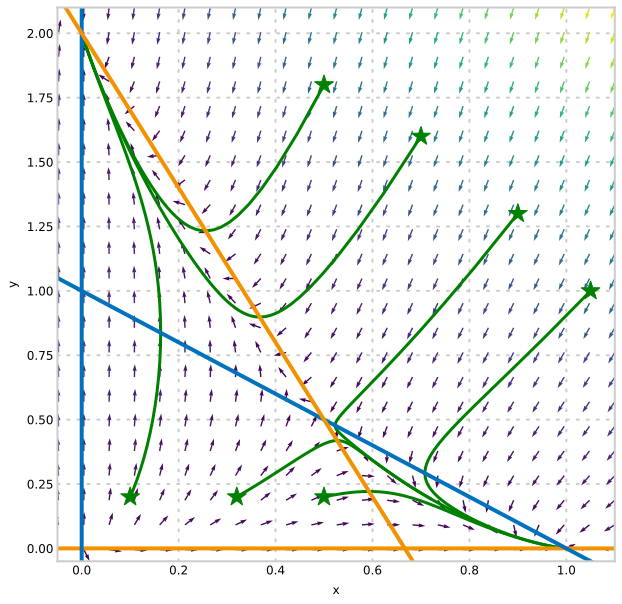
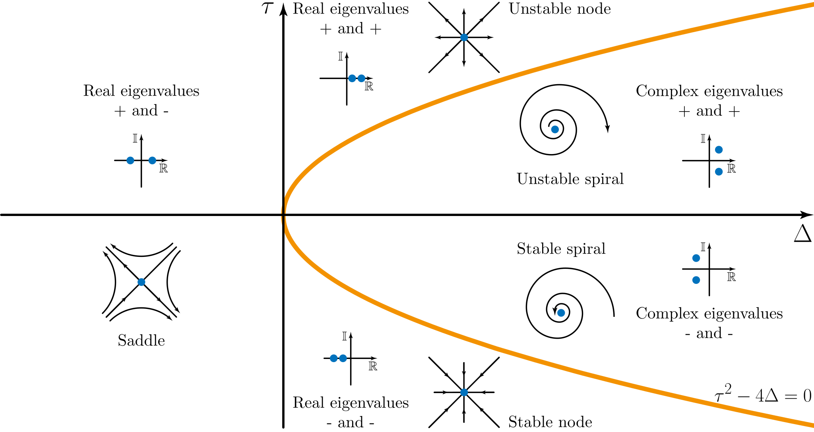

## Phase Planes and Stability

---

## YouTube lecture recording from October 2020

The following YouTube video was recorded for the 2020 iteration of the course.
The material is still very similar:

---

## Recap from previous parts

- 2-D linear systems can be solved analytically
- Eigenvalues are important
- Some larger systems can be simplified
- Phase planes, nullclines and fixed points allow us to understand the behaviour

## Example from previous lecture

$$
\begin{align*}
\dot{x} &= x(1-x) -xy,\\
\dot{y} &= y\left(2-y\right) - 3xy.
\end{align*}
$$

## Linear ODEs for understanding nonlinear

The decoupled ODE system

$$
\begin{align*}
\dot{x} = \frac{\rm{d}x}{\rm{d}t} &= \lambda_1 x,\\
\dot{y} = \frac{\rm{d}y}{\rm{d}t} &= \lambda_2 y,
\end{align*}
$$

has a **fixed point** or **steady state** where $\;\dot{x}=\dot{y}=0\;$, at the origin.

Solutions look like $\;x=Ae^{\lambda_1 t}\;$ and $\;y=Be^{\lambda_2 t}\;$ and thus grow exponentially
or shrink exponentially depending on the values of $\;\lambda_1\;$ and $\;\lambda_2.$

If $\;\lambda_1 < 0\;$ and $\;\lambda_2 < 0\;$ then all the flow is towards the
fixed point. If $\;\lambda_1\;$ or $\;\lambda_2\;$ is positive then some flow will be driven away (towards infinity).

Adding in a constant (inhomogeneous) component shifts the fixed point
away from the origin. Where is the fixed point of

$$
\begin{align*}
\dot{x}  &= \lambda_1 x + 10,\\
\dot{y}  &= \lambda_2 y + 10?
\end{align*}
$$

Coupling the system has the effect of altering the principle directions over
which the exponential terms apply (**changing the basis**).

This means that the **homogeneous** linear system

$$
\begin{align*}
\dot{x}  &= a x +  b y,\\
\dot{y}  &= c x +  d y,
\end{align*}
$$

has a fixed point at the origin. The long-term growth or shrinkage of solutions over time is determined by the eigenvalues of the matrix

> $$\displaystyle A = \begin{pmatrix} a & b \\ c & d \end{pmatrix}$$

More generally, the **inhomogeneous** linear system

$$
\begin{align*}
\dot{x}  &= a x +  b y + p,\\
\dot{y}  &= c x +  d y + q,
\end{align*}
$$

can be written

$$
\left(
\begin{array}{c} \dot{x} \\ \dot{y} \end{array}
\right) =
\left(
\begin{array}{cc} a & b \\ c& d \end{array}
\right)
\left(
\begin{array}{c} x \\ y \end{array}
\right)
+
\left(
\begin{array}{c} p \\ q \end{array}
\right)
.
$$

It has a fixed point at

$$
\left(
\begin{array}{c} x \\ y \end{array}
\right) =
-\left(
\begin{array}{cc} a & b \\ c& d \end{array}
\right)^{-1}
\left(
\begin{array}{c} p \\ q \end{array}
\right)
.
$$

The long-term growth or shrinkage of
solutions over time is again determined by the eigenvalues of the matrix.

## General nonlinear system steady states

A more general two-dimensional nonlinear system is

$$
\begin{align*}
\dot{x} &= f(x,y),\\
\dot{y} &= g(x,y),
\end{align*}
$$

where $\;f\;$ and $\;g\;$ can be any functions whatever.

We can write a polynomial (Taylor) expansion for the system when it is close to a fixed point:

> $\displaystyle \;(x^*, y^*)\;$ for which $\;f(x^*,y^*)=g(x^*,y^*)=0.$

$$
\begin{align*}
\dot{x} &= f(x^*,y^*) + \frac{\partial f}{\partial x}(x-x^*) + \frac{\partial f}{\partial y}(y-y^*) + \ldots,\\
\dot{y} &= g(x^*,y^*) + \frac{\partial g}{\partial x}(x-x^*) + \frac{\partial g}{\partial y}(y-y^*) + \ldots,
\end{align*}
$$

So, close to the fixed point:

$$
\left(
\begin{array}{c} \dot{x} \\ \dot{y} \end{array}
\right)
\approx
\left(
\begin{array}{cc} \frac{\partial f}{\partial x} & \frac{\partial f}{\partial y} \\\frac{\partial g}{\partial x} & \frac{\partial g}{\partial y} \end{array}
\right)
\left(
\begin{array}{c} x-x^* \\ y-y^* \end{array}
\right)
.
$$

This means that (really close to the fixed point) we can approximate
with a linear system. The eigenvalues $\;\lambda_1,\;\lambda_2\;$ of the matrix

$$
J = \left(
\begin{array}{cc} \frac{\partial f}{\partial x} & \frac{\partial f}{\partial y} \\\frac{\partial g}{\partial x} & \frac{\partial g}{\partial y} \end{array}
\right)
$$

will determine if a small perturbation away from $\;(x^*,\;y^*)\;$ will decay or grow.

## Steady state classification

$$
J = \left(
\begin{array}{cc} \frac{\partial f}{\partial x} & \frac{\partial f}{\partial y} \\\frac{\partial g}{\partial x} & \frac{\partial g}{\partial y} \end{array}
\right)
$$

- $\lambda_1<\lambda_2<0$ Stable node
- $\lambda_1=\lambda_2<0$ Stable star
- $\lambda_1>\lambda_2>0$ Unstable node
- $\lambda_1=\lambda_2>0$ Unstable star
- $\lambda_1<0<\lambda_2$ Saddle (or hyperbolic) point: unstable
- Complex $\lambda$: Spiral (with real part determining stability)
- Imaginary $\lambda$: Neutral (solution cycles round fixed point)

The presence of negative eigenvalues determines whether a steady state is physically viable.

### Eigenvalues of $J$

$$
|J-\lambda I| = \left|
\begin{array}{cc} \frac{\partial f}{\partial x}-\lambda & \frac{\partial f}{\partial y} \\\frac{\partial g}{\partial x} & \frac{\partial g}{\partial y}-\lambda \end{array}\right|
= \left(\frac{\partial f}{\partial x}-\lambda\right)\left(\frac{\partial g}{\partial y}-\lambda\right)-\frac{\partial f}{\partial y}\frac{\partial g}{\partial x}
$$

So eigenvalues $\;\lambda\;$ satisfy

$$
\lambda^2 - \lambda\left(\frac{\partial f}{\partial x} + \frac{\partial g}{\partial y}\right) + \frac{\partial f}{\partial x}\frac{\partial g}{\partial y} - \frac{\partial f}{\partial y}\frac{\partial g}{\partial x},
$$

or

$$
\lambda^2 - \lambda\tau + \Delta \quad \rm{where} \quad \tau=\rm{Trace}(J) \quad and \quad \Delta = \rm{Det}(J)
$$

## Example system

$$
\begin{align*}
\dot{x} &= x(1-x) -xy &=f(x)\\
\dot{y} &= y\left(2-y\right) - 3xy &=g(x).
\end{align*}
$$

- What are the nullclines?
- What are the fixed points?
- What is the stability of the fixed points?

### Calculate the Jacobian

$$
J = \left(
\begin{array}{cc} \frac{\partial f}{\partial x} & \frac{\partial f}{\partial y} \\\frac{\partial g}{\partial x} & \frac{\partial g}{\partial y} \end{array}
\right) = \left(\begin{array}{cc} -2x-y+1 & -x \\-3y & -3x-2y+2 \end{array}\right)
$$

At $(0,0)$:

$$
J_{(0,0)} = \left(\begin{array}{cc} 1 & 0 \\0 & 2 \end{array}\right)
$$

$$
\left|\begin{array}{cc} 1-\lambda & 0 \\0 & 2-\lambda\end{array}\right|\quad\implies\quad\lambda_1 = 1, \; \lambda_2 = 2 \qquad\rm{(unstable)}
$$

At $(1/2,1/2)$:

$$
J_{(1/2,1/2)} = \left(\begin{array}{cc} -\frac{1}{2} & -\frac{1}{2} \\-\frac{3}{2} & -\frac{1}{2} \end{array}\right)
$$

$$
\left|\begin{array}{cc} -\frac{1}{2}-\lambda & -\frac{1}{2} \\-\frac{3}{2} & -\frac{1}{2}-\lambda\end{array}\right|\quad\implies\quad\lambda_\pm = \frac{1}{2} \pm \frac{\sqrt{3}}{2} \qquad\rm{(saddle)}
$$

At $(1,0)$:

$$
J_{(1,0)} = \left(\begin{array}{cc} -1 & -1 \\ 0 & -1 \end{array}\right)
$$

$$
\left|\begin{array}{cc} -1-\lambda & -1 \\0 & -1-\lambda\end{array}\right|\quad\implies\quad\lambda_1 = \lambda_2 = -1 \qquad\rm{(stable)}
$$

At $(0,2)$:

$$
J_{(0,2)} = \left(\begin{array}{cc} -1 & 0 \\ -6 & -2 \end{array}\right)
$$

$$
\left|\begin{array}{cc} -1-\lambda & 0 \\-6 & -2-\lambda\end{array}\right|\quad\implies\quad\lambda_1 = -1, \; \lambda_2 = -2 \qquad\rm{(stable)}
$$

If we now look again at the phase plane, after having calculated the stability of the fixed points, we can see that the arrows move towards the stable fixed points, and away from the unstable ones.

## Summary

- Eigenvalues tell us about the behaviour of linear systems
- Eigenvalues tell us about the stability of nonlinear systems

### Main problems

> These questions are extensions of questions on the previous page.

::::challenge{id="16_main_01" title="Main problems 1"}
Classify the fixed points and discuss stability of the following linear systems:

1. $\displaystyle \dot{x} = x+3y,   \qquad \dot{y}=-6x+5y;$
1. $\displaystyle \dot{x} = x+3y+4, \qquad \dot{y}=-6x+5y-1;$
1. $\displaystyle \dot{x} = x+3y+1, \qquad \dot{y}=-6x+5y.$

::::

::::challenge{id="16_main_02" title="Main problems 2"}
Classify the fixed points and discuss stability of the following nonlinear systems:

1. $\displaystyle \dot{x} = -4y+2xy-8   \qquad \dot{y}=4y^2-x^2;$
1. $\displaystyle \dot{x} = y-x^2+2, \qquad \dot{y}=2(x^2-y^2).$

::::

::::challenge{id="16_main_03" title="Main problems 3"}
The population of a host, $H(t)$, and a parasite, $P(t)$, are described approximately by the equations

> $$\displaystyle \def\dd#1#2{{\frac{{\rm d}#1}{{\rm d}#2}}} \dd{H}{T}=(a-bP)H,\qquad \dd{P}{T}=(c-\frac{dP}{H})P, \qquad H>0,$$

where $a,b,c,d$ are positive constants.
Previously, by a change of scales, these equations were put in the simpler form

> $$\displaystyle \def\dd#1#2{{\frac{{\rm d}#1}{{\rm d}#2}}} \dot{y} = (1-x)y, \qquad \dot{x}=\alpha x(1-\frac{x}{y}),$$

where $\displaystyle \alpha=\frac{c}{a}$.

Find and classify the fixed points of these simplified equations.
Sketch the phase flow diagram including these fixed points and the information from the previous sketch.
That is, include the flow across:

1. $\displaystyle y=x$;
1. $\displaystyle x=0$;
1. $\displaystyle y=0$;
1. $\displaystyle x=1$;
1. $\displaystyle y=\beta x$, for $\beta$ greater than and less than 1.

::::

::::challenge{id="16_main_04" title="Main problems 4"}
In the previous parts of this question a model of fish and anglers was developed and simplified.
This question analyses the simplified model.

The simplified version of the model is

> $$\displaystyle \dot{x} = rx(1 - x) - xy,\qquad \dot{y} = \beta x - y$$

where $x$ and $y$ represent fish and angler populations, respectively.
The $\dot{x}$ notation represents the derivative with respect to non-dimensional time.

1. Calculate the steady states of the system.
1. Determine the stability of the fixed points in the case $\beta = r = 4$.
1. Draw the phase plane, including the nullclines and phase trajectories.

::::

### Extension problems

::::challenge{id="16_ext_01" title="Extension problems 1"}

A population $F$ of foxes feeds on a population $H$ of hares.
A model for the changes in the population is given by

$$
\def\dd#1#2{{\frac{{\rm d}#1}{{\rm d}#2}}}
\begin{aligned}
\dd{H}{T} &= aH-bHF\quad &(H>0),\\
\dd{F}{T} &= cHF-dF\quad &(F>0).
\end{aligned}
$$

1. Define the four variables $a,b,c,d$.
1. Find the fixed point of the system and describe the motion in its neighbourhood.
1. What does this mean in terms of the population of hares and foxes?

::::
