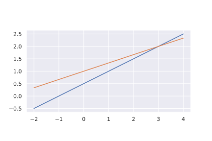
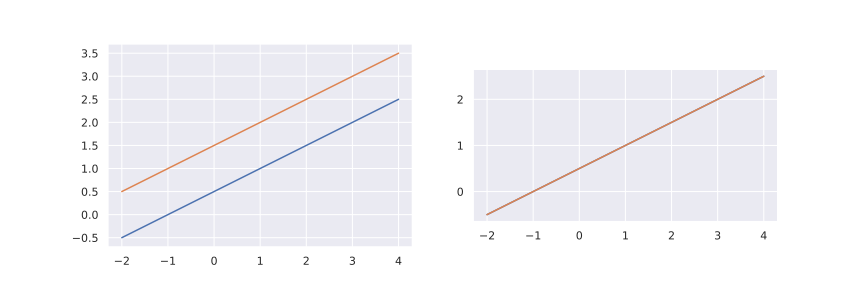

## Systems of linear equations

Linear algebra is largely concerned with representing, manipulating and solving large 
systems of linear equations. Consider the following 2 linear equations:

$$
\begin{aligned}
a_1x+b_1y &= c_1, \quad (1)\\
a_2x+b_2y &= c_2, \quad (2)
\end{aligned}
$$

where the values $\;x\;$ and $\;y\;$ are to be found, and $\;a_1, \;b_1, \;a_2, \;b_2, 
\;c_1\;$ and $\;c_2\;$ are given constants. We know that we can use linear combinations 
of these two equations to solve this sytem for $\;x\;$ and $\;y\;$, like so:

$$
\begin{aligned}
 (1) \times b_2:~~~~~~~~~~~~~~~ b_2a_1x+b_2b_1y &=& b_2c_1, \quad (3)\\
  (2) \times b_1:~~~~~~~~~~~~~~~ b_1a_2x+b_1b_2y &=& b_1c_2, \quad (4)\\
  (3) - (4):~~~~~~~~~~~~~~~ b_2a_1x-b_1a_2x &=& b_2c_1-b_1c_2.
\end{aligned}
$$

## The Matrix

We can also write these linear equations using a matrix. Matrices are structures that 
allow us to more easily manipulate linear systems. While not particularly useful for 
just 2 equations, using a matrix representation allows us to generalise to, say $N$ 
equations and $M$ unknowns, or to solve large systems of equations on a computer.

Consider the original system:

$$
\begin{aligned}
a_1x+b_1y &= c_1, \\
a_2x+b_2y &= c_2. 
\end{aligned}
$$

We rewrite this, in the form of a matrix as:

$$
\left(\begin{matrix}a_1&b_1\\ a_2&b_2\end{matrix}\right)
\left(\begin{matrix}x\\y\end{matrix}\right)
=\left(\begin{matrix}c_1\\ c_2 \end{matrix}\right).
$$
 
Think about how this form relates to the original linear system. 

## Geometry of linear equations

Consider the following system of equations

$$
\begin{aligned}
 x + -2y &= -1, \\
-x +  3y &=  3. 
\end{aligned}
$$

That is,

$$
A = \left(\begin{matrix} 1 & -2 \\ -1 & 3\end{matrix}\right)
$$

Plotting these two linear equations on a graph shows graphically the solution to this 
equation given by

$$
\left(\begin{matrix} x \\ y \end{matrix}\right) = A^{-1} \left(\begin{matrix} -1 \\ 3 
\end{matrix}\right) = \left(\begin{matrix} 3 \\ 2 
\end{matrix}\right)
$$



Now lets consider two different system of equations represented by the matrix:

$$
A = \left(\begin{matrix} 1 & -2 \\ -1 & 2\end{matrix}\right)
$$

$$
\begin{aligned}
 x + -2y &= -1, \\
-x +  2y &=  3. \end{aligned}
$$

and 

$$
\begin{aligned}
 x + -2y &= -1, \\
-x +  2y &=  1. \end{aligned}
$$



The first gives the plot on the left, while the second, which has a different vector of 
constants on the RHS, gives the plot on the right. You can see that depending on the 
constants, the system of equations can have an infinite number of solutions, or no 
solutions at all. 

The matrix $A$ in this case is singular, and therefore does not have an inverse. Looking 
at the equations again, you can see that the two rows of the matrix $A$ are multiples of 
the other, and thus there is only *one* independent row. That is, the *rank* of the 
matrix is one.

## Singular matrices

The *rank* of an $\;n\,\times\,n\;$ matrix $\;A\;$ is the number of linearly independent rows in $\;A\;$ (rows not combinations of other rows).

When $\;\text{rank}(A) < n\;$ then

- The matrix is said to be 'rank deficient'
- The system $\;A\textbf{x} = \textbf{b}\;$ has *fewer* equations than unknowns
- The matrix is said to be singular
- The matrix is said to be underdetermined
- $A\;$ has no inverse
- The determinant of $\;A\;$ is 0
- The equation $\;A\textbf{u} = \textbf{0}\;$ has non-trivial solutions ($\textbf{u} \neq \textbf{0}$)

### The determinant

One way of solving a system of equations represented by $A x = b$ is to calculate the 
*inverse* of A, giving the solution as $x = A^{-1} b$. This can be done by calculating 
what is known as the *determinant* of $A$.

If

$$
A = \left(\begin{matrix} p & q \\ r & s\end{matrix}\right)
$$

then the **determinant** of A is:

$$
|A| = ps-qr
$$

The inverse of $A$ can be found using the determinant:

$$
A^{-1} = \frac{1}{ps-qr} \left(\begin{matrix} s & -q \\ -r & p\end{matrix}\right)
$$

Calculating the inverse of a matrix using its determinant can be very costly for larger 
matrices, therefore other algorithms are used (e.g. Gaussian Elimination, which is 
introduced in the next section)

If $|A| = 0$, A is said to be **singular** (have no inverse). Graphically, this is 
represented by the parallel or non-intersecting lines in the figure above. 

### Using Python to calculate the inverse

To find $A^{-1}$  for

$$
A = \left(\begin{matrix}3&0&2\\ 3&0&-3\\ 0&1&-1\end{matrix}\right)
$$
 
you can using numpy like so:
 
```python
A = np.array([[3, 0, 2], [3, 0, -3], [0, 1, 1]])
np.linalg.inv(A)
```

Output:

```
array([[ 0.2       ,  0.13333333,  0.        ],
       [-0.2       ,  0.2       ,  1.        ],
       [ 0.2       , -0.2       , -0.        ]])
```

It doesn't always work. Consider the following system

$$
A = \left(\begin{matrix}1&1&1\\ 2&4&2\\ 7&10&7\end{matrix}\right)
$$

```python
A = np.array([[1, 1, 1], [2, 5, 2], [7, 10, 7]])
np.linalg.inv(A)
```

Output:

```
Traceback (most recent call last):
  File "<stdin>", line 1, in <module>
  File "<__array_function__ internals>", line 6, in inv
  File "/home/mrobins/git/scientific-computing/env/lib/python3.6/site-packages/numpy/linalg/linalg.py", line 546, in inv
    ainv = _umath_linalg.inv(a, signature=signature, extobj=extobj)
  File "/home/mrobins/git/scientific-computing/env/lib/python3.6/site-packages/numpy/linalg/linalg.py", line 88, in _raise_linalgerror_singular
    raise LinAlgError("Singular matrix")
numpy.linalg.LinAlgError: Singular matrix
```

## Other Reading

- Linear algebra by Ward Cheney
- Linear algebra and its applications by David C. Lay.
- Strang, G. (2016). Introduction to linear algebra (Fifth ed.). Wellesley.
- Linear algebra and its applications by Gilbert Strang
  - lots of supplimentary material via MIT course page here:
https://github.com/mitmath/1806/blob/master/summaries.md
- LA from an ODE perspective: Kapitula, T. (2015). Ordinary Differential Equations and 
  Linear Algebra. Society for Industrial and Applied Mathematics.

## Problems

::::challenge{id=intersection-of-planes title="Intersection of planes" }

1. Describe the intersection of the three planes $u+v+w+z = 6$, $u+w+z = 4$ and $u+w = 
   2$ (all in four-dimensional space). Is it a line or a point or a fourth equation that 
   leaves us with no solution. an empty set? What is the intersection if the fourth 
   plane $u = −1$ is included? Find a fourth equation that leaves us with no solution.

:::solution

The intersection of the 3 planes is the 1d line $u + w = 2$, $v=2$ and $z=2$. 
Introducing a fourth equation that does not intersect this line (e.g. $u + w = 3$) 
leaves us with no solutions.

:::
::::


::::challenge{id=python-intersection-of-planes title="Python: Intersection of planes" }
2. Sketch or plot in Python these three lines and decide if the equations are solvable: 
   3 by 2 system $x + 2y = 2$, $x − y = 2$, and $y = 1$. What happens if all right-hand 
   sides are zero? Is there any nonzero choice of right- hand sides that allows the 
   three lines to intersect at the same point?

:::solution

```python
import numpy as np
import matplotlib.pylab as plt

x = np.linspace(-1, 4, 100)

def plot_lines(b1, b2, b3):
    y1 = (b1 - x) / 2
    y2 = x - b2
    y3 = b3 * np.ones_like(x)
    plt.plot(x, y1)
    plt.plot(x, y2)
    plt.plot(x, y3)
    plt.show()


plot_lines(2, 2, 1)
plot_lines(0, 0, 0)
plot_lines(2, -1, 1)
```

:::
::::

::::challenge{id=upper-triangular-matrix title="Upper triangular matrix" }

3. Write a Python function that takes in a $3 \times 3$ upper triangular matrix $A$ 
   represented as an `ndarray`, and a rhs vector $b$, and solves the equation $A x = b$. 
   i.e. the function will solve the following triangular system for $x = (x_1, x_2, 
   x_3)$:

$$
\begin{aligned}
A_{11} x_1 + A_{12} x_2 + A_{13} x_3 &= b_1, \\
A_{22} x_2 + A_{23} x_3 &= b_2, \\
A_{33} x_3 &= b_3
\end{aligned}
$$

  Generalise this function to a $n \times n$ triangular matrix input.

:::solution

```python
def solve_triangular(A, b):
    n = len(b)
    x = np.empty_like(b)
    for i in range(n-1, -1, -1):
        x[i] = b[i]
        for j in range(n-1, i, -1):
            x[i] -= A[i, j] * x[j]
        x[i] /= A[i, i]
    return x

def random_upper_triangular(n):
    R = np.random.rand(n, n)
    A = np.zeros((n, n))
    triu = np.triu_indices(n)
    A[triu] = R[triu]
    return A

As = [
    np.array([[1, 0, 0], [0, 1, 0], [0, 0, 1]]),
    random_upper_triangular(3),
    random_upper_triangular(4),
    random_upper_triangular(5),
    random_upper_triangular(6),
]

bs = [
    np.array([1, 2, 3]),
    np.random.rand(3),
    np.random.rand(4),
    np.random.rand(5),
    np.random.rand(6),
]

for A, b in zip(As, bs):
    x_scipy = scipy.linalg.solve_triangular(A, b)
    x_mine = solve_triangular(A, b)
    np.testing.assert_almost_equal(x_scipy, x_mine)
```

:::
::::
