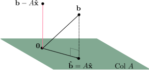

## QR decomposition

## The least-squares problem

One of the most important application of the $QR$ decomposition is the least squares
solution of a set of overdetermined equations. That is a set of $m$ linear equations
with $n$ unknowns, with $m \ge n$. The least squares problem to be solved is the
mimimisation of $||A x - b ||_2$, where $|| x ||_2 = \sqrt{x_1^2 + x_2^2 + ... + x_m^2}$
is the standard 2-norm, and where $A \in \mathbb{R}^{m \times n}$ with $m \ge n$ and $b
\in \mathbb{R}^m$. In this case, the problem $Ax = b$ will often have no solution, and
thus it is nessessary to consider $Ax$ and $b$ as _approximatelly_ equal, and to
minimise the distance between them by minimising the loss function $||A x - b||_2$.

To solve this least squares problem, we need to consider the subspace of all vectors in
$\mathbb{R}^{m}$ that are formed from linear combinations of the columns of $A$. This is
known as the column space of the $A$, and is denoted as $\text{Col }A$. Given that _any_
linear combination of the columns of $A$ will lie in this space, we can say that $Ax$
will also lie in $\text{Col }A$ for any $x$.

Now consider a projection of $b$ into the column space of $A$ to give a new vector
$\hat{b}$ (i.e. $\hat{b}$ is the closest point in Col $A$ to $b$), see the diagram
below. Because $\hat{b}$ is in the column space of $A$, we know that there is another
vector $\hat{x}$ that also lies in Col $A$ and satisfies

$$
A \hat{x} = \hat{b}
$$

Since $\hat{b}$ is the closest point to $b$ in the column space of $A$, we can therefore
say that $\hat{x}$ is the least-squares solution.



We can show that the vector $b - \hat{b} = b - A \hat{x}$ is orthogonal to Col $A$ and
therefore also orthogonal to each column in $A$, so we have $a_j^T (b - A \hat{x})$ for
each column $a_j$ of $A$. Putting these $m$ equations together we can write

$$
A^T (b - A \hat{x}) = 0
$$

or rearranged slightly, we can find the least-sqaures solution $\hat{x}$ via the
solution of the equation

$$
A^T A \hat{x} = A^T b
$$

The $QR$ decomposition divides $A = QR$ into an orthogonal matrix $Q$, and an upper
triangular matrix $R$. Most importantly for the least-squares problem, the matrix $Q$ is
also an orthonormal basis for Col $A$ and therefore $\hat{b} = Q Q^T b$.

Given this decomposition, it can be shown that the least squares solution of $A x = b$
is given by

$$
\hat{x} = R^{-1} Q^T b
$$

To prove this, we let $\hat{x} = R^{-1} Q^T b$ and make the following substitutions

$$
A\hat{x} =  QR \hat{x} = QRR^{-1}Q^T b = Q Q^T b = \hat{b}
$$

Therefore $A\hat{x} = \hat{b}$, which proves that $\hat{x}$ is the least-squares
solution for $A x = b$

Finally, we note that the inverse $R^{-1}$ should not be calculated directly, but
instead $\hat{x}$ should be found by solving

$$
R x = Q^T b
$$

### Constructing the QR decomposition

$QR$ decomposisions are normally computed via Householder reflections, Givens rotations
or the Gram-Schmidt process. For a brief summary of the first two methods, it is useful
to consider a simple $2 \times 2$ reflection or rotation of a 2d vector. For example,
the matrix

$$
Q = \left(\begin{matrix}
\cos(\theta) & \sin(\theta) \\
-\sin(\theta) & \cos(\theta)
\end{matrix}\right)
$$

is a _rotation_ matrix that when applied to a vector $x$ will result in $y = Qx$, where
$y$ is rotated counterclockwise through the angle $\theta$. $Q$ is also _orthogonal_
since $QQ^T = I$.

Similarly, a $2 \times 2$ _reflection_ matrix can be constructed as

$$
Q = \left(\begin{matrix}
\cos(\theta) & \sin(\theta) \\
\sin(\theta) & -\cos(\theta)
\end{matrix}\right)
$$

which when applied to a vector $x$ will result in $y = Qx$, where $y$ is reflected
across the line defined by $\text{span}((\cos(\theta), \sin(\theta))^T)$.

Rotations and reflections are often useful because they can be selected in order to
introduce zeros to the vector they are applied to. Given an $m \times n$ matrix $A$, a
series of $n$ _Householder reflections_ can be applied to reduce $A$ to an upper
triangular matrix $R$

$$
H_n ... H_2 H_1 A = R
$$

By setting $Q = H_1 H_2 ... H_n$, we can show that $A = QR$, and that $Q$ is an
orthogonal matrix which is also an orthonormal basis for the column space of $A$.

Similarly, a _Givens rotation_ can be used to zero a single component of $A$, so that a
a series of rotations can be used to contruct the upper triangular matrix $R$

$$
G_j ... G_2 G_1 A = R
$$

so that $Q = G_1 G_2 ... G_j$, and $A = QR$. For both the Householder and Givens
methods, it is often useful to not construct the full matrix $Q$ but to keep $Q$
factored as a implicit product of either $H_1 H_2 ... H_n$ or $G_1 G_2 ... G_j$. Fast
algorithms exist to calculate the produce of these factored forms to another vector.

The final method to contruct a $QR$ decomposition is using the Gram-Schmidt process,
which is a process for contructing an orthogonal or orthonormal basis for a given
subspace defined by the span of the set of vectors $x_1, x_2, ..., x_n$. If these $n$
vectors are the columns of the $m \times n$ matrix $A$, then the Gram-Schmidt process
can be used to directly contruct the orthonormal basis of the column space of $A$ given
by $Q$, and that $A = QR$ where $R$ is an upper triangular matrix. The matrix $R$ can be
calculated using $R = Q^T A$. Note that the classical Gram-Schmidt exhibits poor
numerical qualities, therefore a modified version of the algorithm exists, which is
described in the Golub and Van Loan Matrix Computations textbook listed below.

In terms of computational work, the Householder method takes $2n^2(m-n/3)$ flops to
compute $Q$ in factored form, and another $2n^2(m-n/3)$ to get the full matrix $Q$,
whereas the Gram-Schmidt method is more efficient at $2mn^2$ flops. However, Householder
is normally prefered in practice as even with the modified algorithm the numerical
properies of the Gram-Schmidt are still poor in comparison with both Householder and
Givens (i.e. the final orthogonality of $Q$ is not ideal), so is only useful when the
columns of $A$ are already fairly independent. Using Givens rotations the matrix $R$ can
be found in $2n^2(m-n/3)$, or the factorised form of the $QR$ decomposition can be found
in the same amount of time. The full matrix $Q$ is not normally calculated via Givens
rotations. Using Givens rotations is most useful when there are only few non-zeros in
$A$, and is more easily parallised than Householder.

### Other Reading

The discussion in this section relied on concepts such as orthogonal and orthonormal
vector pairs, vector spaces and subspaces and basis vectors. It is well worth
investigating these topics further in:

- Linear algebra and its applications by David C. Lay. Chapers 4 & 6.

Additional reading on the $QR$ decomposition can be found at:

- Linear algebra and its applications by David C. Lay. Chaper 6.4
- Golub, G. H. & Van Loan, C. F. Matrix Computations, 3rd Ed. (Johns Hopkins University
  Press, 1996). Chapter 5.2
- <https://en.wikipedia.org/wiki/QR_decomposition>

### Software

[`scipy.linalg.qr`](https://docs.scipy.org/doc/scipy/reference/generated/scipy.linalg.qr.html)

[`scipy.linalg.qr_multiply`](https://docs.scipy.org/doc/scipy/reference/generated/scipy.linalg.qr_multiply.html)

[`scipy.linalg.qr_update`](https://docs.scipy.org/doc/scipy/reference/generated/scipy.linalg.qr_update.html)

[`scipy.linalg.qr_delete`](https://docs.scipy.org/doc/scipy/reference/generated/scipy.linalg.qr_delete.html)

[`scipy.linalg.qr_insert`](https://docs.scipy.org/doc/scipy/reference/generated/scipy.linalg.qr_insert.html)

[`numpy.linalg.lstsq`](https://numpy.org/doc/stable/reference/generated/numpy.linalg.lstsq.html)

## Problems

::::challenge{id=model-fitting title="Model fitting"}

For this exercises we will be using some data on Oxford's weather which is hosted by
[Saad Jbabdi](https://users.fmrib.ox.ac.uk/~saad/) from the Wellcome Centre for
Integrative NeuroImaging (FMRIB), which can be obtained
[here](http://www.fmrib.ox.ac.uk/~saad/ONBI/OxfordWeather.txt).

We wish to fit a quadratic model of the form $y = a x^2 + b x + c$ to the hours of
sunlight observed in Oxford (7th column in `OxfordWeather.txt`) versus the month (2nd
column). The dataset in question has $m > 3$ data points, so our model gives us a set of
$m$ equations for 3 unknowns $a$, $b$, and $c$ that are overdetermined, that is, for
each data point $(y_i, x_i)$ for $i=1..m$ we have:

$$
y_i = a x_i^2 + b x_i + c
$$

Use a $QR$ decomposition to find the least-squares solution to these equations (you can
check it using `np.linalg.lstsq` if you like), and therefore fit the model to the data.
Plot the model and the data side by side to qualitatively evaluate the fit.

:::solution

```python
import pandas as pd
import matplotlib.pylab as plt
import numpy as np
import scipy.linalg

names = ['year', 'month', 'maxTemp', 'minTemp', 'hoursFrost', 'rain', 'hoursSun']
df = pd.read_csv('OxfordWeather.txt',
                 delim_whitespace=True, header=None, names=names)

x = df.month.values.reshape(-1,1)
y = df.hoursSun.values.reshape(-1,1)

# we have to sort the data according to x if we want a nice plot
i = np.argsort(x,axis=0).reshape(-1)
x = x[i]
y = y[i]

# polynomial model $y = a x^2 + b x + c$,
# or $M beta = y$ where $beta = (a, b, c)$
M = np.concatenate([np.ones_like(x), x, x**2], axis=1)
Q, R = scipy.linalg.qr(M, mode='economic')
beta = np.linalg.solve(R, Q.T @ y)

# check against lstsq
np.testing.assert_almost_equal(
    beta, np.linalg.lstsq(M, y, rcond=None)[0]
)

plt.plot(x, y, 'o')
plt.plot(x, M @ beta, 'r')
plt.xlabel('month')
plt.ylabel('hoursSun')
plt.show()
```

:::
::::
