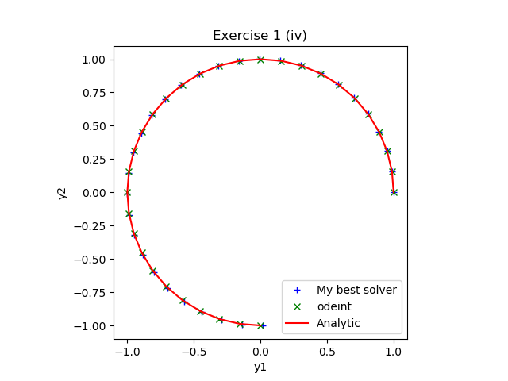

In these exercises we will use Python to solve a variety of Ordinary Differential
Equations (ODEs), including initial and boundary value problems. Prior to attempting the
exercises you should be familiar with how to solve first order ODEs using separable
solutions and integrating factors. You should also know how solve a second order ODE
with constant coefficients and how to reduce a general second order ODE to a system of
coupled first order equations. If you are not familiar with this material then speak to
a module leader or demonstrator who will give you a tutorial. Advanced exercises are
marked with a star ($\star$); you should attempt these only if you have time and have
completed the other exercises.

## Motivation

Ordinary differential equations are used very frequently in modelling biological
and physiological processes. Most commonly they are used to model the way in
which quantities of interest (such as concentrations of drugs, viral load, or
population densities) change as a function of time. The earlier exercises below
are revision of the kinds of ODEs you may have encountered at A level or as an
undergraduate. The later exercises are taken from real models of chemical and
biological systems.

The intentions behind this exercise are:

- To give you a clear goal to meet
- To give you a chance to revise or learn a few things. Specifically:
  - The abstract base class pattern;
  - Unit testing with `unittest`;
  - Ordinary differential equation solver implementations.

A nice feature of this assignment is that you are provided with a testing
infrastructure which gives an
implicit specification of the code you are required to write. This means that
when you've written code
such that all the tests pass then you will know that you have completed the
exercise.

::::challenge{id=initial-value-problems title="Initial value problems"}

Solve the following initial value problems by hand:

1. $\dfrac{\textrm{d} y}{\textrm{d} x} = x^{2}$, $\;$ subject to $y(0)=1$.
2. $\dfrac{\textrm{d} x}{\textrm{d} t} = \dfrac{t^{2}}{x}$, $\;$ subject to $x(0)=1$.
3. $\dfrac{\textrm{d} y}{\textrm{d} x} + \dfrac{y}{x}=1$, $\;$ subject to $y(1)=0$.
4. $\dfrac{\textrm{d} y_{1}}{\textrm{d} x} = -y_{2}$ and $\dfrac{\textrm{d}
     y_{2}}{\textrm{d} x} = y_{1}$, $\;$ subject to
   $y_{1}(0)=1$ and $y_{2}(0)=0$.
5. $\dfrac{\textrm{d}^{2} y}{\textrm{d} x^{2}} +3\dfrac{\textrm{d} y}{\textrm{d} x}
     -4y=0$, $\;$ subject to $y(0)=1$ and $y'(0)=0$.

Solve each of the above initial value problems numerically using
your best Python ODE solver and compare with the analytic
solutions. Note that in order to solve the last problem numerically
you will need to reformulate the equation as a system of first order
ODEs. See if, for some of your answers, you can make a figure similar to those below,
made using model solutions.




:::solution

The analytical solutions to the initial value problems are given as follows:

1. $\dfrac{\textrm{d} y}{\textrm{d} x} = x^{2}$, $y(0)=1$ $\;$ $\Rightarrow$ $\;$
   $y(x)=\frac{x^{3}}{3}+1.$}
2. $\dfrac{\textrm{d} x}{\textrm{d} t} = \dfrac{t^{2}}{x}$, $x(0)=1$ $\;$
   $\Rightarrow$ \ $x(t)=\sqrt{\frac{2t^{3}}{3}+1}.$
3. $\dfrac{\textrm{d} y}{\textrm{d} x} + \dfrac{y}{x}=1$, $y(1)=0$ $\;$
   $\Rightarrow$ $\;$ $y(x)=\frac{x}{2}-\frac{1}{2x}.$
4. $\dfrac{\textrm{d} y_{1}}{\textrm{d} x} = -y_{2}$, $\dfrac{\textrm{d}
     y_{2}}{\textrm{d} x} = y_{1}$, $y_{1}(0)=1$, $y_{2}(0)=0$ $\;$ $\Rightarrow$ $\;$
   $y_{1}(x)=\cos{x}, \; y_{1}(x)=\sin{x}.$
5. $\dfrac{\textrm{d}^{2} y}{\textrm{d} x^{2}} +3\dfrac{\textrm{d} y}{\textrm{d} x}
     -4y=0$, $y(0)=1$, $y'(0)=0$ $\;$ $\Rightarrow$ $\;$ $y(x)=\frac{4}{5}e^{x}+
     \frac{1}{5}e^{-4x} .$

The following example Python codes can be modified to solve all the above
initial value problems:

```python nolint
""" Code for question (ii) """
from matplotlib import pyplot as plt
from scipy.integrate import odeint
import numpy as np
import matplotlib.pyplot as plt
# Function to solve dxdt=tˆ2/x.
def dxdtfor2dsolver(u, t):
    # dxdt=t*t/x (dydt is unused)
    return (t*t/u[0], 0)
def dxdt(x, t):
    # dxdt=t*t/x
    return t*t/x

# My best solver
solver = HigherOrderOdeSolver()
solver.SetInitialValues(1, 42)
solver.SetInitialTimeNumberOfStepsAndFinalTime(0.0, 30, 100.0)
solver.SetRhsFunction(dxdtfor2dsolver)
solver.Solve()

# odeint based on the time-steps in my solver
oi = odeint(dxdt, 1.0, solver.GetTimeTrace())

# the analytic version based on the time-steps in my solver
t = solver.GetTimeTrace()
analytic = np.sqrt((np.power(t, 3)*2)/3 + 1.0)

plt.plot(solver.GetTimeTrace(),solver.GetXTrace(),'b+',
         label='My best solver')
plt.plot(solver.GetTimeTrace(), oi, 'gx', label='odeint')
plt.plot(solver.GetTimeTrace(), analytic, 'r', label='Analytic')
plt.legend()
plt.title('Exercise 1 (ii)')
plt.xlabel('t')
plt.ylabel('x')
plt.show()
```

```python nolint
""" Code for question (iv) """
from matplotlib import pyplot as plt
from scipy.integrate import odeint
import numpy as np
import matplotlib.pyplot as plt
import math
def dydx(y, x):
    # This one ought to look familiar (rhs_circle)
    return (-y[1], y[0])

# My best solver
solver = HigherOrderOdeSolver()
solver.SetInitialValues(1, 0)
solver.SetInitialTimeNumberOfStepsAndFinalTime(0.0, 30, 1.5*math.pi)
solver.SetRhsFunction(dydx)
solver.Solve()

# odeint based on the time-steps in my solver
oi = odeint(dydx, (1,0), solver.GetTimeTrace())

# the analytic version based on the time-steps in my solver
t = solver.GetTimeTrace()
x = solver.GetXTrace()
y = solver.GetYTrace()
analyticx = np.cos(t)
analyticy = np.sin(t)

plt.plot(solver.GetXTrace(), solver.GetYTrace(), 'b+',
         label='My best solver')
plt.plot(oi[:,0], oi[:,1], 'gx', label='odeint')
plt.plot(analyticx,  analyticy, 'r', label='Analytic')
plt.legend()
plt.title('Exercise 1 (iv)')
plt.xlabel('y1')
plt.ylabel('y2')
plt.axes().set_aspect('equal')
plt.show()
```

:::
::::

::::challenge{id=boundary-value-problems title="Boundary value problems"}

Use `scipy.integrate.solve_bvp` to solve the boundary value problem

$$
\begin{aligned}
\dfrac{\textrm{d}^{2} y}{\textrm{d} x^{2}} + 3 \dfrac{\textrm{d} y}{\textrm{d} x} -4y=0,
\end{aligned}
$$

subject to the boundary conditions $y(0)=1$ and $y(1)=1$.

Solve the same boundary value problem, but now with the boundary conditions $y'(0) = 0$
and $y(1)=1$.

:::solution

```python
from scipy.integrate import solve_bvp
import matplotlib.pyplot as plt
import numpy as np
# Solving y'' + 3y'- -4y
# y[0] is y, y[1] is y'
# dy[0]/dx = y[1] and dy[1]/dx = -3y[1]+4y[0]
def dydx(x, y):
    return np.vstack((y[1], -3*y[1]+4*y[0]))

def bcs_a(yat0, yat1):
    # Dirichlet: y at both ends = 1, i.e. y(x=1)-1 = 0
    return (yat0[0]-1, yat1[0]-1)
def bcs_b(yat0, yat1):
    # Dirichlet/Neumann y'(x=0)= 1, y(x=1)-1 = 0
    return (yat0[1]-1, yat1[0]-1)

x = np.linspace(0, 1, 50)
init_y = np.ones((2, x.size))
sol_a = solve_bvp(dydx, bcs_a, x, init_y)
sol_b = solve_bvp(dydx, bcs_b, x, init_y)
plt.plot(sol_a.x, sol_a.y[0], 'b-+', label='(a)')
plt.plot(sol_b.x, sol_b.y[0], 'r-*', label='(b)')
plt.title('Exercise (a)')
plt.legend()
plt.xlabel('x')
plt.ylabel('y')
plt.show()
```

:::
::::

::::challenge{id=chemical-reaction-systems title="Chemical reaction systems"}

Mathematical models of simple chemical or biochemical reaction mechanisms often take the
form of non-linear systems of ordinary differential equations (derived using the
standard chemical laws of mass action). Often the various reactions making up the system
happen on very different time scales leading to a _stiff_ system. An example is
Robertson's chemical reaction model, in which the concentrations of three reacting
chemical species evolve according to the system of equations

$$
\begin{aligned}
  \dfrac{\textrm{d} y_{1}}{\textrm{d} x} &= -0.04y_1 + 10000 y_2 y_3, \\
  \dfrac{\textrm{d} y_{2}}{\textrm{d} x} &=0.04y_1 - 10000 y_2 y_3 - 30000000y_2^2,\\
  \dfrac{\textrm{d} y_{3}}{\textrm{d} x} &=   30000000y_2^2,
\end{aligned}
$$

with initial conditions

$$
\begin{aligned}
  y_1(0) = 1, \;  y_2(0) = 0, \;  y_3 (0) = 0.
\end{aligned}
$$

**Note: your mileage may vary with this question,** because with more modern versions
of `scipy` it becomes increasingly hard to stop the integration
scheme being "clever" and using a sophisticated scheme earlier.

1. Read the documentation for `scipy.integrate.ode`. Solve this
   system using the Dormand \& Prince `dopri` solver, which is a
   high-order Runge-Kutta solver, until $t=100$ in steps of $\Delta t=1$. (Note that the interface is a bit
   more difficult to set up than `odeint` but an example is given with
   the documentation.) What warning do you get from the solver? Can you change any of the
   `dopri` parameters to get rid of warnings? How long does the
   integrator take to solve the system?
2. If you are still getting warnings for the `dopri` then you will
   have a hint to help you select a better `scipy.integrate.ode`
   method. Switch to such a method. Again work to remove all warnings.
3. ($\star$) Explain what is happening mathematically and chemically.
4. Repeat parts (a)--(b) for the system

   $$
   \begin{aligned}
     \dfrac{\textrm{d} y_{1}}{\textrm{d} x} &= -0.04y_1 +  y_2 y_3, \\
     \dfrac{\textrm{d} y_{2}}{\textrm{d} x} &=0.04y_1 -  y_2 y_3 - 30y_2^2,\\
     \dfrac{\textrm{d} y_{3}}{\textrm{d} x} &=   30y_2^2,
   \end{aligned}
   $$

   with the same initial conditions.
   Which solver is faster now?  
   Which solver gives you warnings now?

5. Which solver should you use in which situation?
6. ($\star$) If you are feeling brave then assess how one of the fixed time-step solvers
   you have written yourself measures up to the
   solver you used in part (b). There are 3 species so you may want
   to extend the functionality to cope with $y_3$. Use the solution
   from part (b) as a reference to measure your error. How small do
   you need to make your time-step to get within a particular error?

:::solution

Code for all parts of this question is given below.

To answer part (c) there is a large discrepancy between numerical
values (or concentrations) so effects are occurring on different
scales. The proper term for this is _multiscale_ but in ODEs
we often call these systems "stiff". Problems arise a little after the
initial time when there is a small amount of $y_2$ which leads to
massive gradients.

Therefore, to answer part (e), for problems occurring on single
scales it is okay to use Runge-Kutta type solvers but for problems
defined on multiple scales you should use adaptive stiff solvers.

```python
import matplotlib.pyplot as plt
import time
from scipy.integrate import ode

def Robertson(t, Y):
    dYdt = [-0.04*Y[0] + 10000*Y[1]*Y[2],
         0.04*Y[0] - 10000*Y[1]*Y[2] - 30000000*Y[1]**2,
         30000000*Y[1]**2]
    return dYdt

def SimpleODE(t, Y):
    dYdt = [-0.04*Y[0] + Y[1]*Y[2],
         0.04*Y[0] - Y[1]*Y[2] - 30*Y[1]**2,
         30*Y[1]**2]
    return dYdt


t=0
y=[1,0,0]
times=[t]
y1=[1]
y2=[0]
y3=[0]

# Experiments for part (a)
solver = ode(Robertson).set_integrator('dopri')
# UserWarning: dopri5: larger nmax is needed
solver = ode(Robertson).set_integrator('dopri', max_step=1e-6)
# dopri5: larger nmax is needed      0.7 sec WRONG
solver = ode(Robertson).set_integrator('dopri', nsteps=100)
# dopri5: larger nmax is needed       0.2 sec
solver = ode(Robertson).set_integrator('dopri', nsteps=1000)
# dopri5: larger nmax is needed       1.5 sec
solver = ode(Robertson).set_integrator('dopri', nsteps=10000)
# dopri5: problem is probably stiff   1.5 sec


# Experiments for part (b) (FIND A STIFF SOLVER)
solver = ode(Robertson)
# Fails with  "vode: Excess work done on this call." and other messages
solver = ode(Robertson).set_integrator('vode', method='bdf')
# vode: Excess work done on this call
solver = ode(Robertson).set_integrator('vode', method='bdf', nsteps=1000)
# vode: Excess work done on this call
solver = ode(Robertson).set_integrator('vode', method='bdf', nsteps=8000)
# No warnings!            2.2 sec


# Experiments for part (d)
solver = ode(SimpleODE)
# ~6 ms
solver = ode(SimpleODE).set_integrator('dopri')
# ~3 ms
solver = ode(SimpleODE).set_integrator('dopri', nsteps=1000)
# ~3 ms
solver = ode(SimpleODE).set_integrator('vode', method='bdf')
# ~2 ms
solver = ode(SimpleODE).set_integrator('vode', method='bdf', nsteps=8000)
# ~2 ms
# (They all succeed and take a similar amount of time)

solver.set_initial_value(y,t)

start_time = time.time()
while t<100:
    t=t+1
    y=solver.integrate(t)
    y1.append(y[0])
    y2.append(y[1])
    y3.append(y[2])
    times.append(t)
print('Time taken =',time.time()-start_time)
plt.plot(times, y1, label='y1')
plt.plot(times, y2, label='y2')
plt.plot(times, y3, label='y3')
plt.legend()
plt.xlabel('t')
plt.show()
```

:::
::::

::::challenge{id=zombie-invasion title="When Zombies Attack!"}

($\star$)Inspired by a famous SIR model for epidemics there is a
SZR model for
zombie invasion. The paper describing this model is
available to download from
[https://mysite.science.uottawa.ca/rsmith43/Zombies.pdf](https://mysite.science.uottawa.ca/rsmith43/Zombies.pdf)
which includes modelling code in `Matlab`.

A more advanced model included in the paper, which includes latent infection and
quarantine, is known as the SIZRQ model. This model is defined by

$$
\begin{aligned}
  \dfrac{\textrm{d} S}{\textrm{d} t} &= \Pi - \beta SZ - \delta S, \\
  \dfrac{\textrm{d} I}{\textrm{d} t} &= \beta S Z -\rho I - \delta I - \kappa I,
  \\
  \dfrac{\textrm{d} Z}{\textrm{d} t} &= \rho I + \zeta R - \alpha S Z -\sigma Z,
  \\
  \dfrac{\textrm{d} R}{\textrm{d} t} &= \delta S + \delta I + \alpha SZ -\zeta R +
  \gamma Q, \\
  \dfrac{\textrm{d} Q}{\textrm{d} t} &= \kappa I +\sigma Z - \gamma Q,
\end{aligned}
$$

with initial conditions

$$
\begin{aligned}
  S(0) = 500, \; I(0) = 0, \; Z(0) = 0, \; R(0) = 0, \; Q(0) = 0
\end{aligned}
$$

and parameter values

$$
\begin{aligned}
  \Pi = 0, \;
  \alpha = 0.005, \;
  & \beta = 0.0095, \;
  \zeta = 0.1, \;
  \delta = 0.0001, \\
  \rho = 0.5, \;
  & \kappa = 0.1, \;
  \sigma = 0.01, \;
  \gamma = 0.01.
\end{aligned}
$$

1. Solve this system of equations numerically.
2. How realistic is this type of model? Can you think of any improvements to the
   model?

:::solution

```python
import numpy as np
from scipy.integrate import odeint
# Function to solve the SIZRQ Zombie ODE system.
alpha = 0.005
zeta = 0.1
rho = 0.5
sigma = 0.01
pi = 0
beta = 0.0095
delta = 0.0001
kappa = 0.1
gamma = 0.01

def Zombie(Y, t):
    S = Y[0]
    I = Y[1]
    Z = Y[2]
    R = Y[3]
    Q = Y[4]
    dSdt = pi - beta*S*Z - delta*S  # Susceptible
    dIdt = beta*S*Z - rho*I - delta*I - kappa*I # Infected
    dZdt = rho*I + zeta*R - alpha*S*Z - sigma*Z # Zombie
    dRdt = delta*S + delta*I + alpha*S*Z - zeta*R + gamma*Q # Removed
    dQdt = kappa*I + sigma*Z - gamma*Q # Quarantined
    return [dSdt, dIdt, dZdt, dRdt, dQdt]

S0=500
I0=Z0=R0=Q0=0
StartTime=0
EndTime = 50
t = np.linspace(StartTime, EndTime, 100)
Y = odeint(Zombie, [S0,I0,Z0,R0,Q0], t)

plt.plot(t,Y[:,0], label='Susceptible')
plt.plot(t,Y[:,1], label='Infected')
plt.plot(t,Y[:,2], label='Zombie')
plt.plot(t,Y[:,3], label='Removed')
plt.plot(t,Y[:,4], label='Quarantined')

plt.legend()
plt.title('When zombies attack')
plt.xlabel('time')
plt.show()
```

Possible improvements include the incorporation of delays, spatial
heterogeneity, and more realistic nonlinear interaction terms.

:::
::::

::::challenge{id=events title="Simple events"}

($\star$)ODE-based models of biological systems often include specific events,
which may occur either at predetermined times or when a given
condition on the values of the state variables or their derivatives is
met. The following model describes a zombie outbreak in which there is
periodic culling (Spoiler alert. It looks like we all die
whatever we do.
If you think that's depressing then you might have to read this
[followup paper](http://dx.doi.org/10.1080/23737867.2014.11414478)).
of the zombie population:

$$
\begin{aligned}
\dfrac{\textrm{d} S}{\textrm{d} t} &= \Pi - \beta SZ - \delta S, & \; t &\ne t_{n} ,\\
\dfrac{\textrm{d} Z}{\textrm{d} t} &= \beta SZ + \zeta R - \alpha S Z, & t &\ne t_{n},
\\
\dfrac{\textrm{d} R}{\textrm{d} t} &= \delta S + \alpha SZ -\zeta R, & t &\ne t_{n}, \\
\triangle Z &= -kZ, & t &= t_{n}.
\end{aligned}
$$

Here $k\in(0,1]$ is the kill ratio, and the last equation represents periodic culling of the zombie population.

Solve this model subject to initial conditions

$$
\begin{aligned}
  S(0) = 500, \;  Z(0) = 0, \; \text{and} \; R(0) = 0,
\end{aligned}
$$

and with parameter values

$$
\begin{aligned}
  \Pi = 0, \; \alpha = 0.005, \; \beta = 0.0095, \;   \zeta = 0.1, \; \delta = 0.0001,
  \; k = 0.25,
\end{aligned}
$$

and culling every 10 units of time (i.e. $t_1=10$, $t_2=20$, etc.). Hint: you will need to loop over time intervals to solve this model.

:::solution

```python
import numpy as np
from scipy.integrate import odeint
# Function to solve the SZR Zombie ODE system with culling.
alpha = 0.005
zeta = 0.1
pi = 0
beta = 0.0095
delta = 0.0001

def SZR(Y,t):
    S = Y[0]
    Z = Y[1]
    R = Y[2]
    # Susceptible / Zombie / Removed
    dSdt = pi - beta*S*Z - delta*S
    dZdt = beta*S*Z + zeta*R - alpha*S*Z
    dRdt = delta*S + alpha*S*Z - zeta*R
    return [dSdt, dZdt, dRdt]


S0=500
Z0=0
R0=0
EndTime = 50
CullEffect = 0.30
CullInterval = 10.0
NumCull = round(EndTime/CullInterval)

Y0 = [S0, Z0, R0]
for i in range(0, NumCull):
    t = np.linspace(CullInterval*i, CullInterval*(i+1), 100)
    Y = odeint(SZR, Y0, t)
    # Get state at end
    Y0 = Y[-1,:]
    CullSize = CullEffect*Y0[1]
    Y0[1] -= CullSize
    Y0[2] += CullSize
    plt.plot(t,Y[:,0], 'r', label='Susceptible')
    plt.plot(t,Y[:,1], 'g', label='Zombie')
    plt.plot(t,Y[:,2], 'b', label='Removed')
plt.legend()
plt.title('Zombie culling at '+str(CullEffect*100)+'%')
plt.xlabel('time')
plt.show()
# Turn that graph on its side and you have a Christmas tree!
```

:::
::::
