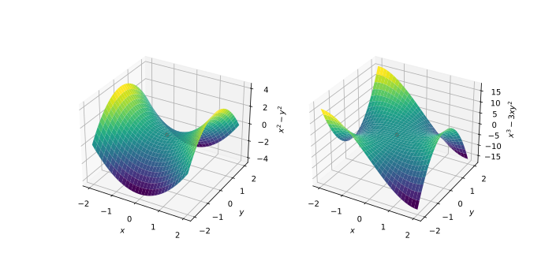

### Saddle points

Saddle point pose a particular challenge in non-linear optimisation, particularly in 
higher dimensions. The plots below show two examples of saddle points in two dimensions. 
Like local minima and maxima, these are stationary points where the gradient of the 
function is zero $\nabla f = 0$, but where the value of the function rises along certain 
directions and reduces along others (left plot). An alternative type of saddle point 
arises when the hessian is singular, and are characterised by a plateau around the 
stationary point, like the [monkey saddle](https://en.wikipedia.org/wiki/Monkey_saddle) 
depicted in the plot to the right. 



Near the location of the critical point, the function $f$ can be restated using the quadratic form like so (see also [Pascanu, Dauphin and Ganguli 2014](https://arxiv.org/abs/1405.4604)):

$$
f(\mathbf{\theta}^\star + \delta \mathbf{\theta}) = f(\mathbf{\theta}^\star)  + \frac{1}{2} \sum_{i=1}^{n_\theta} \lambda_i \delta \mathbf{v}^2_i
$$

where $\lambda_i$ is the $i$th eigenvalue of the Hessian, and $\nabla \mathbf{v}_i$ is the motion of $\delta \mathbf{\theta}$ along the $i$th eigenvector of
the Hessian.  If the $i$th eigenvalue is negative/positive then along the $i$th
eigenvector the function $f$ will achieve a maximum/minimum at $\mathbf{\theta}^\star$.

*Gradient descent* algorithms will move away or towards $\mathbf{\theta}^\star$ with a
step given by $-\lambda_i \delta \mathbf{v}_i$. So for negative eigenvalues the
motion will be towards lower values of $f$ *away* from $\mathbf{\theta}^\star$. For
positive eigenvalues the motion will be towards lower values of $f$ *towards*
$\mathbf{\theta}^\star$. The problem here is the size of the step, which
is very small for small values of $\lambda_i$.

*Newton methods* rescale the step size by $\lambda_i$ so that it becomes
$-\delta \mathbf{v}_i$. For negative eigenvalues, this has the undesirable
characteristic that these methods move towards *increasing* values of $f$ (i.e.
towards the critical point) along corresponding eigenvectors. Since for 
positive eigenvalues it is *also* moving towards the critical point, this means
that saddle points act as *attractors* for these types of methods.

*Trust region methods* restate the optimisation problem as a sequence of
optimisations of a second order approximation to 
$f$ in a local *trust-region* surrounding the current point $a_k$. The exact
solution to each of these subproblems can be shown to be 
$(\nabla^2 f(a_k) + \lambda_t I)^{-1} \nabla f(a_k)$, where the value of $\lambda_t$ is related to
the size of the trust region. In comparison with the previous methods above,
this is equivilent to moving with a step given by 
$-\frac{\lambda_i}{\lambda_i + \lambda_t}\delta \mathbf{v}_i$. As long as $\lambda_t$ is chosen to be larger
than the most negative eigenvalue then the direction of each step is now always
towards more negative values of $f$. As long as $\lambda_t$ is small 
compared with $\lambda_i$ then we avoid the small step sizes associated with
gradient descent.  

### Trust region methods

Like many line search methods, trust region methods also use the second order Taylor 
expansion of $f$ around $a_k$

$$
f(a_k + p) \approx f(a_k) + g_k^T p + \frac{1}{2} p^T B_k p = m_k(p)
$$

where $g_k = \nabla f(a_k)$, $B_k$ is an approximation to the hessian matrix $B_k 
\approx \nabla^2 f(a_k)$ or the hessian itself $B_k = \nabla^2 f(a_k)$. Trust region 
methods aim to find the $p$ that minimises $m_k$ in a local trust region  $||p|| < 
\Delta_k$ around the current point $a_k$, where $\Delta_k$ is the trust region radius. 

Solving the minimisation given above is normally done approximately, with different 
trust region methods varying how the approximation is achieved. Choosing the 
trust-region radius is fundamental to this class of methods, and is done by comparing 
the actual to the predicted reduction in the function value

$$
\rho_k = \frac{f(a_k) - f(a_k + p_k)}{m_k(0) - m_k(p_k)}.
$$

Since $m_k(0) - m_k(p_k)$ is always positive, if $\rho_k$ is negative then the actual 
function value is increasing, the step is rejected and the trust region radius 
$\Delta_k$ is decreased in order to improve the approximate model $m_k$. If $\rho_k$ is 
positive but much smaller than one then we do not alter $\Delta_k$. If $\rho_k$ is close 
to or greater than 1 we can be confident in our model and thus increase $\Delta_k$. The 
general algorithm for a trust region method (reproduced from the text by Nocedal and 
Wright cited below) is:

### Trust region algorithm

Given $a_0$, $\hat{\Delta} > 0$, $\Delta_0 \in (0, \hat{\Delta})$, and $\nu \in [0, 
\frac{1}{4})$:

**for** $k = 0, 1, 2, ...$   
>  Obtain $p_k$ by (approximately) minimising $m_k(p)$ where $||p|| < \Delta_k$   
>  $\rho_k := \frac{f(a_k) - f(a_k + p_k)}{m_k(0) - m_k(p_k)}$   
>  **if** $\rho_k < \frac{1}{4}$   
>>   $\Delta\_{k+1} := \frac{1}{4} \Delta_k$    

>  **else**     
>>   **if** $\rho_k > \frac{3}{4}$ and $||p_k|| = \Delta_k$   
>>>    $\Delta\_{k+1} := \min(2 \Delta_k, \hat{\Delta})$   

>>   **else**   
>>>    $\Delta\_{k+1} := \Delta_k$   

>  **if** $\rho\_k > \nu$   
>>   $a\_{k+1} := a_k + p_k$  

>  **else**   
>>   $a\_{k+1} := a_k$  

**end for**   

### Solving the trust region subproblem

We will describe two algorithms for minimising $m_k(p)$, the *Cauchy point* and the 
*dogleg* methods. The Cauchy point first solves a linear version of $m_k$ defined as

$$
p^s_k = \min_{p \in \mathcal{R}^n} f(a_k) + g_k^T p \text{ for }||p|| \le \Delta_k
$$

Subsequently, $p^s_k$ is used to find the scalar $\tau_k > 0$ such that

$$
\tau_k = \min_{\tau \ge 0} m_k(\tau p_k^s) \text{ for }||\tau p_k^s|| \le \Delta_k
$$

Finally, the Cauchy point is given as $p_k^C = \tau_k p_k^s$.

The solution to this problem can be shown to be

$$
p_k^C = -\tau_k \frac{\Delta_k}{|| g_k ||} g_k,
$$

where 

$$
\tau_k = \begin{cases}
1 & \text{if }g_k^T B_k g_k \le 0 \\
\min (||g_k||^3 / (\Delta_k g_k^T B_k g_k), 1) & \text{otherwise}.
\end{cases}
$$

The second method we describe is the *dogleg* method, which is applicable when $B_k$ is 
a positive definite matrix. If the original hessian is positive definite then this 
method is directly applicable, or one of the quasi-Newton positive definite 
approximation to the hessian could also be used. The dogleg method is derived by 
considering the path of the $p$ that minimises $m_k(p)$ with increasing $\Delta_k$, 
which forms a curved path in parameter space. The method approximates this path with two 
straight line segments. The first segment follows the steepest descent direction and is 
given by

$$
p_k^U = -\frac{g_k^T g_k}{g_k^T B_k g_k} g_k
$$

The second step is along the path between $p_k^U$ and $p^B_k = -B_k^{-1} g_k$. In the 
case where $p_k^B$ is *inside* the trust region $||p_k^B|| \le \Delta_k$ then $p_k^B$ 
can be used without modification. Otherwise the point of intersection with the 
trust-region radius must be calculated, which can be done by solving the following 
quadratic equation


$$
||p_k^U + (\tau - 1)(p_k^B - p_k^U)||^2 = \Delta_k^2
$$

with the second segment being defined by

$$
\tilde{p}_k(\tau) = \begin{cases}
\tau p_k^U, & 0 \le \tau 1, \\
p_k^U + (\tau - 1)(p_k^B - p_k^U), & 1 \le \tau \le 2.
\end{cases}
$$


### Problems

::::challenge{id="the-dog-leg" title="The Dog Leg"}

1. Let $f(x) = 10 \left( x_2 − x^2_1 \right)^2 + (1 − x_1)^2$. At $x = (0,−1)$ draw the 
   contour lines of the quadratic model 
   
   $$
   m_k(p) = f(a_k) + g_k^T p + \frac{1}{2} p^T B_k p,
   $$
   
   assuming that $B\_k$ is the Hessian of $f$. Draw the family of solutions of $\min_{p 
   \in \mathcal{R}^n}m_k(p)$ so that $||p|| \le \Delta_k$  as the trust region radius 
   varies from $\Delta_k = 0$ to $\Delta_k = 2$. Repeat this at $x = (0, 0.5)$.

:::solution

```python
import numpy as np
import matplotlib.pylab as plt

def f(x):
    return 10*(x[1] - x[0]**2)**2 + (1-x[0])**2

def grad_f(x):
    return np.array([
        40*x[0] * (x[0]**2 - x[1]) + 2*x[0] - 2,
        -20*x[0]**2 + 20*x[1]
    ])

def hessian_f(x):
    return np.array([
        [120 * x[0]**2 - 40*x[1] + 2, -40*x[0]],
        [-40*x[0], 20],
    ])

# plot contours
x = np.linspace(-0.5, 2.0, 100)
y = np.linspace(-1.5, 2.0, 100)
X, Y = np.meshgrid(x, y)
Z = f([X, Y])
plt.contour(X, Y, Z, levels=30)
min_x = np.array([1., 1.])

for x0 in [np.array([0., -1.]), np.array([0., 0.5])]:
    N = 20
    x = np.empty((N, 2), dtype=float)
    plt.plot(x0[0], x0[1], '.')
    plt.plot(min_x[0], min_x[1], '+')
    for i, delta in enumerate(np.linspace(1e-3, 2, N)):
        # if minimum of f is within radius, this is the min point, otherwise it is
        # somewhere on the border of the search radius
        if np.sum((min_x - x0)**2) < delta**2:
            x[i, :] = min_x
        else:
            min_f = 1e10
            for omega in np.linspace(0, 2*np.pi, 200):
                test_x = x0 + delta * np.array([np.cos(omega), np.sin(omega)])
                test_f = f(test_x)
                if test_f < min_f:
                    x[i, :] = test_x
                    min_f = test_f
    plt.plot(x[:, 0], x[:, 1], '-.', linewidth=2)

plt.show()
```
:::
::::


::::challenge{id="dogleg-method" title="Dogleg method"}

2. Write a program that implements the dogleg method. Choose $B_k$ to be the exact 
   Hessian. Apply it to minimise the function in (1) from the same two starting 
   points. If you wish, experiment with the update rule for the trust region by 
   changing the constants in the trust region algorithm given above, or by designing 
   your own rules.
   
:::solution
```python
def line_sphere_intersect(o, u, r2):
    """
    algorithm from https://en.wikipedia.org/wiki/Line%E2%80%93sphere_intersection

    here we assume that the line intersects the sphere, and we are only interested in
    the most positive solution
    """
    u_dot_o = u.dot(o)
    det = u_dot_o**2 - (np.dot(o, o) - r2)
    return -u_dot_o + np.sqrt(det)

def dogleg(delta, g, B, x0):
    """
    implements the dogleg method of minimising m(p)

    returns min p and a boolean that is True if min p lies on the trust region border
    """
    delta2 = delta**2
    pB = - np.linalg.solve(B, g)

    # if pB is within trust region then use that
    if np.dot(pB, pB) < delta2:
        return pB, False

    pU = - np.dot(g, g) / np.dot(g, B @ g) * g

    # find intersection of segment x0 -> pU -> pB with trust region
    if np.dot(pU, pU) > delta2:
        u = (pU - x0) / np.linalg.norm(pU - x0)
        intersect = line_sphere_intersect(x0, u, delta2)
        return x0 + intersect * u, True
    else:
        u = (pB - pU) / np.linalg.norm(pB - pU)
        intersect = line_sphere_intersect(pU, u, delta2)
        return pU + intersect * u , True


def minimise(f, grad_f, hessian_f, x0, tol=1e-5, max_iter=1000):
    nu = 0.2
    delta_hat = 1.0
    delta = delta_hat
    a = np.copy(x0)
    a_store = np.empty((max_iter+1, len(x0)), dtype=float)
    a_store[0, :] = a
    j = 1
    for i in range(max_iter):
        g = grad_f(a)
        B = hessian_f(a)
        f_a = f(a)
        p, p_equal_delta = dogleg(delta, g, B, a)
        rho = (f_a - f(a + p)) / (-g.dot(p) - 0.5*p.dot(B @ p))
        if rho < 0.25:
            delta *= 0.25
        else:
            if rho > 0.75 and p_equal_delta:
                delta = min(2*delta, delta_hat)
        if rho > nu:
            a += p
            a_store[j, :] = a
            j += 1
            if np.linalg.norm(p) < tol:
                break
    return a_store[:j, :]

# plot contours
x = np.linspace(-0.5, 2.0, 100)
y = np.linspace(-1.5, 2.0, 100)
X, Y = np.meshgrid(x, y)
Z = f([X, Y])
plt.contour(X, Y, Z, levels=30)
min_x = np.array([1., 1.])

# do the minimisation for both points and plot all iterations
for x0 in [np.array([0., -1.]), np.array([0., 0.5])]:
    plt.plot(x0[0], x0[1], '.')
    plt.plot(min_x[0], min_x[1], '+')
    a_store = minimise(f, grad_f, hessian_f, x0)
    print('done in', a_store.shape[0], 'iterations')
    plt.plot(a_store[:, 0], a_store[:, 1])

plt.show()
```
:::
::::
