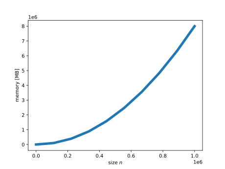

## Why sparse matrices

Taking advantage of any special structure in the matrix of interest is always of great
importance when designing a linear algebra algorithm/solver. Thus far we have discussed
special structures such as symmetric or positive definite matrices, but one of the most
common matrix structures in scientific computing is that of a *sparse matrix*, or a
matrix containing many zero elements. Since zeros can be ignored in many computations,
for example multiplication or addition, a sparse matrix will specify a special data
structure so that only the *non-zero* elements of the matrix are actually stored and
used in computation. Note also that a sparse matrix can itself be symmetric or positive
definite, and it is often necessary to take all these properties into account when
designing your algorithm.

The most obvious benefit of a sparse matrix is low memory usage. A dense matrix needs to
store all the elements of a matrix of size $n$, and thus the memory requirements scale
as $\mathcal{O}(n^2)$. For example, the following show the memory requirements of a
matrix of double precision numbers (taken from the excellent
[scipy-lectures](http://scipy-lectures.org/advanced/scipy_sparse/introduction.html#why-sparse-matrices)

A sparse matrix only stores non-zero elements, and in many different applications this
represents a huge memory saving as matrices are often very sparse, holding only a few
non-zero elements. Some typical applications are:

- solution of partial differential equations (PDEs), such as the finite difference
  method illustrated below
- applications of graphs or networks (e.g. electrical networks, website links), where
  non-zero elements of the matrix represent edges between nodes

Note that while a sparse matrix has obvious benefits in terms of matrix multiplication,
where the zero elements can simply be ignored, direct solver algorithms such as $LU$
decomposition for the problem $Ax = b$, where $A$ is sparse, need considerably more
thought as the zeros in $A$ can have propagating effects, and there is no guarantee that
the decomposition of a $A$ or its inverse will be itself sparse, there can be a
significant amount of what is known as *fill-in* (i.e. non-zero elements where there
were zeros in the original matrix). This fact motivates a separate class of *iterative*
(as opposed to *direct*) solvers that only rely on the matrix multiplication of $A$ with
a vector, ignoring the internal sparsity structure of $A$ and only taking advantage of
the increased speed of the matrix multiplication itself. These iterative solvers will be
covered in the following chapter, but in this chapter we will focus on the practical
requirements of constructing and using sparse matrices using the `scipy.sparse` library.
