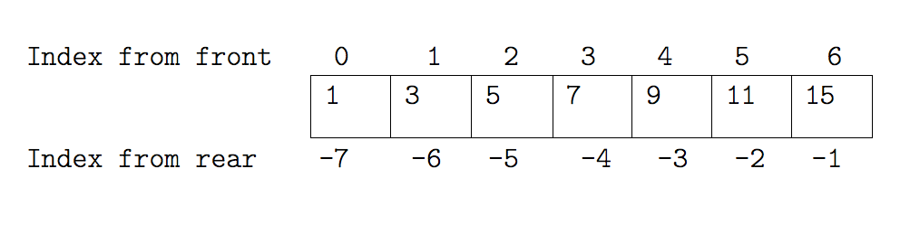

_Container_ types are those that can hold other objects, and C++ supports a number of
different [containers](https://cplusplus.com/reference/stl/) we can use to hold
data of differing types in a multitude of ways.

## Vector and Arrays

One of the most fundamental data structures in any language is the array, used to hold
many values at once in a contiguous region of memory. There are two array containers in
C++, depending on if you have a fixed sized array (`std::array`), or variable sized
(`std::vector`). When using these a user needs to specify the type of value held by that
container, and for the `std::array` you also need to specify the length. For example, to
define a `std::vector` of `double` values you could write

```cpp
std::vector<double> x;
```

or a `std::array` of five `int` values is declared as:

```cpp
std::array<int, 5> y;
```

The angle bracket syntax here is an example of using _templates_ in C++, and both
`std::vector` and `std::array` are examples of _templated_ classes. Templates in C++ are
a form of _generic programming_, and allow us to write classes (and functions) that can
accept many different types. All the container in C++ need to be able to hold any type
of value, and therefore all of the container types in C++ are templated on the value
type. The `std::array` class represents an array with a pre-defined size, and so this
size is another template argument. Note that unlike arguments to functions, all
template arguments must be know _at compile time_.

Since `std::array` has more limited use compared with `std::vector`, we will focus the
remainder of this section on `std::vector`. The interface to `std::array` is very
similar, and you can read about this particular container on [its cpp reference page](https://en.cppreference.com/w/cpp/container/array).
We will also from here on refer to `std::vector` as a vector, rather than the more general term "array", to match
with the name of the class itself.

### Creating and Extracting Things from Vectors

To define a vector initialised to a list of values, we can simply write a comma
separated list of items in curly brackets. We can also define a two dimensional vector
by defining a "vector of vectors".

```cpp
std::vector<int> odds = {1, 3, 5, 7, 9, 11, 15};
std::vector<std::vector<int>> more_numbers = { {1, 2}, {3, 4, 5}, { {6, 7}, {8} } }
```

We can see that our multi-dimensional vector can contain elements themselves of any size
and depth. This could be used as way of representing matrices, but later we'll learn a
better way to represent these.

This curly bracket syntax is for representing _initializer lists_ in C++. These
initializer lists can only be used when initialising, or constructing, an instance of a
class, and cannot be used once the instance has been already created. For example, the
following code will give a compile error:

```cpp
std::vector<int> odds;
odds = {1, 3, 5, 7, 9, 11, 15};
```

Note that every value in a vector must be of the same type, and this must match the type
that the `std::vector` is templated on.

We can select individual elements from vectors by indexing them. Looking at our `odds`
vector:



For example:

```cpp
std::cout << odds[0] << ' ' << odds[odds.size() - 1] << std::endl;
```

This will print the first and last elements of a vector:

```text
1 15
```

We can replace elements within a specific part of the vector (note that in C++,
indexes start at 0):

```cpp
odds[6] = 13;
```

To add elements to the _end_ of the vector use `push_back`, remove elements from
the _end_ of the vector using `pop_back`. You can resize the vector using
`resize`. Get the current size of the vector using `size`.

```cpp
std::vector<double> x;
x.push_back(1.0);
x.push_back(2.0); // x holds {1.0, 2.0}
x.pop_back();     // x holds {1.0}
x.resize(3);      // x holds {1.0, ?, ?}

std::cout << x.size() << std::endl; // 3
```

## Loop or iterate over a Vector

Every container in C++ defines its own _iterators_, which can be used to iterate
over that container.

```cpp
for (std::vector<double>::iterator i = x.begin();
     i != x.end(); ++i) {
   std::cout << *i << std::endl;
}
```

An iterator acts like a pointer to each element of the vector, and thus it can be
dereferenced using `*` to obtain a reference to the value pointed to.

We can simplify this rather verbose iterator classname by using the `auto`{.Cpp}
keyword. This tells the compiler to infer the
correct type (i.e. what is returned from `x.begin()`{.Cpp}:

```cpp
for (auto i = x.begin(); i != x.end(); ++i)
{
   std::cout << *i << std::endl;
}
```

Another `for` loop in C++ is the _range-based_ loop, and these have the most compact
syntax, and work with any container that has `begin` and `end` methods.

```cpp
std::vector<double> x = {1.0, 2.0, 3.0, 4.0};
for (double i: x)
{
   std::cout << i << std::endl;
}
```

You can also use `auto`{.Cpp} here to simplify things...

```cpp
for (auto i: x)
{
   std::cout << i << std::endl;
}
```

The previous code snippet could not alter the contents of the vector
because `i` was a _copy_ of each element of x. You can instead make `i` a
reference to either edit values

```cpp
for (auto& i: x)
{
    i = 1.0; // set each element to 1.0
}
```

or to provide a constant reference to each value (thus avoiding any copies)

```cpp
for (const auto& i: x)
{
    std::cout << i << std::endl; // print each element to the console
}
```

::::challenge{id=dot_product title="Dot Product" }

Write code to calculate the scalar (dot) product of two `std::vector<double>` variables

:::solution

```cpp
std::vector<double> x = {1.0, 2.0, 3.0};
std::vector<double> y = {1.0, 2.0, 3.0};

assert(x.size() == y.size());
double dot = 0.0;
for (int i = 0; i < x.size(); ++i) {
  dot += x[i]*y[i];
}

std::cout << "dot with vectors = "<< dot << std::endl;
```

:::
::::

::::challenge{id=matrix_multiply title="Matrix multiply" }

Write code to multiply two 3 x 3 matrices $C = AB$ using `std::array`. Think about how you would
store your matrices. You could use a flat array `std::array<double, 9>`, or
you could use nested arrays `std::array<std::array<double, 3>, 3>`. Output the
result in a nicely formatted way, for example:

```text
C =
| 1, 2, 3 |
| 4, 5, 6 |
| 7, 8, 9 |
```

:::solution

```cpp
std::array<std::array<double,3>,3> A = {{{5, 8, 2}, {8, 3, 1}, {5, 3, 9}}};
std::array<std::array<double,3>,3> B = {{{1, 0, 0}, {0, 1, 0}, {0, 0, 1}}};
std::array<std::array<double,3>,3> C = {};

for (int i = 0; i < 3; ++i) {
  for (int j = 0; j < 3; ++j) {
    for (int k = 0; k < 3; ++k) {
      C[i][j] += A[i][k] * B[k][j];
    }
  }
}

std::cout << "C = " << std::endl;
for (int i = 0; i < 3; ++i) {
  std::cout << "| ";
  for (int j = 0; j < 3; ++j) {
    std::cout << C[i][j];
    if (j == 2) {
      std::cout << " |" << std::endl;
    } else {
      std::cout << ", ";
    }
  }
}
```

:::

### Deleting Values, big-O notation and std::list

Deleting elements from the end of a vector is simple and fast and can be done using the
`pop_back` function, which takes constant, or $\mathcal{O}(1)$ time using big-O notation. This
means that the time taken is a constant or fixed amount of time independent of the size
of the vector. Deleting elements from the _start_ or _middle_ of the vector is more
difficult. An vector in C++ is an implementation of an _array_ data structure, and
therefore the values contained occupy a _contiguous_ section of memory, the start of
which is also the start of the vector. When deleting an element from the start or
middle, the remainder of the vector must be shifted down to maintain the contiguous
nature of the vector and the alignment of the first element to the start of the
allocated memory. Therefore deleting elmements from the start or middle of a vector
takes an amount of time that scales linearly with the size of the vector $n$, or
$\mathcal{O}(n)$ time.

For example, if we want to delete an element from the middle of a vector while
preserving the order of the elements, we can do the
following:

```cpp
std::vector<int> x = {1, 2, 3, 4};
auto delete_this = x.begin() + 1; // an iterator to "2"
for (auto i = x.begin(); i != x.end(); i++) {
  if (i >= delete_this) {
    *i = *(i + 1);
  }
}
x.resize(x.size() - 1);
std::cout << "[";
for (auto i = x.begin(); i != x.end(); i++) {
  std::cout << *i << ", ";
}
std::cout << "]" << std::endl;
```

Notice that this requires a loop through all the elements of the vector, hence the time
taken is $\mathcal{O}(n)$. The output of this program will show us the vector with a '2'
removed:

```text
[1, 3, 4, ]
```

A linked list is a data structure that provides constant-time insertion or deletion of
elements in the middle/start of the container. The C++ implmentation of a linked list is `std::list`, which you can use like this:

```cpp
std::list<int> x = {1, 2, 3, 4};
auto delete_this = x.begin() + 1; // an iterator to "2"
x.erase(delete_this);

std::cout << "[";
for (auto i = x.begin(); i != x.end(); i++) {
  std::cout << *i << ", ";
}
std::cout << "]" << std::endl;
```

## Move semantics for containers

Recall that we can use `std::move` to move rather than copy values in C++. This
is often useful to efficiently move values into a container without the expense
of copying them, e.g.

```cpp
std::string war_and_peace = "....";
std::string moby_dick = "....";
std::list books;
books.push_back(std::move(war_and_peace));
books.push_back(std::move(moby_dick));
```

## Memory allocation and iterator invalidation

Each container manages its own memory via an allocator class (one of the
template arguements to each container). When using the `std::vector` class, it
is useful to have an awareness of how this allocation works. Generally
the memory allocation is handled automatically by the allocator, which reserves a
certain amount of memory (its capacity) which might be greater than the size of
the vector. Whenever the size of the vector exceeds this capacity the allocator
reallocates the memory for that vector, reserving a greater amount.

```cpp
std::vector<int> x;
int old_capacity = x.capacity();
for (int i = 0; i < 3000; i++) {
  x.push_back(1);
  if (old_capacity != x.capacity()) {
    old_capacity = x.capacity();
    std::cout << "Size = " << x.size() << " Capacity = " << x.capacity() << std::endl;
  }
}
```

```text
Size = 1 Capacity = 1
Size = 2 Capacity = 2
Size = 3 Capacity = 4
Size = 5 Capacity = 8
Size = 9 Capacity = 16
Size = 17 Capacity = 32
Size = 33 Capacity = 64
Size = 65 Capacity = 128
Size = 129 Capacity = 256
Size = 257 Capacity = 512
Size = 513 Capacity = 1024
Size = 1025 Capacity = 2048
Size = 2049 Capacity = 4096
```

Memory allocations are in general slow, so if the user has knowledge of the
neccessary size of the vector, then this process can be optimised by reserving
the correct amount of memory using `std::vector::reserve()`{.cpp}

```cpp
std::vector<int> x;
x.reserve(3000);
```

Another implication of memory reallocation for any container is that memory
reallocation neccessarily invalidates any iterators currently pointing at
specific elements (since they are now at a new memory address). This can be a
source of bugs, so be aware that growing or resizing a vector can invalidate
your iterators!

```cpp
std::vector<int> data = {1, 2, 3, 4};
// keep track of how much data we've already processed
auto processed = data.begin();
for (; processed != data.end(); processed++) {
  process_data(*processed);
}

// add some new data
for (int i = 0; i < 10; i++) {
  data.push_back(i);
}

// processed iterator might be invalid, so we might not be processing the new data
for (; processed != data.end(); processed++) {
  process_data(*processed);
}
```

If the function `process_data` prints out the value given, then the output
might look like the below. In this case the reallocated vector has been moved
to a section of memory far away from the original location, and all the
intermediate memory locations are processed as well as the vector itself:

```text
1 2 3 4 0 0 1041 0 540155953 540287027 540024880 825503793 891301920 892416052 859126069 808727840 808925234 891303730 842018868 808990772 892483616 926101557 941634361 808661305 808597809 842610720 808857908 941634101 842086709 959852598 942684192 943141431 941633588 842610736 875770421 825833504 926101555 941633587 825242164 943077432 942684192 925907257 941634103 942944825 909194803 909261088 892416049 958412597 859189556 825635636 942684192 858863158 941634864 959789104 959461431 842283040 925905206 941633586 892876848 942684471 825506080 825504566 941633840 942682676 959461174 959789344 892482872 958412857 943075892 842608948 859060512 875639857 958411059 859189556 943207731 842283040 925905206 941635123 926364983 825373744 892483616 892547896 958411824 808531506 892679473 825506080 892547894 941635384 875705650 875966770 859060512 876033840 958411315 943075892 842608948 892483872 842477625 958412597 859189556 858796340 842283296 942945337 958412082 959527216 858798132 959461664 808531506 941635640 825504313 959721526 943012128 892481844 941635385 942750005 909456697 892483616 909456182 958412339 943075892 842608948 943011872 825439800 958412853 859189556 875968564 959789344 825833527 958411824 909392181 825439281 842283040 808663090 958410804 809055538 909128245 825506080 892547894 941635128 926429753 942946358 842283296 875837494 941633847 808793394 808988726 892483616 892612661 958412342 859189556 808728627 842283296 909260854 958412343 909392181 876032305 959789344 859387959 941634612 942944825 842479666 943012128 942813492 958412597 925905716 842610741 842283040 959983670 941635636 909130037 842085680 892811296 943272758 958412597 825505845 959787057 959789088 891303992 808661305 842610995 942684192 858863158 941634864 825635380 892942640 842283296 825505846 941634105 909654069 943010099 825506080 942945078 941634614 859190578 808989493 842610720 909259833 941633588 942813748 909718067 892483616 943009845 958412340 859189556 892350772 959461664 808727862 958413110 825242420 960049200 892483616 808857653 958410808 876163636 943140917 825506080 909390646 941634609 959527221 943142192 942684192 876165177 941634361 825635380 808597296 959461664 943273266 958411571 859189556 943207731 842283296 926101816 958412852 825702704 926298168 842610720 909326388 958412337 808465204 892614713 943012128 858927412 941633588 942750005 909456697 842610720 925906227 958411319 909392181 875968049 942684192 943141431 958411318 825505845 808530227 892483616 875705394 958410802 875573302 808464953 842610720 909326388 941635121 892876848 859125303 0 0 49 0 1641085147 5 469321016 -564037215 0 1 2 3 0 0 81 0 1 2 3 4 0 1 2 3 4 5 6 7 8 9
```

## Strings as Containers

Conceptually, a string is a type of container, in this case of letters. The
`std::string`{.cpp} class is the standard implementation of a string class in
C++. The `std::string`{.cpp} container class has most of the same iterators and
functions as `std::vector`{.cpp} and behaves in a very similar way:

```cpp
#include <string>

//...

std::string element = "oxygen";
element.push_back('!');
std::cout << element[1] << ' ';
for (auto i = element.begin(); i != element.end(); i++) {
  std::cout << *i;
}
std::cout << std::endl;
```

gives the output

```text
x oxygen!
```

As well as acting like a vector, `std::string`{.cpp} also has some useful
string-specific functionality, like being able to concatenate strings, to find
and extract substrings or to easily print out to screen

```cpp
using namespace std::string_literals;

const std::string oxygen = "oxygen"; // initialise with a const char *
const std::string hydrogen = "hydrogen"s; // initialise using a string literal
const std::string water = hydrogen + '-' + oxygen + '-' + hydrogen;
std::string::size_type first_dash = water.find("-");
const auto first_hydrogen = water.substr(0, first_dash); // first_hydrogen is a std::string

std::cout << "water is " << water << std::endl;
std::cout << "first element in water is " << first_hydrogen << std::endl;
```

```text
water is hydrogen-oxygen-hydrogen
first element in water is hydrogen
```

## Map and Set

The standard map class in C++ is `std::map`{.cpp}

This is also known as an "associative array", "dictionary" or "hashmap" in
other languages. The `std::map`{.cpp} class implements an ordered map, if you
wish to use an unordered map use `std::unordered_map`{.cpp}.

A map is templated on two types, one is the key type that we use to index the
map, the other is the value type that is stored in the map. The `std::map`
class implements a mapping between the key type to the value type. For example,
we can store and access the populations of various UK cities like so:

```cpp
#include <map>

//...

std::map<std::string, size_t> populations = {
  {"Liverpool", 467995},
  {"Edinburgh", 448850},
  {"Manchester", 430818}
};

populations.insert({"Oxford", 137343});

for (const auto& [key, value] : populations) {
  std::cout << '[' << key << "] = " << value << "; ";
}
std::cout << std::endl;

const auto key = "Liverpool";
std::cout << "The population of " << key << " is " << populations[key] << std::endl;
```

```text
[Edinburgh] = 448850; [Liverpool] = 467995; [Manchester] = 430818; [Oxford] = 137343;
The population of Liverpool is 467995
```

A set is similar to a map that only contains keys (no values). The C++
implementation of a set is `std::set`. Each element of the set is unique (just
like the keys in a map).

## Tuples

A tuple is a fixed-size container of values that can be of _different_ types. It
is most useful for holding a collection of useful variables, or returning
multiple values from a function.

```cpp
std::tuple<std::string, int, std::string> y = {"Apple", 1, "Cherry"};
auto fruits = std::make_tuple(3.14, 2, "Cherry");
```

Values can be obtained from a tuple via _destructuring_. For C++17 and onwards, the syntax is

```cpp
auto [weight, number, name] = fruits;
```

Note that previously the syntax was more cumbersome:

```cpp
double weight;
int number;
std::string name;
std::tie(weight, number, name) = fruits;
```

## General Rule

Your programs will be faster and more readable if you use the appropriate
container type for your data's meaning. For example, always use a set for lists
which can't in principle contain the same data twice, always use a map
for anything which feels like a mapping from keys to values, always use a list over
a vector if you are constantly removing or adding elements from the middle of
the container.

::::challenge{id=data_analysis_containers title="Analysing the IRIS dataset"}

Download the [iris dataset hosted by the UCI Machine Learning Repository](https://archive.ics.uci.edu/ml/machine-learning-databases/iris/iris.data). This is a CSV file with the following columns:

1. sepal length in cm
2. sepal width in cm
3. petal length in cm
4. petal width in cm
5. class:
   -- Iris Setosa
   -- Iris Versicolour
   -- Iris Virginica)\_)

Your goal is to provide minimum and maximum bounds of sepal length for each
class of Iris. Below is an example code for reading in the dataset and printing
it to the screen. Modify this code to initially store the dataset in one or
more `std::vector`'s. Subsequently, calculate the minimum/maximum sepal length
using your data vector(s) and store the result in a `std::map` which maps
class name to min/max bounds.

```cpp
#include <iostream>
#include <string>
#include <fstream>
#include <algorithm>
#include <sstream>


int main() {
  std::ifstream dataset_f("iris.data");
  if (!dataset_f.is_open()) {
    std::cerr << "Failed to open dataset" << std::endl;
    return -1;
  }
  std::string line;
  while (std::getline(dataset_f, line)) {
    if (line.empty()) {
      continue;
    }
    std::replace(line.begin(), line.end(), ',', ' ');

    std::istringstream iss(line);
    double sepal_len, unused;
    std::string iris_class;
    iss >> sepal_len >> unused >> unused >> unused >> iris_class;
    std::cout << sepal_len << ' ' << iris_class << std::endl;
  }
}
```

:::solution

```cpp
#include <iostream>
#include <string>
#include <map>
#include <fstream>
#include <algorithm>
#include <vector>
#include <sstream>


int main() {
  std::ifstream dataset_f("iris.data");
  if (!dataset_f.is_open()) {
    std::cerr << "Failed to open dataset" << std::endl;
    return -1;
  }
  std::string line;
  std::vector<std::tuple<double, std::string>> dataset;
  while (std::getline(dataset_f, line)) {
    if (line.empty()) {
      continue;
    }
    std::replace(line.begin(), line.end(), ',', ' ');

    std::istringstream iss(line);
    double sepal_len, unused;
    std::string iris_class;
    iss >> sepal_len >> unused >> unused >> unused >> iris_class;
    std::cout << sepal_len << ' ' << iris_class << std::endl;
    dataset.push_back(std::make_tuple(sepal_len, iris_class));
  }

  std::map<std::string, std::tuple<double, double>> stats;
  for (const auto& [sepal_len, iris_class]: dataset) {
    if (stats.count(iris_class)) {
      auto& [min, max] = stats[iris_class];
      if (sepal_len < min) {
        min = sepal_len;
      }
      if (sepal_len > max) {
        max = sepal_len;
      }
    } else {
      stats[iris_class] = std::make_tuple(sepal_len, sepal_len);
    }
  }

  for (const auto& [iris_class, bounds]: stats) {
    const auto& [min, max] = bounds;
    std::cout << iris_class << " = (" << min << " - " << max << ")" << std::endl;
  }
}
```

::::
