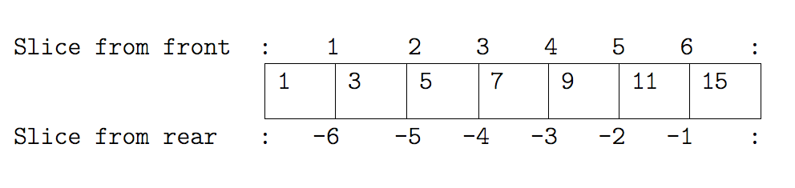

*Container* types are those that can hold other objects, and Python supports a
number of different containers we can use to hold data of differing types in a
multitude of ways.

## Lists

One of the most fundamental data structures in any language is the array, used
to hold many values at once. Python doesn’t have a native array data structure
(the defacto standard is the Numpy `ndarray`, which we will describe later on),
but it has the list which is much more general and can be used as a
multidimensional array quite easily. You'll likely find, for general purposes,
you'll be using lists a lot. How you use them also forms the basis for how you
use more specialised types of containers we'll see later.

### Creating and Extracting Things from Lists

To define a list we simply write a comma separated list of items in square brackets:

~~~python
odds = [1, 3, 5, 7, 9, 11, 15]
more_numbers = [ [1, 2], [3, 4, 5], [ [6, 7], [8] ] ]
~~~

We can see that our multi-dimensional array can contain elements themselves of
any size and depth. This could be used as way of representing matrices, but
later we'll learn a better way to represent these.

A list in Python is just an ordered collection of items which can be of any
type. By comparison, in many languages an array is an ordered collection of
items of a single type - so a list is more flexible than an array.

~~~python
various_things = [1, 2, 'banana', 3.4, [1, 2] ]
~~~

We can select individual elements from lists by indexing them. Looking at our `odds` list:

For example:

~~~python
print(odds[0], odds[-1])
~~~

This will print the first and last elements of a list:

~~~
1 15
~~~

We can replace elements within a specific part of the list (note that in Python, indexes start at 0):

~~~python
odds[6] = 13
~~~

We can also *slice* lists to either extract or set an arbitrary subset of the list.

Note that here, we are selecting the *boundaries* between elements, and not the indexes.

For example, to show us elements 3 to 5 (inclusive) in our list:

~~~python
odds[2:5]
~~~

We select the boundaries `2` and `5`, which produce:

~~~
[5, 7, 9]
~~~

We can also leave out either start or end parts and they will assume their
maximum possible value:

~~~python
odds[5:]
~~~

~~~
[11, 13]
~~~

Or even:

~~~python
odds[:]
~~~

Which will show us the whole list.

~~~
[1, 3, 5, 7, 9, 11, 13]
~~~

::::challenge{id=slicing-from-the-end, title="Sliding from the End"}

Use slicing to access only the last four characters of a string or entries of a list.

~~~python
string_for_slicing = "Observation date: 02-Feb-2013"
list_for_slicing = [["fluorine", "F"],
                    ["chlorine", "Cl"],
                    ["bromine", "Br"],
                    ["iodine", "I"],
                    ["astatine", "At"]]

print(string_for_slicing)
print(list_for_slicing)
~~~

~~~
'Observation date: 02-Feb-2013'
[['fluorine', 'F'], ['chlorine', 'Cl'], ['bromine', 'Br'], ['iodine', 'I'], ['astatine', 'At']]
~~~

So what would you use to see the following?

~~~
'2013'
[['chlorine', 'Cl'], ['bromine', 'Br'], ['iodine', 'I'], ['astatine', 'At']]
~~~

Would your solution work regardless of whether you knew beforehand
the length of the string or list
(e.g. if you wanted to apply the solution to a set of lists of different lengths)?
If not, try to change your approach to make it more robust.

Hint: Remember that indices can be negative as well as positive

:::solution
Use negative indices to count elements from the end of a container (such as list or string):

~~~python
string_for_slicing[-4:]
list_for_slicing[-4:]
~~~
:::
::::

### Strings as Containers

Conceptually, a string is a type of container, in this case of letters. We can also index and slice strings in the same way as a list:

~~~python
element = 'oxygen'
print(element[1], element[0:3], element[3:6])
~~~

~~~
x oxy gen
~~~

:::callout
## Only One Way to do It

Which demonstrates a key design principle behind Python: "there should be one - and preferably only one - obvious way to do it."
"To describe something as 'clever' is not considered a compliment in Python culture." - Alex Martelli, Python Software Foundation Fellow.
:::

:::callout
## Mutability

An important thing to remember is that Python variables are simply *references* to values, and also that they fall into two distinct types:

* Immutable types: value changes by referencing a newly created value (e.g. when adding a letter in a string). Note you cannot change individual elements of an immutable container (e.g. you can't change a single character in a string directly 'in place')
* Mutable types: values can be changed 'in place', e.g. changing or adding an item in a list
:::

This matters when you are 'copying' variables or passing them as arguments to functions.

So since strings are immutable types, we cannot change elements 'in place':

~~~python
element[2] = 'y'
~~~

~~~
Traceback (most recent call last):
  File "<stdin>", line 1, in <module>
TypeError: 'str' object does not support item assignment
~~~

Sometimes it's useful to be able to split a string by a delimiter into a list:

~~~python
str = 'This is a string'
a_list = str.split()
print(a_list)
~~~

~~~
['This', 'is', 'a', 'string']
~~~

We can also join together a list of strings into a single string:

~~~python
new_str = ' '.join(a_list)
print(new_str)
~~~

~~~
This is a string
~~~

### Adding and Deleting Elements

We can also add and delete elements from a Python list at any time:

~~~python
odds.append(21)
del odds[0]
odds
~~~

Which will show us the list with a '21' added to the end and its first element removed:

~~~
[3, 5, 7, 9, 11, 13, 21]
~~~

### Checking an Elements are in a List

We can also check if an element is within a list:

~~~python
9 in odds
~~~

~~~
True
~~~

## Tuples

A tuple is an immutable sequence. It is like a list, in terms of indexing, repetition and nested objects, except it cannot be changed - it's an immutable type. Instead of using square brackets to define them, we use round brackets.

With a single element tuple, you need to end the assignment with a comma.

~~~python
x = 0,
y = ('Apple', 'Banana', 'Cherry')
type(x)
~~~

~~~
<class 'tuple'>
~~~

So similarly to lists for indexing elements:

~~~python
y[1]
~~~

~~~
'Banana'
~~~

But as we mentioned, it's an immutable type:

~~~python
my_tuple = ('Hello', 'World')
my_tuple[0] = 'Goodbye'
~~~

~~~
Traceback (most recent call last):
  File "<stdin>", line 1, in <module>
TypeError: 'tuple' object does not support item assignment
~~~

## Dictionaries

Python supports a container type called a dictionary.

This is also known as an "associative array", "map" or "hash" in other languages. Dictionaries are ordered: elements used to be unordered in older versions of Python, but since version 3.6 they are guaranteed to be ordered.

In a list, we use a number to look up an element:

~~~python
names = 'Martin Luther King'.split(' ')
names[1]
~~~

~~~
'Luther'
~~~

In a dictionary, we look up an element using another object of our choice:

~~~python
me = { 'name': 'Joe', 'age': 39, 
       'Jobs': ['Programmer', 'Teacher'] }
me
~~~

~~~
{'name': 'Joe', 'age': 39, 'Jobs': ['Programmer', 'Teacher']}
~~~

~~~python
me['Jobs']
~~~

~~~
['Programmer', 'Teacher']
~~~

~~~python
me['age']
~~~

~~~
39
~~~

~~~python
type(me)
~~~

~~~
<class 'dict'>
~~~

### Keys and Values

The things we can use to look up with are called keys:

~~~python
me.keys()
~~~

~~~
dict_keys(['name', age', 'Jobs'])
~~~

The things we can look up are called values:

~~~python
me.values()
~~~

~~~
dict_values(['Joe', 39, ['Programmer', 'Teacher']])
~~~

When we test for containment on the dict itself we essentially test on its keys:

~~~python
'Jobs' in me
~~~

~~~
True
~~~

~~~python
'Joe' in me
~~~

~~~
False
~~~

But we can also test on the values of a dict:

~~~python
'Joe' in me.values()
~~~

~~~
True
~~~

### Immutable Keys Only

The way in which dictionaries work is one of the coolest things in computer science: the "hash table". The details of this are beyond the scope of this course, but we will consider some aspects in the section on performance programming.

One consequence of this implementation is that you can only use immutable things as keys.

~~~python
good_match = {
    ("Lamb", "Mint"): True, 
    ("Bacon", "Chocolate"): False
   }
~~~

But:

~~~python
illegal = {
    ["Lamb", "Mint"]: True, 
    ["Bacon", "Chocolate"]: False
   }
~~~

~~~
Traceback (most recent call last):
  File "<stdin>", line 3, in <module>
TypeError: unhashable type: 'list'
~~~

Remember -- square brackets denote lists, round brackets denote tuples.

## Beware 'Copying' of Containers!

Here, note that `y` is not equal to the contents of `x`, it is a second label on the *same object*. So when we change `y`, we are also changing `x`. This is generally true for mutable types in Python.

~~~python
x = [1, 2, 3]
y = x
y[1] = 20
print(x, y)
~~~

~~~
[1, 20, 3] [1, 20, 3]
~~~

Instead, if we wanted to ensure our changes occurred separately on an actual copy of the contents, we could do:

~~~python
x = [1, 2, 3]
y = x[:]
y[1] = 20
print(x, y)
~~~

~~~
[1, 2, 3] [1, 20, 3]
~~~

In this case, we are using `x[:]` to create a new list containing all the elements of `x` which is assigned to `y`. This happens whenever we take any sized slice from a list.

This gets more complicated when we consider nested lists.

~~~python
x = [['a', 'b'] , 'c']
y = x
z = x[:]

x[0][1] = 'd'
z[1] = 'e'

print(x, y, z)
~~~

~~~
[['a', 'd'], 'c'] [['a', 'd'], 'c'] [['a', 'd'], 'e']
~~~

Note that `x` and `y` are the same as we may expect. But `z`, despite being a
copy of `x`'s original contents, now contains `'d'` in its nested list.

The copies that we make through slicing are called shallow copies: we don't copy
all the objects they contain, only the references to them. This is why the
nested list in `x[0]` is not copied, so `z[0]` still refers to it. It is
possible to actually create copies of all the contents, however deeply nested
they are - this is called a *deep copy*. Python provides methods for that in its
standard library in the `copy` module.

## General Rule

Your programs will be faster and more readable if you use the appropriate
container type for your data's meaning. For example, always use a set for lists
which can't in principle contain the same data twice, always use a dictionary
for anything which feels like a mapping from keys to values.

## Key Points:
- Python containers can contain values of any type.
- Lists, sets, and dictionaries are mutable types whose values can be changed after creation.
- Lists store elements as an ordered sequence of potentially non-unique values.
- Dictionaries store elements as unordered key-value pairs.
- Dictionary keys are required to be of an immutable type.
- Sets are an unordered collection of unique elements.
- Containers can contain other containers as elements.
- Use `x[a:b]` to extract a subset of data from `x`, with `a` and `b` representing element *boundaries*, not indexes.
- Tuples are an immutable type whose values cannot be changed after creation and must be re-created.
- Doing `x = y`, where `y` is a container, doesn't copy its elements, it just creates a new reference to it.