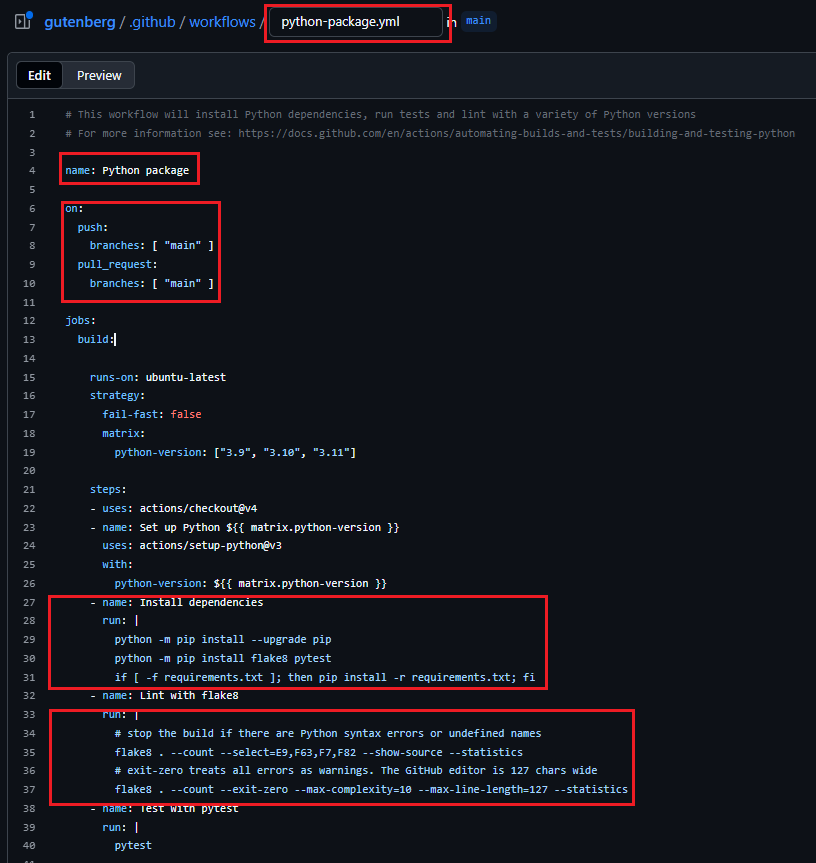

## Overview

With a GitHub repository there's a very easy way to set up CI that runs when your
repository changes: simply add a [.yml file](https://learnxinyminutes.com/docs/yaml/) to your repository in the directory

```text
.github/workflows
```

Each file in this directory represents a _workflow_ and will, when triggered, spin up a virtual machine and run the sequence of commands in the file.

[Information about the specifications of these VMs can be found here](https://docs.github.com/en/free-pro-team@latest/actions/reference/specifications-for-github-hosted-runners).
At the time of writing, each VM will have a 2-core CPU, 7GB of RAM and 14 GB of SSD space available, and each workflow can run for up to 6 hours.

These resources are all free for public repositories, and for private repositories you have a monthly quota of VM-minutes before any payment is required.

In this section you will create several workflows by using the wizard and built-in editor on the GitHub website.

## Creating a basic workflow

We will start with a minimal example to demonstrate various features of a GitHub Actions workflow.
Create a file in your repository called:

```text
.github/workflows/basic.yml
```

Copy the following code, then commit and push the changes to GitHub.

```yml
name: Basic GitHub Actions Workflow

on:
  push:
  pull_request:
  workflow_dispatch:

jobs:
  basic-job:
    runs-on: ubuntu-latest

    steps:
      - name: Run a one-line script
        run: echo "Hello, world!"
```

Here's a brief breakdown of this basic workflow:

1. The `name` field gives your workflow a name. This name will be displayed in the Actions tab of your GitHub repository.

2. The `on` field specifies when your workflow should run. In this case, it's configured to run on `push` events, `pull_request` events, and `workflow_dispatch` events.

3. The `jobs` field describes the jobs that make up your workflow. This workflow includes a single job called `basic-job`.

4. The `runs-on` field inside the `basic-job` job specifies the type of machine to run the job on. Here it is set to run on the latest available version of Ubuntu.

5. The `steps` field is a list of tasks to perform in the job. Each item in the list is a separate task. Here, we have one task that runs a basic shell command (`echo "Hello, world!"`). The `name` field gives the step a name that will be displayed in the GitHub Actions UI.

6. The `run` field specifies the command to run. Here, it's just echoing "Hello, world!" to the console.

If you now navigate to the _Actions_ tab on your GitHub repository, you should see that this workflow has run and succeeded.

In this case it was run because we just pushed a change.
We can also trigger this workflow by opening a pull request, or by navigating to the workflow via the _Actions_ tab and then selecting the _Run Workflow_ dropdown (this is the `workflow_dispatch` trigger).

## Creating a Python-specific workflow

Now let's do something more useful.

Navigate to the GitHub _Actions_ tab and then click _New Workflow_ (near the top left).
This will let us start with a preset workflow containing many of the elements we are interested in.

Search for "python package" and select the following workflow by pressing _Configure_:

```text
Python package
By GitHub Actions

Create and test a Python package on multiple Python versions.
```

This takes us into the web editor.
We will make the following changes to the workflow:

1. change the name to "Python versions", and the filename to `python_versions.yml`

1. add the `workflow_dispatch` trigger, just like in the basic file

1. Change the "Install dependencies" step to run the following block:

   ```bash
           python -m pip install --upgrade pip setuptools wheel
           python -m pip install .[dev]
   ```

1. Change the "Lint with flake8" step to just run `flake8` (with no options at all)



Then use the web interface to commit the changes.
Go over to the _Actions_ tab to see it running.

Let's go through what is happening in this workflow:

The name of this workflow is `Python versions`. It runs whenever there's a push to the `main` branch, a pull request targeting the `main` branch, or on a `workflow_dispatch` trigger.

This workflow only has one job, named `build`, and it runs on the latest version of Ubuntu.

This job utilizes a strategy called a matrix, which allows you to run the same job with different configurations.
In this case, it's set to run the job with three different Python versions - "3.9", "3.10", and "3.11".
The `fail-fast` option is set to `false`, which means that if one version fails, the other versions will continue to run.

This job consists of a series of steps:

1. **Checkout Code:** The first step uses an action, `actions/checkout@v4`, which checks out your repository's code onto the runner, so the job can access it.

2. **Set Up Python:** The next step uses another action, `actions/setup-python@v3`, to set up a Python environment with the version specified in the matrix.

3. **Install Dependencies:** The third step runs a series of shell commands to install Python dependencies. It first updates pip, setuptools, and wheel, then installs the development dependencies for the project using `pip install .[dev]`. If you are unfamiliar with this, look in the repository's `setup.py`, which lists the project dependencies near the bottom.

4. **Lint with flake8:** The fourth step runs the `flake8` linter to check the code for styling errors. `flake8` is a tool for enforcing Python's PEP 8 style guide, and it can find many different types of common problems with your code. You can check the `flake8` configuration for this project in the `.flake8` file in the repository.

5. **Test with pytest:** The last step runs the `pytest` command to execute tests. `pytest` is a Python testing framework.

## Identify and fix the errors

If all has gone to plan, the workflow should fail.

**Now would be a good time to pull changes from GitHub if you are now working from your computer and not in the GitHub web interface.**

::::challenge{id="fix-ci-failure" title="Fix the CI failure"}

Check your GitHub Actions workflow, which should have failed.
Identify why it failed, and fix the problem.

Push your fixed code, and check that the workflow now passes.

:::solution

This one is a simple fix - the code on line 36 of `functionality.py` is over-indented.
Fix the indentation, and that should be enough.

:::
::::

## Create a workflow on multiple operating systems

::::challenge{id="workflow-on-multiple-os" title="Workflow on multiple operating systems"}

Create a similar workflow in a file called `os_versions.yml` that tests the code on a fixed python version, but this time on multiple operating systems.

You may want a matrix, with a list such as `[ubuntu-latest, macos-latest, windows-latest]`.

Push your new workflow, and check that it runs as expected.

:::solution

The full file might look like this:

```yml
# This workflow will install Python dependencies, run tests and lint with a variety of Python versions
# For more information see: https://docs.github.com/en/actions/automating-builds-and-tests/building-and-testing-python

name: Operating systems

on:
  push:
    branches: ["main"]
  pull_request:
    branches: ["main"]
  workflow_dispatch:

jobs:
  build:
    runs-on: ${{ matrix.os }}
    strategy:
      fail-fast: false
      matrix:
        os: [ubuntu-latest, macos-latest, windows-latest]

    steps:
      - uses: actions/checkout@v4
      - name: Set up Python 3.11
        uses: actions/setup-python@v5
        with:
          python-version: "3.11"
      - name: Install dependencies
        run: |
          python -m pip install --upgrade pip setuptools wheel
          python -m pip install .[dev]
      - name: Lint with flake8
        run: |
          flake8
      - name: Test with pytest
        run: |
          pytest
```

:::
::::

## Next steps

1. \[optional\] read more about [GitHub's hosted runners](https://docs.github.com/en/free-pro-team@latest/actions/reference/specifications-for-github-hosted-runners).

1. \[optional\] read more about the [syntax for GitHub Actions](https://docs.github.com/en/free-pro-team@latest/actions/reference/workflow-syntax-for-github-actions).
