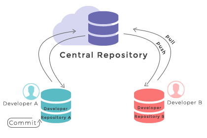

## Collaboration with Git

 Git collaboration diagram](fig/collaboration.png)

Collaboration in Git works by isolating different copies of the repository.
Copies of a repository can be created and updated to keep up to date with
changes or to send local changes to the cloud.

In the image below, adapted from [the wc3 docs Git tutorial](https://www.w3docs.com/learn-Git/Git-repository.html),
Developer A and Developer B are collaborating on a repository
(hosted in the cloud, on GitHub for example). Developer A is making local
local changes, which Developer B will not receive until Developer A has *pushed*
those changes to the cloud and Developer B has *pulled* those changes from the
cloud.

Because of its asynchronous nature, it's much easier to avoid conflicts (where
the two developers have changed the same line of code in different ways) if
each developer works on their own branch. Then, if there are any conflicts,
they can be resolved once, when the branches are merged, rather than having to
be resolved every time one of the developers pushes a change!

## *Clone* a repository

How do Developer A and B get their copies of the central repository in the
first place? They do this using the *clone* operation, which simply copies
the contents of a repository from one place to another.

> ### What else does *clone* do?
> 
> > *Clone* also sets the *remote origin* for the repository so that it remains linked
> > to the repository you cloned. This makes it straightforward to keep your
> > version up to date with the cloud version, and to push your changes to the
> > cloud when you're ready.
> {: .solution}
{: .callout}

## *Pull* and *push*

When Developer A has made their commits to their own branch of the repository,
they can *push* those changes to the cloud. When the cloud has been updated,
Developer B can then *pull* those changes. If Developer A was working on their
own branch, Developer B will get a copy of that branch when they *pull*. If
Developer A *merged* their branch into the `main` branch, then Developer B will
see those changes in the `main` branch, too, and may want to *rebase* any
branches that they're working on to make sure they incorporate the latest
changes that Developer A just made.

## *Remote origin*

The *remote origin* of a repository determines where the *push* and *pull*
operations try to push to and pull from. If Developer A and Developer B both
have repositories with the same *remote origin* (in this case the GitHub cloud),
they can collaborate on the code.

If things are set up in the normal way, by *cloning* a remote repository, then
you should not need to mess around with changing the *remote origin*. It is
useful to know what it is, though, because many Git messages mention the
*remote origin*.

## *Merge conflicts*

Git is very good at following changes made to files. In some cases, however,
it is unable to determine which of two different versions of a line is the
appropriate one. This means it is unable to *merge* the file properly, resulting
in the dreaded *merge conflict*. If you keep your head, however, you'll find
that resolving *merge conflicts* is not as difficult as it appears.

*Merge conflicts* usually arise when modifying an out-of-date branch.
Imagine Developer A and Developer B are working on their own branches, but
some of their changes affect the same line in the same file. Developer A merges
and pushes their changes, and then Developer B pulls those changes and tries
to merge their own changes.

The line that Developer A wrote might be the correct version for the merged
code, or the line that Developer B wrote might be the correct version. It may
be that *both* lines are required to make the software work, or even that
the line needs to be complete rewritten. This is where a human with knowledge
of how the repository works needs to intervene.

Git will show where conflicts have occurred, and it will be up to the developer
to determine what the correct course of action is, and to edit the file to
make those changes.

## *Blame*

*Blame* is a rather pejorative term for a very useful Git function that
shows the last commit to alter any given line of code. GitHub has a
[nice interface for tracking blame](https://github.com/OxfordRSE/oxrse_unit_conv/blame/main/src/oxrse_unit_conv/units.py). It is rare to need to use this, but it is good to know it exists for
when you want to see where changes in the repository happened.
