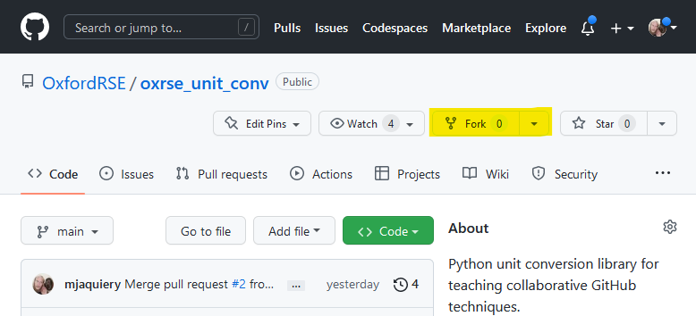
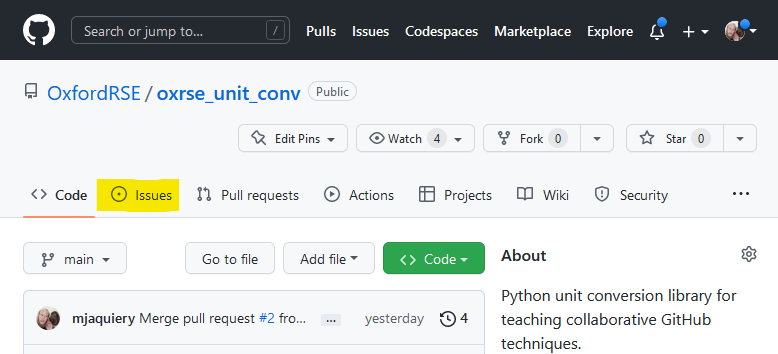
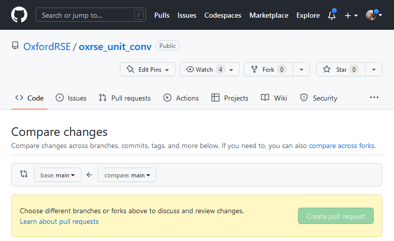

## GitHub

 Git pull request workflow](fig/pull_request.png)

GitHub offers a suite of project management tools alongside a cloud hosting
platform for git projects. Here, we'll cover a few of the key parts of
GitHub that you'll need to know for collaborating.

## *Contributors* and *collaborators*

GitHub grew out of open source software development, so its roots are very
pro collaboration. By default, repositories are **public**, meaning that they
can be viewed and copied by anyone.

Letting people view your repository, and allowing them to make their own copies
to play around with, is usually good thing. But you probably don't want just
anyone to be able to edit **your** copy of the repository!

GitHub uses *contributors* to define anyone who has added a change to a
repository, and *collaborators* to define people who are allowed to change your
version of the code.

## *Forking* repositories

If you're not a *collaborator* on a repository, you can still make changes to
your own copy of a **public** repository. You make your own copy by *forking*
the repository on GitHub. This will create a copy of the repository under your
account, which you can then *clone*, modify, and update. If you make a change
that you're happy with, you can always submit a *pull request* from your fork
back to the original repository to request that they include your code.

We won't cover *forks* here, because on almost all projects you will work on
you will be a *collaborator* with the ability to modify the original remote
repository directly.

## *Issues*

GitHub uses *issues* as its primary project tracking feature. It also has
many other features that do similar things, but *issues* are the most heavily
used.

*Issues* are used to identify areas of improvement for the repository. They
can be anything: bug reports, questions, ideas. Once created, *issues* can be
assigned to developers, marked as 'closed' when no longer relevant, and be
grouped together into larger project features like milestones.

It is very common for repositories to use the *issue* tracker as their primary
means of organisation. Many software and other projects hosted on GitHub will
request that users submit bug reports directly through the *issue* interface.

## *Pull requests*

When working alone, it is common to work only on the `main` branch, or to use
other branches and then *merge* freely whenever you feel like it. When working
collaboratively, a more structured approach is required. The collaborative
version of *merging* is the *pull request* or *PR*.

A *pull request* is a **request** to **pull** the changes in one branch into
another branch. When a *pull request* is created, the two branches are
designated and the code is compared to show what changes will be made to the
target branch (the first one in the figure).

Pull requests on small projects between trusted collaborators may be merged
(i.e. accepted) immediately, while more mature or complex projects may have
processes that need to be completed before a PR is allowed to be merged.
This process is likely to include *code review* and/or automated testing
(*CI/CD*).

## *Code review*

*Code review* is a process of pooling knowledge and experience, and inviting
additional perspectives on changes so that they are more likely to be helpful
and less likely to include mistakes or be written in confusing ways.

GitHub incorporates *code review* as part of the *pull request* framework.
When a *pull request* is opened, a review can be requested from a
*collaborator*. Anyone with the ability to comment on the *pull request* is
able to contribute to the review, whether or not they are invited.

The review happens using the list of changes that are included in the body
of the *pull request*. Any line or section of code can be selected for comment.
Comments should be courteous and constructive. It's fine to include questions
where you don't understand something, or where you want to allow a developer
to consider another perspective without ordering them to change things, but
it should always be clear from a comment what, if anything, you want the
developer to **do** in response.

## *Continuous Integration* and *Continuous Deployment*

GitHub allows all accounts around 3000 hours of virtual machine time per month.
This is used to test (*integration*) and deploy your code. Almost all modern
code should include some tests that guarantee that the code does what it is
supposed to do. These tests can be set up to run automatically, whenever changes
are made to the repository, so that it becomes immediately obvious if a change
is going to introduce a bug.

Many projects are deployed to some or other platform (this tutorial, for
example, runs on [GitHub Pages](https://pages.github.com/)) and its web code
is regenerated automatically whenever the content code is updated.

You do not need a deep knowledge of *CI/CD* on this course, but you should
be aware what they are so that you can pick up the details of the specific
implementation used by any project you collaborate on.
