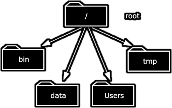
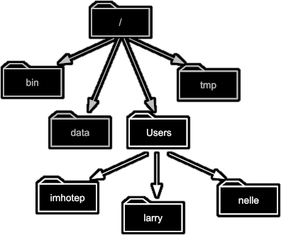
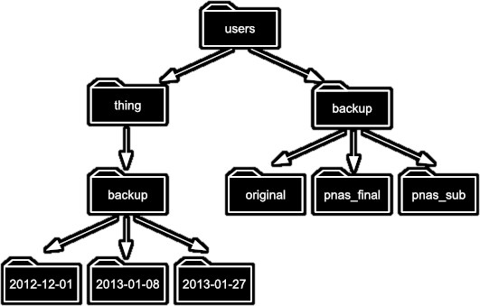

The part of the operating system responsible for managing files and directories is called the **file system**.
It organizes our data into files,
which hold information,
and directories (also called "folders", for example, on Windows systems),
which hold files or other directories.

The shell has a notion of *where you currently are*, and as we'll see, works by running programs at that location. For this reason, the most fundamental skills to using the shell are navigating and browsing the file system, so let's take a look at some important commands that let us do these things.

To start exploring them, let's open a shell window:

~~~bash
$
~~~

The dollar sign is a **prompt**,
which represents our input interface to the shell.
It shows us that the shell is waiting for input;
your shell may show something more elaborate.

### Working out who we are and where we are
Type the command `whoami`,
then press the `Enter` key (sometimes called `Return`) to send the command to the shell.
The command's output is the identity of the current user,
i.e., it shows us who the shell thinks we are (yours will be something different!):

~~~bash
$ whoami
~~~

~~~
nelle
~~~

So what's happening? When we type `whoami` the shell:

1.  Finds a program called `whoami`
2.  Runs that program
3.  Displays that program's output (if there is any), then
4.  Displays a new prompt to tell us that it's ready for more commands

Next, let's find out where we are in our file system by running a command called `pwd`
(which stands for "print working directory").
At any moment,
our **current working directory**
is our current default directory.
This is the directory that the computer assumes we want to run commands in
unless we explicitly specify something else.
Here,
the computer's response is `/Users/nelle`,
which is Nelle's **home directory**:

~~~bash
$ pwd
~~~

~~~
/Users/nelle
~~~

:::callout
## Home directory

The home directory path will look different on different operating systems.
On Linux it will look like `/home/nelle`,
on Git Bash on Windows it will look something like `/c/Users/nelle`,
and on Windows itself it will be similar to `C:\Users\nelle`.
Note that it may also look slightly different for different versions of
Windows.
:::

:::callout
## Alphabet Soup

If the command to find out who we are is `whoami`, the command to find
out where we are ought to be called `whereami`, so why is it `pwd`
instead? The usual answer is that in the early 1970s, when Unix - where the Bash shell originates - was
first being developed, every keystroke counted: the devices of the day
were slow, and backspacing on a teletype was so painful that cutting the
number of keystrokes in order to cut the number of typing mistakes was
actually a win for usability. The reality is that commands were added to
Unix one by one, without any master plan, by people who were immersed in
its jargon. The result is as inconsistent as the roolz uv Inglish
speling, but we're stuck with it now.
:::

:::callout
## Real typing timesavers

Save yourself some unnecessary keypresses!

Using the up and down arrow keys allow you to cycle through your previous
commands - plus, useful if you forget exactly what you typed earlier!

We can also move to the beginning of a line in the shell by typing `^A`
(which means Control-A) and to the end using `^E`. Much quicker on long
lines than just using the left/right arrow keys.
:::

### How file systems are organised

To understand what a "home directory" is,
let's have a look at how the file system as a whole is organized.
At the top is the **root directory**
that holds everything else.
We refer to it using a slash character `/` on its own;
this is the leading slash in `/Users/nelle`.

Let's continue looking at Nelle's hypothetical file system as an example. Inside the `/` directory are several other directories, for example:

So here we have the following directories:

- `bin` (which is where some built-in programs are stored),
- `data` (for miscellaneous data files),
- `Users` (where users' personal directories are located),
- `tmp` (for temporary files that don't need to be stored long-term),

We know that our current working directory `/Users/nelle` is stored inside `/Users`
because `/Users` is the first part of its name.
Similarly,
we know that `/Users` is stored inside the root directory `/`
because its name begins with `/`.

Underneath `/Users`,
we find one directory for each user with an account on this machine, e.g.:
`/Users/imhotep`,
`/Users/larry`,
and ours in `/Users/nelle`,
which is why `nelle` is the last part of the directory's name.

:::callout
## Path

Notice that there are two meanings for the `/` character.
When it appears at the front of a file or directory name,
it refers to the root directory. When it appears *inside* a name,
it's just a separator.
:::

### Listing the contents of directories and moving around

But how can we tell what's in directories, and how can we move around the file system?

We're currently in our home directory, and can see what's in it by running `ls`,
which stands for "listing" (the `...` refers to other files and directories that have been left out for clarity):

~~~bash
$ ls
~~~

~~~
shell-novice       Misc                   Solar.pdf
Applications           Movies                 Teaching
Desktop                Music                  ThunderbirdTemp
Development            Notes.txt              VirtualBox VMs
Documents              Pictures               bin
Downloads              Pizza.cfg              mbox
...
~~~

Of course, this listing will depend on what you have in your own home directory.

If you're using Git Bash on Windows, you'll find that it looks a little different, with characters such as `/` added to some names.
This is because Git Bash automatically tries to highlight the type of thing it is. For example, `/` indicates that entry is a directory.
There's a way to also highlight this on Mac and Linux machines which we'll see shortly!

We need to get into the repository directory `shell-novice`, so what if we want to change our current working directory?
Before we do this,
`pwd` shows us that we're in `/Users/nelle`.

~~~bash
$ pwd
~~~

~~~
/Users/nelle
~~~

Let's first get hold of some example files we can explore. First, download the example zip file to your home directory.
If on WSL or Linux (e.g. Ubuntu or the Ubuntu VM), then do:

~~~bash
$ wget https://www.uhpc-training.co.uk/material/technology_and_tooling/bash_shell/shell-novice.zip
~~~

Or, if on a Mac, do:

~~~bash
$ curl -O https://www.uhpc-training.co.uk/material/technology_and_tooling/bash_shell/shell-novice.zip
~~~

Once done, you can unzip this file using the `unzip` command in Bash, which will unpack all the files
in this zip archive into the current directory:

~~~bash
$ unzip shell-novice.zip
~~~

If you do `ls` now, you should see a new `shell-novice` directory.

We can use `cd` followed by a directory name to change our working directory.
`cd` stands for "change directory",
which is a bit misleading:
the command doesn't change the directory,
it changes the shell's idea of what directory we are in.

~~~bash
$ cd shell-novice
~~~

`cd` doesn't print anything,
but if we run `pwd` after it, we can see that we are now in `/Users/nelle/shell-novice`:

~~~bash
$ pwd
~~~

~~~
/Users/nelle/shell-novice
~~~

If we run `ls` without arguments now,
it lists the contents of `/Users/nelle/shell-novice`,
because that's where we now are:

~~~bash
$ ls
~~~

~~~
AUTHORS			Gemfile			_config.yml		_includes		bin			files			setup.md
CITATION		LICENSE.md		_episodes		_layouts		code			index.md		shell
CODE_OF_CONDUCT.md	Makefile		_episodes_rmd		aio.md			data			reference.md		slides
CONTRIBUTING.md		README.md		_extras			assets			fig			requirements.txt
~~~

`ls` prints the names of the files and directories in the current directory in alphabetical order,
arranged neatly into columns (where there is space to do so).
We can make its output more comprehensible by using the **flag** `-F`,
which tells `ls` to add a trailing `/` to the names of directories:

~~~bash
$ ls -F
~~~

~~~
AUTHORS			Gemfile			_config.yml		_includes/		bin/			files/			setup.md
CITATION		LICENSE.md		_episodes/		_layouts/		code/			index.md		shell/
CODE_OF_CONDUCT.md	Makefile		_episodes_rmd/		aio.md			data/			reference.md		slides/
CONTRIBUTING.md		README.md		_extras/		assets/			fig/			requirements.txt
~~~

Here,
we can see that this directory contains a number of **sub-directories**.
The names that don't have trailing slashes,
like `reference.html`, `setup.md`, and `requirements.txt`,
are plain old files.
And note that there is a space between `ls` and `-F`:
without it,
the shell thinks we're trying to run a command called `ls-F`,
which doesn't exist.

:::callout
## What's In A Name?

You may have noticed that all of these files' names are "something dot
something". This is just a convention: we can call a file `mythesis` or
almost anything else we want. However, most people use two-part names
most of the time to help them (and their programs) tell different kinds
of files apart. The second part of such a name is called the
**filename extension**, and indicates
what type of data the file holds: `.txt` signals a plain text file, `.pdf`
indicates a PDF document, `.html` is an HTML file, and so on.

This is just a convention, albeit an important one. Files contain
bytes: it's up to us and our programs to interpret those bytes
according to the rules for PDF documents, images, and so on.

Naming a PNG image of a whale as `whale.mp3` doesn't somehow
magically turn it into a recording of whalesong, though it *might*
cause the operating system to try to open it with a music player
when someone double-clicks it.
:::

For this exercise, we need to change our working directory to `shell-novice`, and then `shell` (within the `shell-novice` directory). As we have already used cd to move into `shell-novice` we can get to `shell` by using `cd` again:

~~~bash
$ cd shell
~~~

Note that we are able to add directories together by using `/`.
Now if we view the contents of that directory:

~~~bash
$ ls -F
~~~

~~~
shell-novice-data.zip	tools/ test_directory/
~~~

Note that under Git Bash in Windows, the `/` is appended automatically.

Now let's take a look at what's in the directory `test_directory`, by running `ls -F test_directory`. So here, we're giving the shell the command `ls` with the **arguments** `-F` and `test_directory`. The first argument is the `-F` flag we've seen before. The second argument --- the one *without* a leading dash --- tells `ls` that
we want a listing of something other than our current working directory:

~~~bash
$ ls -F test_directory
~~~

~~~
creatures/          molecules/          notes.txt           solar.pdf
data/               north-pacific-gyre/ pizza.cfg           writing/
~~~

The output shows us that there are some files and sub-directories.
Organising things hierarchically in this way helps us keep track of our work:
it's a bit like using a filing cabinet to store things. It's possible to put hundreds of files in our home directory, for example,
just as it's possible to pile hundreds of printed papers on our desk,
but it's a self-defeating strategy.

Notice, by the way, that we spelled the directory name `test_directory`, and it doesn't have a trailing slash.
That's added to directory names by `ls` when we use the `-F` flag to help us tell things apart.
And it doesn't begin with a slash because it's a **relative path** -
it tells `ls` how to find something from where we are,
rather than from the root of the file system.

:::callout
## Parameters vs. Arguments

According to [Wikipedia](https://en.wikipedia.org/wiki/Parameter_(computer_programming)#Parameters_and_arguments),
the terms argument and **parameter**
mean slightly different things.
In practice,
however,
most people use them interchangeably or inconsistently,
so we will too.
:::

If we run `ls -F /test_directory` (*with* a leading slash) we get a different response,
because `/test_directory` is an **absolute path**:

~~~bash
$ ls -F /test_directory
~~~

~~~
ls: /test_directory: No such file or directory
~~~

The leading `/` tells the computer to follow the path from the root of the file system,
so it always refers to exactly one directory,
no matter where we are when we run the command.
In this case, there is no `data` directory in the root of the file system.

Typing `ls -F test_directory` is a bit painful, so a handy shortcut is to type in the first few letters and press the *TAB* key, for example:

~~~bash
$ ls -F tes
~~~

Pressing *TAB*, the shell automatically completes the directory name:

~~~bash
$ ls -F test_directory/
~~~

This is known as *tab completion* on any matches with those first few letters.
If there are more than one files or directories that match those letters, the shell will show you both --- you can then enter more characters (then using *TAB* again) until it is able to identify the precise file you want and finish the tab completion.

Let's change our directory to `test_directory`:

~~~bash
$ cd test_directory
~~~

We know how to go down the directory tree:
but how do we go up?
We could use an absolute path, e.g. `cd /Users/nelle/shell-novice/novice/shell`.

but it's almost always simpler to use `cd ..` to go up one level:

~~~bash
$ pwd
~~~

~~~
/Users/nelle/shell-novice/novice/shell/test_directory
~~~

~~~bash
$ cd ..
~~~

`..` is a special directory name meaning
"the directory containing this one",
or more succinctly,
the **parent** of the current directory.

~~~bash
$ pwd
~~~

~~~
/Users/nelle/shell-novice/novice/shell/
~~~

Let's go back into our test directory:

~~~bash
$ cd test_directory
~~~

The special directory `..` doesn't usually show up when we run `ls`.
If we want to display it, we can give `ls` the `-a` flag:

~~~bash
$ ls -F -a
~~~

~~~
./			creatures/		molecules/		notes.txt		solar.pdf
../			data/			north-pacific-gyre/	pizza.cfg		writing/
~~~

`-a` stands for "show all";
it forces `ls` to show us file and directory names that begin with `.`,
such as `..` (which, if we're in `/Users/nelle/shell-novice/novice/shell/test_directory`, refers to the `/Users/nelle/shell-novice/novice/shell` directory).
As you can see,
it also displays another special directory that's just called `.`,
which means "the current working directory".
It may seem redundant to have a name for it,
but we'll see some uses for it soon.

:::callout
## Special Names

The special names `.` and `..` don't belong to `ls`;
they are interpreted the same way by every program.
For example,
if we are in `/Users/nelle/shell-novice`,
the command `ls ..` will give us a listing of `/Users/nelle`,
and the command `cd ..` will take us back to `/Users/nelle` as well.

How `.`, `..` and `~` behave is a feature of how Bash represents
your computer's file system, not any particular program you can run in it.
:::

Another handy feature is that we can reference our home directory with `~`, e.g.:

~~~bash
$ ls ~/shell-novice
~~~

~~~
AUTHORS			Gemfile			_config.yml		_includes		bin			files			setup.md
CITATION		LICENSE.md		_episodes		_layouts		code			index.md		shell
CODE_OF_CONDUCT.md	Makefile		_episodes_rmd		aio.md			data			reference.md		slides
CONTRIBUTING.md		README.md		_extras			assets			fig			requirements.txt
~~~

Which again shows us our repository directory.

Note that `~` only works if it is the first character in the
path: `here/there/~/elsewhere` is *not* `/Users/nelle/elsewhere`.

## Exercises

::::challenge{id=relative-path-resolution title="Relative Path Resolution"}
If `pwd` displays `/Users/thing`, what will `ls ../backup` display?

1.  `../backup: No such file or directory`
2.  `2012-12-01 2013-01-08 2013-01-27`
3.  `2012-12-01/ 2013-01-08/ 2013-01-27/`
4.  `original pnas_final pnas_sub`

:::solution
**4** is correct. `ls` shows the contents of the path you give it,
and `../backup` means "Go up one level, then into a directory called `backup`".
:::
::::

::::challenge{id=ls-reading-comprehension title="ls Reading Comprehension"}
If `pwd` displays `/Users/backup`,
and `-r` tells `ls` to display things in reverse order,
what command will display:

~~~bash
`pnas-sub/ pnas-final/ original/`
~~~

1.  `ls pwd`
2.  `ls -r -F`
3.  `ls -r -F /Users/backup`
4.  Either \#2 or \#3 above, but not \#1.

:::solution
**4** is correct. The current directory (as shown by `pwd`) is `/Users/backup`, so `ls`
will give the same result with or without `/Users/backup`.

Then, in order to get the output in reverse order, and with a `/` after the directories, we need the `-r` and `-F` flags.
:::
::::