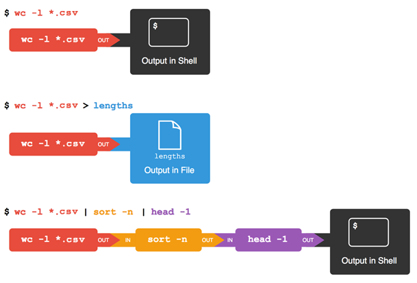

Now that we know a few basic commands,
we can finally look at the shell's most powerful feature:
the ease with which it lets us combine existing programs in new ways.

## Joining commands together using files

One way we can use programs together is to have the output of one command captured
in a file, and use that file as the input to another command.

We'll start with a directory called `data`, which is in the `shell-novice/data`
directory, one directory up from `test_directory`. i.e. from `test_directory`:

~~~bash
$ cd ../..
$ cd data
~~~

Doing `ls` shows us three files in this directory:

~~~
sc_climate_data.csv      sc_climate_data_10.csv   sc_climate_data_1000.csv
~~~

The data in these files is taken from a real climate science research project
that is looking into woody biomass yields. The files are as follows:

* sc_climate_data.csv: the entire 20MB data set.
* sc_climate_data_1000.csv: a subset of the entire data, but only 1000 data rows.
* sc_climate_data_10.csv: a much smaller subset with only 10 rows of data.

We'll largely be working on the 10-row version, since this allows us to more
easily reason about the data in the file and the operations we're performing on
it.

:::callout
## Why not just use the entire 20MB data set?

Running various commands over a 20MB data set could take some time.
It's generally good practice when developing code, scripts, or just using
shell commands, to use a representative subset of data that is manageable to
start with, in order to make progress efficiently.
Otherwise, we'll be here all day!
Once we're confident our commands, code, scripts, etc. work the way we want, we
can then test them on the entire data set.
:::

The `.csv` extension indicates that these files are in Comma Separated Value
format,
a simple text format that specifies data in columns separated by commas
with lines in the file equating to rows.

Let's run the command `wc *.csv`:

* `wc` is the "word count" command, it counts the number of lines, words, and characters in files.
* The `*` in `*.csv` matches zero or more characters, so the shell turns `*.csv` into a complete list of `.csv` files:

~~~bash
$ wc *.csv
~~~

~~~
 1048576 1048577 21005037 sc_climate_data.csv
      11      12     487 sc_climate_data_10.csv
    1001    1002   42301 sc_climate_data_1000.csv
 1049588 1049591 21047825 total
~~~

Sometimes we need to pass multiple filenames to a single command,
or find or use filenames that match a given pattern,
and this is where **wildcards** can be really useful.

`*` is a wildcard that matches zero or more
characters, so `*.csv` matches `sc_climate_data.csv`, `sc_climate_data_10.csv`, and so on.
On the other hand, `sc_climate_data_*.csv` only matches `sc_climate_data_10.csv` and `sc_climate_data_1000.csv`, because the `sc_climate_data_` at the front only matches those two files.

`?` is also a wildcard, but it only matches a single character. This
means that `s?.csv` matches `si.csv` or `s5.csv`, but not `sc_climate_data.csv`, for example.
We can use any number of wildcards at a time: for example, `p*.p?*`
matches anything that starts with a `p` and ends with `.p`, and is followed by at
least one more character (since the `?` has to match one character, and
the final `*` can match any number of characters). Thus, `p*.p?*` would
match `preferred.practice`, and even `p.pi` (since the first `*` can
match no characters at all), but not `quality.practice` (doesn't start
with `p`) or `preferred.p` (there isn't at least one character after the
`.p`).

When the shell sees a wildcard, it expands the wildcard to create a
list of matching filenames *before* running the command that was
asked for. As an exception, if a wildcard expression does not match
any file, Bash will pass the expression as a parameter to the command
as it is. For example typing `ls *.pdf` in the data directory
(which contains only files with names ending with `.csv`) results in
an error message that there is no file called `*.pdf`.
However, generally commands like `wc` and `ls` see the lists of
file names matching these expressions, but not the wildcards
themselves. It's the shell, not the other programs, that expands the wildcards.

Going back to `wc`, if we run `wc -l` instead of just `wc`,
the output shows only the number of lines per file:

~~~bash
$ wc -l *.csv
~~~

~~~
 1048576 sc_climate_data.csv
      11 sc_climate_data_10.csv
    1001 sc_climate_data_1000.csv
 1049588 total
~~~

We can also use `-w` to get only the number of words,
or `-c` to get only the number of characters.

Which of these files is shortest?
It's an easy question to answer when there are only three files,
but what if there were 6000?
Our first step toward a solution is to run the command:

~~~bash
$ wc -l *.csv > lengths.txt
~~~

The greater than symbol, `>`, tells the shell to **redirect** the command's output
to a file instead of printing it to the screen.
The shell will create the file if it doesn't exist,
or overwrite the contents of that file if it does.
This is why there is no screen output:
everything that `wc` would have printed has gone into the file `lengths.txt` instead.

`ls lengths.txt` confirms that the file exists:

~~~bash
$ ls lengths.txt
~~~

~~~
lengths.txt
~~~

We can now send the content of `lengths.txt` to the screen using `cat lengths.txt`.
`cat` is able to print the contents of files one after another.
There's only one file in this case,
so `cat` just shows us what it contains:

~~~bash
$ cat lengths.txt
~~~

~~~
 1048576 sc_climate_data.csv
      11 sc_climate_data_10.csv
    1001 sc_climate_data_1000.csv
 1049588 total
~~~

Now let's use the `sort` command to sort its contents.
We will also use the -n flag to specify that the sort is
numerical instead of alphabetical.
This does *not* change the file;
instead, it sends the sorted result to the screen:

~~~bash
$ sort -n lengths.txt
~~~

~~~
      11 sc_climate_data_10.csv
    1001 sc_climate_data_1000.csv
 1048576 sc_climate_data.csv
 1049588 total
~~~

We can put the sorted list of lines in another temporary file called `sorted-lengths.txt`
by putting `> sorted-lengths.txt` after the command,
just as we used `> lengths.txt` to put the output of `wc` into `lengths.txt`.
Once we've done that,
we can run another command called `head` to get the first few lines in `sorted-lengths.txt`:

~~~bash
$ sort -n lengths.txt > sorted-lengths.txt
$ head -1 sorted-lengths.txt
~~~

~~~
      11 sc_climate_data_10.csv
~~~

Using the parameter `-1` with `head` tells it that
we only want the first line of the file;
`-20` would get the first 20,
and so on.
Since `sorted-lengths.txt` contains the lengths of our files ordered from least to greatest,
the output of `head` must be the file with the fewest lines.

If you think this is confusing,
you're in good company:
even once you understand what `wc`, `sort`, and `head` do,
all those intermediate files make it hard to follow what's going on.
Fortunately, there's a way to make this much simpler.

## Using pipes to join commands together

We can make it easier to understand by running `sort` and `head` together:

~~~bash
$ sort -n lengths.txt | head -1
~~~

~~~
      11 sc_climate_data_10.csv
~~~

The vertical bar between the two commands is called a **pipe**.
It tells the shell that we want to use
the output of the command on the left
as the input to the command on the right.
The computer might create a temporary file if it needs to,
or copy data from one program to the other in memory,
or something else entirely;
we don't have to know or care.

We can even use another pipe to send the output of `wc` directly to `sort`,
which then sends its output to `head`:

~~~bash
$ wc -l *.csv | sort -n | head -1
~~~

~~~
      11 sc_climate_data_10.csv
~~~

This is exactly like a mathematician nesting functions like *log(3x)*
and saying "the log of three times *x*".
In our case,
the calculation is "head of sort of line count of `*.csv`".

This simple idea is why systems like Unix - and its successors like Linux - have been so successful.
Instead of creating enormous programs that try to do many different things,
Unix programmers focus on creating lots of simple tools that each do one job well,
and that work well with each other.
This programming model is called "pipes and filters", and is based on this "small pieces, loosely joined" philosophy.
We've already seen pipes;
a **filter** is a program like `wc` or `sort`
that transforms a stream of input into a stream of output.
Almost all of the standard Unix tools can work this way:
unless told to do otherwise,
they read from standard input,
do something with what they've read,
and write to standard output.

The key is that any program that reads lines of text from standard input
and writes lines of text to standard output
can be combined with every other program that behaves this way as well.
You can *and should* write your programs this way
so that you and other people can put those programs into pipes to multiply their power.

:::callout
## Redirecting Input

As well as using `>` to redirect a program's output, we can use `<` to
redirect its input, i.e., to read from a file instead of from standard
input. For example, instead of writing `wc sc_climate_data_10.csv`, we could write
`wc < sc_climate_data_10.csv`. In the first case, `wc` gets a command line
parameter telling it what file to open. In the second, `wc` doesn't have
any command line parameters, so it reads from standard input, but we
have told the shell to send the contents of `sc_climate_data_10.csv` to `wc`'s
standard input.
:::

If you're interested in how pipes work in more technical detail, see the description after the exercises.

## Exercises

::::challenge{id=double-chevron-meaning title="What does Double Chevron Mean?"}
## What does `>>` mean?

What is the difference between:

~~~bash
echo hello > testfile01.txt
~~~

And:

~~~bash
echo hello >> testfile02.txt
~~~

Hint: Try executing each command twice in a row and then examining the output files.

:::solution
If there isn't a file already there with the name `testfile01.txt`, both `>` and `>>` will create one.

However, if there *is* a file, then `>` will *overwrite* the contents of the file, whilst `>>` will *append* to the existing contents.
:::
::::

For those interested in the technical details of how pipes work:

:::callout
## What's happening 'under the hood' - pipes in more detail

Here's what actually happens behind the scenes when we create a pipe.
When a computer runs a program --- any program --- it creates a **process**
in memory to hold the program's software and its current state.
Every process has an input channel called **standard input**.
(By this point, you may be surprised that the name is so memorable, but don't worry:
most Unix programmers call it "stdin").
Every process also has a default output channel called **standard output**
(or "stdout").

The shell is actually just another program.
Under normal circumstances,
whatever we type on the keyboard is sent to the shell on its standard input,
and whatever it produces on standard output is displayed on our screen.
When we tell the shell to run a program,
it creates a new process
and temporarily sends whatever we type on our keyboard to that process's standard input,
and whatever the process sends to standard output to the screen.

Here's what happens when we run `wc -l *.csv > lengths.txt`.
The shell starts by telling the computer to create a new process to run the `wc` program.
Since we've provided some filenames as parameters,
`wc` reads from them instead of from standard input.
And since we've used `>` to redirect output to a file,
the shell connects the process's standard output to that file.

If we run `wc -l *.csv | sort -n` instead,
the shell creates two processes
(one for each process in the pipe)
so that `wc` and `sort` run simultaneously.
The standard output of `wc` is fed directly to the standard input of `sort`;
since there's no redirection with `>`,
`sort`'s output goes to the screen.
And if we run `wc -l *.csv | sort -n | head -1`,
we get three processes with data flowing from the files,
through `wc` to `sort`,
and from `sort` through `head` to the screen.

:::