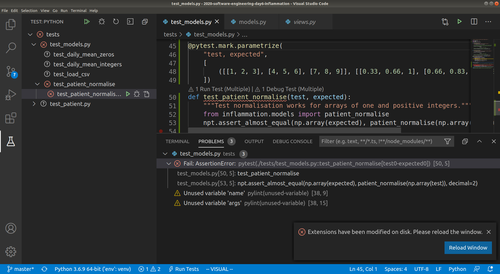
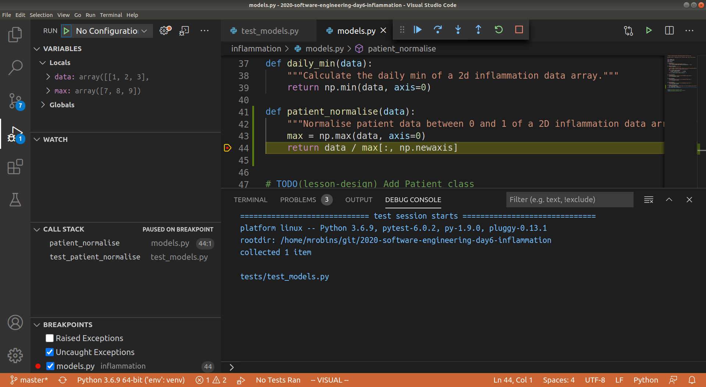

## Introduction

Unit testing can tell us something is wrong in our code and give a rough idea of where the error is by which
test(s) are failing. But it does not tell us exactly where the problem is (i.e. what line of code), or how it came about.
To give us a better idea of what is going on, we can:
 - output program state at various points, e.g. by using print statements to output the contents of
variables,
- use a logging capability to output the state of everything as the program progresses, or
- look at intermediately generated files.

But such approaches are often time consuming and sometimes not enough to fully
pinpoint the issue.  In complex programs, like simulation codes, we often need
to get inside the code while it is running and explore.  This is where using a
**debugger** can be useful.

## Setting the Scene

Let us add a new function called `patient_normalise()` to our inflammation example to normalise a
given inflammation data array so that all entries fall between 0 and 1.
To normalise each patient's inflammation data we need to divide it by the maximum inflammation 
experienced by that patient. To do so, we can add the following code to `inflammation/models.py`:

~~~python
def patient_normalise(data):
    """Normalise patient data from a 2D inflammation data array."""
    max = np.max(data, axis=0)
    return data / max[:, np.newaxis]
~~~

**Note:** *there are intentional mistakes in the above code, which will be
detected by further testing and code style checking below so bear with us for the moment!*

In the code above, we first go row by row and find the maximum inflammation
value for each patient and store these values in a 1-dimensional NumPy array
`max`. We then want to use NumPy's element-wise division, to divide each value
in every row of inflammation data (belonging to the same patient) by the maximum
value for that patient stored in the 1D array `max`.  However, we cannot do that
division automatically as `data` is a 2D array (of shape `(60, 40)`) and `max`
is a 1D array (of shape `(60, )`), which means that their shapes are not
compatible.


Hence, to make sure that we can perform this division and get the expected
result, we need to convert `max` to be a 2D array by using the `newaxis` index
operator to insert a new axis into `max`, making it a 2D array of shape `(60,
1)`.


Now the division will give us the expected result. Even though the shapes are
not identical, NumPy's automatic `broadcasting` (adjustment of shapes) will make
sure that the shape of the 2D `max` array is now "stretched" ("broadcast") to
match that of `data` - i.e. `(60, 40)`, and element-wise division can be
performed.


:::callout
## Broadcasting

The term broadcasting describes how NumPy treats arrays with different shapes
during arithmetic operations.  Subject to certain constraints, the smaller array
is “broadcast” across the larger array so that they have compatible shapes. Be
careful, though, to understand how the arrays get stretched to avoid getting
unexpected results.

:::

Note there is an assumption in this calculation that the minimum value we want
is always zero. This is a sensible assumption for this particular application,
since the zero value is a special case indicating that a patient experienced no
inflammation on a particular day.

Let us now add a new test in `tests/test_models.py` to check that the
normalisation function is correct for some test data.

~~~python
@pytest.mark.parametrize(
    "test, expected",
    [
        ([[1, 2, 3], [4, 5, 6], [7, 8, 9]], [[0.33, 0.67, 1], [0.67, 0.83, 1], [0.78, 0.89, 1]])
    ])
def test_patient_normalise(test, expected):
    """Test normalisation works for arrays of one and positive integers.
       Assumption that test accuracy of two decimal places is sufficient."""
    from inflammation.models import patient_normalise
    npt.assert_almost_equal(patient_normalise(np.array(test)), np.array(expected), decimal=2)
~~~

Note that we are using the `assert_almost_equal()` Numpy testing function
instead of `assert_array_equal()`, since it allows us to test against values
that are *almost* equal. This is very useful when we have numbers with arbitrary
decimal places and are only concerned with a certain degree of precision, like
the test case above, where we make the assumption that a test accuracy of two
decimal places is sufficient.

Run the tests again using `python -m pytest tests/test_models.py` and you will
note that the new test is failing, with an error message that does not give many
clues as to what went wrong.

~~~
E       AssertionError:
E       Arrays are not almost equal to 2 decimals
E
E       Mismatched elements: 6 / 9 (66.7%)
E       Max absolute difference: 0.57142857
E       Max relative difference: 1.345
E        x: array([[0.14, 0.29, 0.43],
E              [0.5 , 0.62, 0.75],
E              [0.78, 0.89, 1.  ]])
E        y: array([[0.33, 0.67, 1.  ],
E              [0.67, 0.83, 1.  ],
E              [0.78, 0.89, 1.  ]])

tests/test_models.py:53: AssertionError
~~~

Let us use a debugger at this point to see what is going on and why the function
failed.

## Pytest and debugging in VSCode

Let's use a debugger to see what's going on and why the function failed. Think
of it like performing exploratory surgery - on code! Debuggers allow us to peer
at the internal workings of a program, such as variables and other state, as it
performs its functions.

### Setup testing in VSCode

First we will set up VSCode to run and debug our tests. If you haven't done so already, 
you will first need to enable the PyTest framework in VSCode. You can do this by 
selecting the `Python: Configure Tests` command in the Command Palette (Ctrl+Shift+P). 
This will then prompt you to select a test framework (`Pytest`), and a directory 
containing the tests (`tests`). You should then see the Test view, shown as a beaker, in 
the left hand activity sidebar. Select this and you should see the list of tests, along 
with our new test `test_patient_normalise`. If you select this test you should see some 
icons to the right that either run, debug or open the `test_patient_normalise` test. You 
can see what this looks like in the screenshot below.




Click on the "run" button next to `test_patient_normalise`, and you will be able to see 
that VSCode runs the function, and the same `AssertionError` that we saw before. 

### Running the Debugger

Now we want to use the debugger to investigate what is happening inside the
`patient_normalise` function. To do this we will add a *breakpoint* in the code.
A breakpoint will pause execution at that point allowing us to explore the state
of the program.

To set a breakpoint, navigate to the `models.py` file and move your mouse to the
`return` statement of the `patient_normalise` function. Click to just to the
left of the line number for that line and a small red dot will appear,
indicating that you have placed a breakpoint on that line.


Now if you debug `test_patient_normalise`, you will notice that execution will be paused 
at the return statement of `patient_normalise`, and we can investigate the exact state 
of the program as it is executing this line of code. Navigate to the Run view, and you 
will be able to see the local and global variables currently in memory, the call stack 
(i.e. what functions are currently running), and the current list of breakpoints. In the 
local variables section you will be able to see the `data` array that is input to the 
`patient_normalise` function, as well as the `max` local array that was created to hold 
the maximum inflammation values for each patient. See below for a screenshot.



In the Watch section of the Run view you can write any expression you want the debugger 
to calculate, this is useful if you want to view a particular combination of variables, 
or perhaps a single element or slice of an array. Try putting in the expression `max[:, 
np.newaxis]` into the Watch section, and you will be able to see the column vector that 
we are dividing `data` by in the return line of the function. You can also open the 
Debug Console and type in `max[:, np.newaxis]` to see the same result.

Looking at the `max` variable, we can see that something looks wrong, as the maximum 
values for each patient do not correspond to the `data` array. Recall that the input 
`data` array we are using for the function is

~~~python
  [[1, 2, 3],
   [4, 5, 6],
   [7, 8, 9]]
~~~


So the maximum inflammation for each patient should be `[3, 6, 9]`, whereas the debugger 
shows `[7, 8, 9]`. You can see that the latter corresponds exactly to the last column of 
`data`, and we can immediately conclude that we took the maximum along the wrong axis of 
`data`. So to fix the function we can change `axis=0` in the first line to `axis=1`. 
With this fix in place, running the tests again will result in a passing test, and a 
nice green tick next to the test in the VSCode IDE.

:::callout
## NumPy Axis

Getting the axes right in NumPy is not trivial - the 
[following tutorial](https://www.sharpsightlabs.com/blog/numpy-axes-explained/#:~:text=NumPy%20axes%20are%20the%20directions,along%20the%20rows%20and%20columns.) 
offers a good explanation on how axes work when applying NumPy functions to arrays.
:::


## Corner or Edge Cases

The test case that we have currently written for `patient_normalise` is
parameterised with a fairly standard data array. However, when writing your test
cases, it is important to consider parameterising them by unusual or extreme
values, in order to test all the edge or corner cases that your code could be
exposed to in practice.  Generally speaking, it is at these extreme cases that
you will find your code failing, so it's beneficial to test them beforehand.

What is considered an "edge case" for a given component depends on what that
component is meant to do.  In the case of `patient_normalise` function, the goal
is to normalise a numeric array of numbers.  For numerical values, extreme cases
could be zeros, very large or small values, not-a-number (`NaN`) or infinity
values.  Since we are specifically considering an *array* of values, an edge
case could be that all the numbers of the array are equal.

For all the given edge cases you might come up with, you should also consider
their likelihood of occurrence.  It is often too much effort to exhaustively
test a given function against every possible input, so you should prioritise
edge cases that are likely to occur. For our `patient_normalise` function, some
common edge cases might be the occurrence of zeros, and the case where all the
values of the array are the same.

When you are considering edge cases to test for, try also to think about what
might break your code.  For `patient_normalise` we can see that there is a
division by the maximum inflammation value for each patient, so this will
clearly break if we are dividing by zero here, resulting in `NaN` values in the
normalised array.

With all this in mind, let us add a few edge cases to our parametrisation of
`test_patient_normalise`.  We will add two extra tests, corresponding to an
input array of all 0, and an input array of all 1.

~~~python
@pytest.mark.parametrize(
    "test, expected",
    [
        ([[0, 0, 0], [0, 0, 0], [0, 0, 0]], [[0, 0, 0], [0, 0, 0], [0, 0, 0]]),
        ([[1, 1, 1], [1, 1, 1], [1, 1, 1]], [[1, 1, 1], [1, 1, 1], [1, 1, 1]]),
        ([[1, 2, 3], [4, 5, 6], [7, 8, 9]], [[0.33, 0.67, 1], [0.67, 0.83, 1], [0.78, 0.89, 1]]),
    ])
~~~

Running the tests now from the command line results in the following assertion error, due to the division by zero as we predicted.

~~~
E           AssertionError:
E           Arrays are not almost equal to 2 decimals
E
E           x and y nan location mismatch:
E            x: array([[nan, nan, nan],
E                  [nan, nan, nan],
E                  [nan, nan, nan]])
E            y: array([[0, 0, 0],
E                  [0, 0, 0],
E                  [0, 0, 0]])

tests/test_models.py:88: AssertionError
~~~

How can we fix this? Luckily, there is a NumPy function that is useful here,
[`np.isnan()`](https://numpy.org/doc/stable/reference/generated/numpy.isnan.html),
which we can use to replace all the NaN's with our desired result, which is 0.
We can also silence the run-time warning using
[`np.errstate`](https://numpy.org/doc/stable/reference/generated/numpy.errstate.html):

~~~python
...
def patient_normalise(data):
    """
    Normalise patient data from a 2D inflammation data array.

    NaN values are ignored, and normalised to 0.

    Negative values are rounded to 0.
    """
    max = np.nanmax(data, axis=1)
    with np.errstate(invalid='ignore', divide='ignore'):
        normalised = data / max[:, np.newaxis]
    normalised[np.isnan(normalised)] = 0
    normalised[normalised < 0] = 0
    return normalised
...
~~~


::::challenge{id=edge-cases title="Exploring Tests for Edge Cases"}

Think of some more suitable edge cases to test our `patient_normalise()` function and add them to the parametrised tests. After you have finished remember to commit your changes.

:::solution
~~~python
@pytest.mark.parametrize(
    "test, expected",
    [
        (
            [[0, 0, 0], [0, 0, 0], [0, 0, 0]],
            [[0, 0, 0], [0, 0, 0], [0, 0, 0]],
        ),
        (
            [[1, 1, 1], [1, 1, 1], [1, 1, 1]],
            [[1, 1, 1], [1, 1, 1], [1, 1, 1]],
        ),
        (
            [[float('nan'), 1, 1], [1, 1, 1], [1, 1, 1]],
            [[0, 1, 1], [1, 1, 1], [1, 1, 1]],
        ),
        (
            [[1, 2, 3], [4, 5, float('nan')], [7, 8, 9]],
            [[0.33, 0.67, 1], [0.8, 1, 0], [0.78, 0.89, 1]],
        ),
        (
            [[-1, 2, 3], [4, 5, 6], [7, 8, 9]],
            [[0, 0.67, 1], [0.67, 0.83, 1], [0.78, 0.89, 1]],
        ),
        (
            [[1, 2, 3], [4, 5, 6], [7, 8, 9]],
            [[0.33, 0.67, 1], [0.67, 0.83, 1], [0.78, 0.89, 1]],
        )
    ])
def test_patient_normalise(test, expected):
    """Test normalisation works for arrays of one and positive integers."""
    from inflammation.models import patient_normalise
    npt.assert_almost_equal(patient_normalise(np.array(test)), np.array(expected), decimal=2)
...
~~~

You could also, for example, test and handle the case of a whole row of NaNs.

:::
::::

## Defensive Programming

In the previous section, we made a few design choices for our `patient_normalise` function:

1. We are implicitly converting any `NaN` and negative values to 0,
2. Normalising a constant 0 array of inflammation results in an identical array of 0s,
3. We don't warn the user of any of these situations.

This could have be handled differently. We might decide that we do not want to silently make these changes to the data, but instead to explicitly check that the input data satisfies a given set of assumptions (e.g. no negative values) and raise an error if this is not the case. Then we can proceed with the normalisation, confident that our normalisation function will work correctly.

Checking that input to a function is valid via a set of preconditions is one of the simplest forms of
**defensive programming** which is used as a way of avoiding potential errors.
Preconditions are checked at the beginning of the function to make sure that all assumptions are satisfied.
These assumptions are often based on the *value* of the arguments, like we have already discussed.
However, in a dynamic language like Python one of the more common preconditions is to check that the arguments of a
function are of the correct *type*. Currently there is nothing stopping someone from calling `patient_normalise`
with a string, a dictionary, or another object that is not an `ndarray`.

As an example, let us change the behaviour of the `patient_normalise()` function to raise an error on negative
inflammation values. Edit the `inflammation/models.py` file, and add a precondition check to the beginning of the `patient_normalise()` function like so:

~~~python
...
    if np.any(data < 0):
        raise ValueError('Inflammation values should not be negative')
...
~~~

We can then modify our test function in `tests/test_models.py` to check that the function raises the correct exception - a `ValueError` - when input to the test contains negative values (i.e. input case `[[-1, 2, 3], [4, 5, 6], [7, 8, 9]]`).
The [`ValueError`](https://docs.python.org/3/library/exceptions.html#ValueError) exception is part of the standard Python
library and is used to indicate that the function received an argument of the right type, but of an inappropriate value.

~~~python
@pytest.mark.parametrize(
    "test, expected, expect_raises",
    [
        ... # previous test cases here, with None for expect_raises, except for the next one - add ValueError 
        ... # as an expected exception (since it has a negative input value)
        (
            [[-1, 2, 3], [4, 5, 6], [7, 8, 9]],
            [[0, 0.67, 1], [0.67, 0.83, 1], [0.78, 0.89, 1]],
            ValueError,
        ),
        (
            [[1, 2, 3], [4, 5, 6], [7, 8, 9]],
            [[0.33, 0.67, 1], [0.67, 0.83, 1], [0.78, 0.89, 1]],
            None,
        ),
    ])
def test_patient_normalise(test, expected, expect_raises):
    """Test normalisation works for arrays of one and positive integers."""
    from inflammation.models import patient_normalise
    if expect_raises is not None:
        with pytest.raises(expect_raises):
            npt.assert_almost_equal(patient_normalise(np.array(test)), np.array(expected), decimal=2)
    else:
        npt.assert_almost_equal(patient_normalise(np.array(test)), np.array(expected), decimal=2)
~~~

Be sure to commit your changes so far and push them to GitHub.

::::challenge{id=precondition title="Optional Exercise: Add a Precondition to Check the Correct Type and Shape of Data"}

Add preconditions to check that data is an `ndarray` object and that it is of the correct shape.
Add corresponding tests to check that the function raises the correct exception.
You will find the Python function [`isinstance`](https://docs.python.org/3/library/functions.html#isinstance)
useful here, as well as the Python exception [`TypeError`](https://docs.python.org/3/library/exceptions.html#TypeError).

:::solution

In `inflammation/models.py`:

~~~python
...
def patient_normalise(data):
    """
    Normalise patient data between 0 and 1 of a 2D inflammation data array.

    Any NaN values are ignored, and normalised to 0

    :param data: 2D array of inflammation data
    :type data: ndarray

    """
    if not isinstance(data, np.ndarray):
        raise TypeError('data input should be ndarray')
    if len(data.shape) != 2:
        raise ValueError('inflammation array should be 2-dimensional')
    if np.any(data < 0):
        raise ValueError('inflammation values should be non-negative')
    max = np.nanmax(data, axis=1)
    with np.errstate(invalid='ignore', divide='ignore'):
        normalised = data / max[:, np.newaxis]
    normalised[np.isnan(normalised)] = 0
    return normalised
...
~~~

In `test/test_models.py`:

~~~python
...
@pytest.mark.parametrize(
    "test, expected, expect_raises",
    [
        ...
        (
            'hello',
            None,
            TypeError,
        ),
        (
            3,
            None,
            TypeError,
        ),
        (
            [[1, 2, 3], [4, 5, 6], [7, 8, 9]],
            [[0.33, 0.67, 1], [0.67, 0.83, 1], [0.78, 0.89, 1]],
            None,
        )
    ])
def test_patient_normalise(test, expected, expect_raises):
    """Test normalisation works for arrays of one and positive integers."""
    from inflammation.models import patient_normalise
    if isinstance(test, list):
        test = np.array(test)
    if expect_raises is not None:
        with pytest.raises(expect_raises):
            npt.assert_almost_equal(patient_normalise(test), np.array(expected), decimal=2)
    else:
        npt.assert_almost_equal(patient_normalise(test), np.array(expected), decimal=2)
...
~~~

Note the conversion from `list` to `np.array` has been moved out of the call to `npt.assert_almost_equal()` within the test function, and is now only applied to list items (rather than all items). This allows for greater flexibility with our test inputs, since this wouldn't work in the test case that uses a string.

:::
::::

You should not take it too far by trying to code preconditions for every conceivable eventuality.
You should aim to strike a balance between making sure you secure your function against incorrect use,
and writing an overly complicated and expensive function that handles cases that are likely never going to occur.
For example, it would be sensible to validate the shape of your inflammation data array when it is actually read
from the csv file (in `load_csv`), and therefore there is no reason to test this again in `patient_normalise`.
You can also decide against adding explicit preconditions in your code, and instead state the assumptions and
limitations of your code for users of your code in the docstring and rely on them to invoke your code correctly.
This approach is useful when explicitly checking the precondition is too costly.

## Improving Robustness with Automated Code Style Checks 

Linters are tools that analyze source code to detect and report errors,
inconsistencies, and stylistic issues. They are widely used in software
development to ensure that code is readable, maintainable, and adheres to best
practices.

Let's look at a very well used one of these called `pylint`. First install it into your virtual environment and check that it runs:

```bash
pip install pylint
pylint --version
```

We should see the version of Pylint, something like:

~~~
pylint 2.13.3
~~~

Pylint is a command-line tool that can help our code in many ways:

- **Check PEP8 compliance:** whilst in-IDE context-sensitive highlighting such as that provided via PyCharm helps us stay consistent with PEP8 as we write code, this tool provides a full report
- **Perform basic error detection:** Pylint can look for certain Python type errors
- **Check variable naming conventions**: Pylint often goes beyond PEP8 to include other common conventions, such as naming variables outside of functions in upper case
- **Customisation**: you can specify which errors and conventions you wish to check for, and those you wish to ignore

Pylint can also identify **code smells**.

:::callout
## How Does Code Smell?

There are many ways that code can exhibit bad design whilst not breaking any
rules and working correctly. A *code smell* is a characteristic that indicates
that there is an underlying problem with source code, e.g. large classes or
methods, methods with too many parameters, duplicated statements in both if and
else blocks of conditionals, etc. They aren't functional errors in the code, but
rather are certain structures that violate principles of good design and impact
design quality. They can also indicate that code is in need of maintenance and
refactoring.

The phrase has its origins in Chapter 3 "Bad smells in code" by Kent Beck and Martin Fowler in 
[Fowler, Martin (1999). Refactoring. Improving the Design of Existing Code. Addison-Wesley. ISBN 0-201-48567-2](https://www.amazon.com/Refactoring-Improving-Design-Existing-Code/dp/0201485672/).

:::


Let's run Pylint over our project after having added some more code to it. From the project root do:

~~~bash
$ pylint inflammation
~~~

You may see something like the following in Pylint's output:

~~~bash
************* Module inflammation.models
...
inflammation/models.py:60:4: W0622: Redefining built-in 'max' (redefined-builtin)
...
~~~

The above output indicates that by using the local variable called `max` it the
`patient_normalise` function, we have redefined a built-in Python function
called `max`. This isn't a good idea and may have some undesired effects (e.g.
if you redefine a built-in name in a global scope you may cause yourself some
trouble which may be difficult to trace).

Feel free to rename the local variable `max` to something else (e.g. call it
`max_data`) to get rid of this warning.

::::challenge{id=fix-code-style title="Fix Code Style Errors"}

Rename our local variable max to something else (e.g. call it max_data), then
rerun your tests.

::::

## Key Points

- Unit testing can show us what does not work, but does not help us locate problems in code.
- Use a **debugger** to help you locate problems in code.
- A debugger allows us to pause code execution and examine its state by adding **breakpoints** to lines in code.
- Use **preconditions** to ensure correct behaviour of code.
- Ensure that unit tests check for **edge** and **corner cases** too.
- Using **linting** tools to automatically flag suspicious programming language constructs and stylistic errors can help improve code robustness.