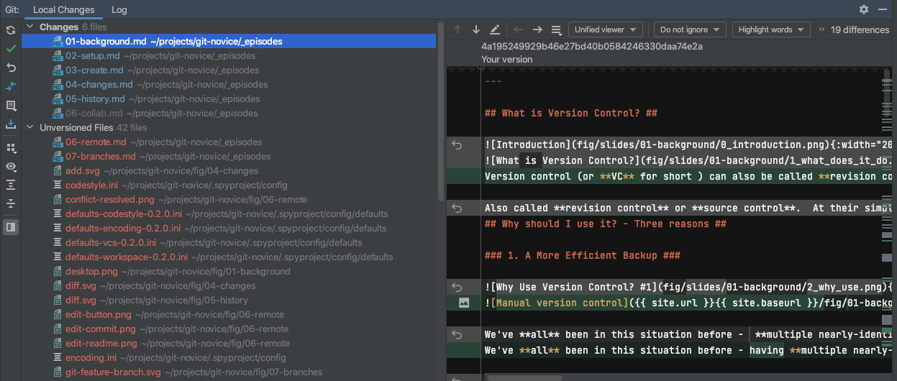
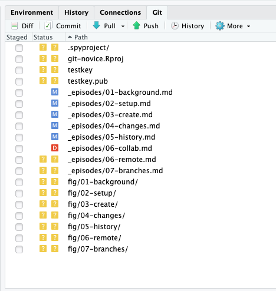

## What is Version Control?

Version control (or **VC** for short ) can also be called **revision control** or **source control**. The simplest description is that VC is a tool that tracks **changes** to files. It's like turning on "Track Changes" in Word or Google Docs, but for code. So why would you want to do that?

### 1. A More Efficient Backup

We've **all** been in this situation before - having **multiple nearly-identical** versions of the same file with no meaningful **explanation** of what the differences are, just incremental changes in filename (`thesis.doc`, `thesis_final.doc`, `thesis_final2.doc`...).

If we're just dealing with text documents, some word processors let us deal with this a little better, like Microsoft Word's "Track Changes" or Google Docs' version history. However, **research isn't just Word docs**, it's code and data and diagrams too, and a single paper or project can involve a whole constellation of files, all of which need backing up!

Using **version control** means **we don't keep dozens of different versions** of our files hanging about taking up space, and when we store a **revision**, we store an **explanation** of what changed.

### 2. Reproducibility

When you use  **version control**, at any point in the future, you can retrieve the **correct versions** of your documents, scripts or code.  So, for example, a year after **publication**, you can get hold of the **precise combination** of scripts and data that you used to assemble a paper.

Version control makes **reproducibility** simpler. Without using version control it's very hard to say that your research is truly reproducible...

### 3. To Aid Collaboration

As well as maintaining a revison history, VC tools also help multiple authors **collaborate** on the **same file** or set of files.

 **Professional software developers** use VC to work in large **teams** and to keep track of what they've done. If you know what changes have been made to each file, you can easily combine multiple people's changes to a single file. You can also track down where and when (and by who!) bugs in the code were introduced.

**Every** large software development project relies on VC, and most programmers use it for their small jobs as well.

**VC is not just for software**: papers, small data sets -  anything that changes over time, or needs to be shared **can**, and **probably should** be stored in a version control system.

We'll look at both the backup and collaboration scenarios, but first it's useful to understand what going on **under the hood**.

## How do Version Control Tools Work? ##

**Version control systems start by storing the base version** of the file that you save and then **store just the changes** you made at each step on the way. You can think of it like storing Lego bricks and the instructions for putting them together - if you start with the first piece, then add each other in turn, you end up with your final document.

Once you think of **changes as separate from the document** itself, you can then think about taking the same document and adding different changes to it, getting different versions of the document. For example, **two users can make independent sets of changes** based on the same document.

If there aren't conflicts, you can even try to combine two different sets of changes together onto the same base document, a process called **merging**.

## Version Control Alternatives

**Git** is overwhelmingly the most popular version control system in academia, and beyond.
It's a **distributed** version control system, where every developer in a team has their own **full copy** of a repository, and can synchronise between them.

It's partly become such a success thanks to sites like **GitHub** and **GitLab**, which make it easy to collaborate on a Git repository,
and provide all kinds of extra tools to manage software projects.
Plus, GitHub offers free upgraded membership to academics, students and educators -
you can apply [here](https://docs.github.com/en/education/explore-the-benefits-of-teaching-and-learning-with-github-education/apply-for-an-educator-or-researcher-discount).

If you're working on old projects, or ones with very specific needs, you might use **Mercurial**, another distributed system,
or possibly **Subversion**, a **centralised** system where there's a single copy of the repository that everyone connects to.

Because Git is so popular, and making a GitHub account is so easy, we're going to teach you how to use them.

## Graphical User Interfaces

We're going to teach you how to use Git on the *command line*, as it's the same on every single platform (Mac, Linux & Windows) - and it's the only way to use it on high-performance clusters like Iridis. This isn't the only way to use it, however. There are many different graphical user interfaces for Git, like:

### [SourceTree](https://www.sourcetreeapp.com/)

### [Git Kraken](https://www.gitkraken.com/)

### [GitHub Desktop](https://desktop.github.com/)

Fundamentally, though, these are all just 'wrappers' around the command line version of Git.
If you understand what they're doing under the hood, you can easily switch between versions. You can, for example, manage your code on Iridis using command-line git and GitHub Desktop on your desktop workstation.

:::callout
## Git GUI Integrations

Most code editors and Integrated Development Environments (or IDEs) integrate Git into their UI,
so you can easily see the state of your files and work with your repository. Examples include:

### [VS Code](https://code.visualstudio.com)

### [PyCharm & CLion](https://www.jetbrains.com/pycharm/)

### [RStudio/Posit](https://posit.co)

Others include MatLab, Atom, Sublime Text and Notepad++. The only common IDE with poor Git support is Spyder! 
:::