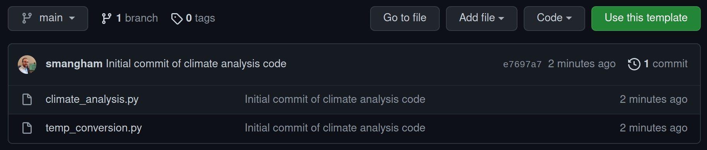
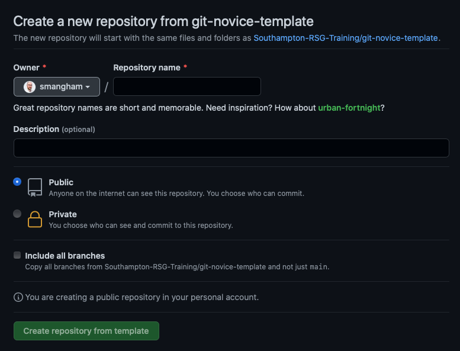
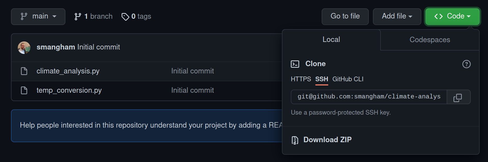

## Creating a Repository

Now let's create a new repository for us to work on.

For convenience, we're going to work with some pre-existing template code that's already stored in a repository. The first thing we need to do is create our own copy of that template, which we can do on [GitHub](https://github.com).

[Go to our template repository](https://github.com/Southampton-RSG-Training/git-novice-template) and select **Use this template**:

We should get prompted to give details for what we'd like our copy of the template to be called. As this demo code is for analysing climate data, we'll name our copy of it `climate-analysis`. We also want it to be public, so anyone can see and copy our code:

:::callout
## Public or Private?

GitHub will allow you to create private repositories, so only people you specify can access the code, but it's always best to keep your code public - especially if you're going to use it in a paper!
Code that generates or analyses data is a fundamental part of your method, and if you don't include your full method in papers your work can't be reproduced, and reproducibility is key to the scientific process.
**Always** keep your repositories public unless you've got a strong reason, like embargoes imposed by industrial partners.

A major advantage of this is if you leave academia, or you switch institution and forget to update the email on your GitHub account before you lose your old one, your work won't be lost forever!
:::

After a brief wait, GitHub will have created a **remote repository** - a copy of the files and their history stored on GitHub's servers.

## Cloning the Repository

Next, from the new GitHub repository click on the **code** button, and you should have a choice of ways to copy the code. Select **SSH**, then click the copy button to copy the repository's URL:

Now we'll download a copy of the repository to our server.

:::callout
## SSH vs HTTPS

**Make sure you select SSH!** Whilst Git supports both **HTTPS** and **SSH**, **GitHub** will only let you *download* with **HTTPS**, as it's less secure.
:::

We have our SSH key in place and have created our new repository from the template, so we can finally clone the repository to our machine:

~~~bash
$ git clone git@github.com:yourname/climate-analysis.git
~~~

After you enter the `git clone` command, you should see:

~~~
Cloning into 'climate-analysis'...
The authenticity of host 'github.com (140.82.121.4)' can't be established.
ECDSA key fingerprint is SHA256:p2QAMXNIC1TJYWeIOttrVc98/R1BUFWu3/LiyKgUfQM.
ECDSA key fingerprint is MD5:7b:99:81:1e:4c:91:a5:0d:5a:2e:2e:80:13:3f:24:ca.
Are you sure you want to continue connecting (yes/no)? yes
~~~

Then, when you're prompted, continue the connection with `yes` and it will finish downloading:

~~~
remote: Enumerating objects: 4, done.
remote: Counting objects: 100% (4/4), done.
remote: Compressing objects: 100% (4/4), done.
remote: Total 4 (delta 0), reused 3 (delta 0), pack-reused 0
Receiving objects: 100% (4/4), done.
~~~

Now, if we use `ls` to list the contents of the directory, we should see we have a new directory, called `climate-analysis`, that's a **local repository** containing the code from our **remote repository**. This is linked up automatically - making it easy for us to download updates to the remote repository, or to send our changes back up to it.

:::callout
## What if I Accidentally Cloned the Repository using HTTPS?

As a note, if you've already cloned a repository you can check if you selected **HTTPS** as the access method using, e.g.:

~~~bash
$ cd climate-analysis
$ git remote -v
~~~

~~~
origin	git@github.com:yourname/climate-analysis (fetch)
origin	git@github.com:yourname/climate-analysis (push)
~~~

In this case, we're using SSH. If you see **HTTPS**, you can fix this with the following:

~~~bash
$ git remote set-url origin git@github.com:yourname/climate-analysis
~~~
:::

:::callout
## Creating Repositories Locally
 
We've shown you how to create a repository on GitHub then download it via `git clone`, but you don't have to do it that way.

If you want, you can create a repository locally by entering any directory and using `git init`. This turns any directory into a **git repository**, one stored entirely locally on your computer.
After you've used `git init` to turn a directory into a repository, you can use the other commands we introduce in this section to add files to it.

We still want to make sure our **local repository** is linked to a **remote repository** on GitHub though! To do that, you can [make an empty repository on GitHub](https://github.com/new) and name it. Once you've got that, you can then connect your **local repository** to it using `git remote add origin git@github.com:yourname/repositoryname`.
 
`git remote add` tells your local repository to link up to a remote one, and `origin git@github.com:yourname/repositoryname` tells it that the remote is at `git@github.com:yourname/repositoryname`, and can be referred to as `origin`. You can link a **local repository** to many **remote repositories** if you want, but the main one is always called `origin`.
:::

# Exploring a Repository

Now, let's **change to our code directory** and look at the files we just downloaded.

~~~bash
$ cd ~/climate-analysis
$ ls
~~~

~~~
climate_analysis.py  temp_conversion.py
~~~

These are some Python files for analysing climate data-
you'll recognise them if you've done some of our earlier lessons.
Don't worry, you don't need to know Python to follow along.

You'll notice that even though this directory is a **version control repository**, nothing actually looks special about it. But, if we add the `-a` flag to show everything,
we can see that there's a hidden directory called `.git`:

~~~bash
$ ls -a
~~~

~~~
.  ..  climate_analysis.py  .git  temp_conversion.py
~~~

Git stores information about the project in here.
If we ever delete it, we will lose the project's history.

### Check Status

We can check that everything is set up correctly
by asking Git to tell us the status of our project with the **status** command:

~~~bash
$ git status
~~~

~~~
# On branch main
nothing to commit, working tree clean
~~~

A **branch** is an independent line of development.  We have only one, and the default name is **main**.

Our **local repository** is connected to a **remote repository** (called **origin** by default), and is currently up-to-date; we haven't made any changes to the code yet.

Git works on **commits** - snapshots of the current state of the repository. *"nothing to commit, working tree clean"* means that the directory currently looks exactly the same as the last snapshot we took of it, with no changes or edits.

:::callout
## Branch names
 
In this workshop, we have a **default branch** called **main**. In older versions of Git,
if you create a new repository on the command line, it'll have a default branch called **master**, and a lot of examples online will show **master** instead of **main**. Don't worry - branches work the same, regardless of what they're called!
:::