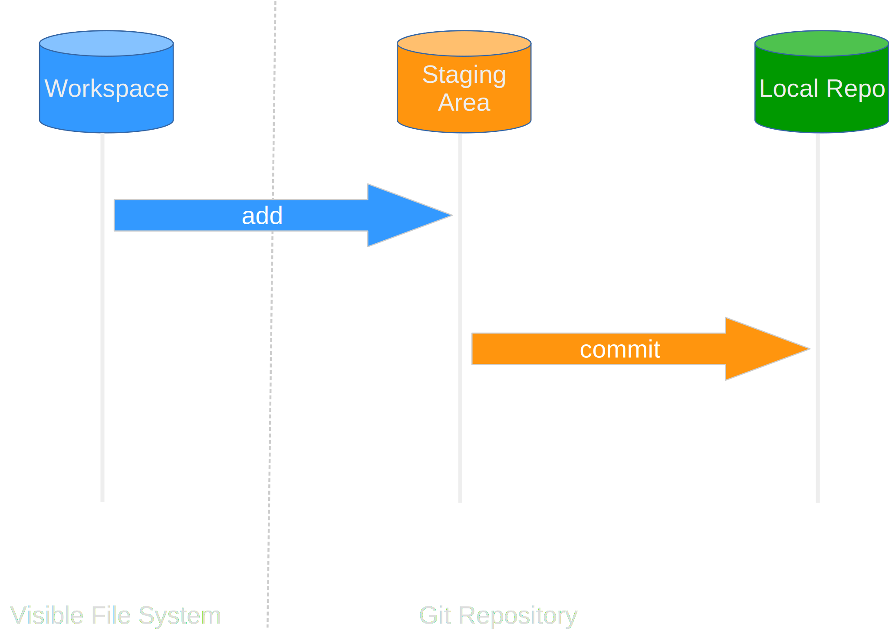
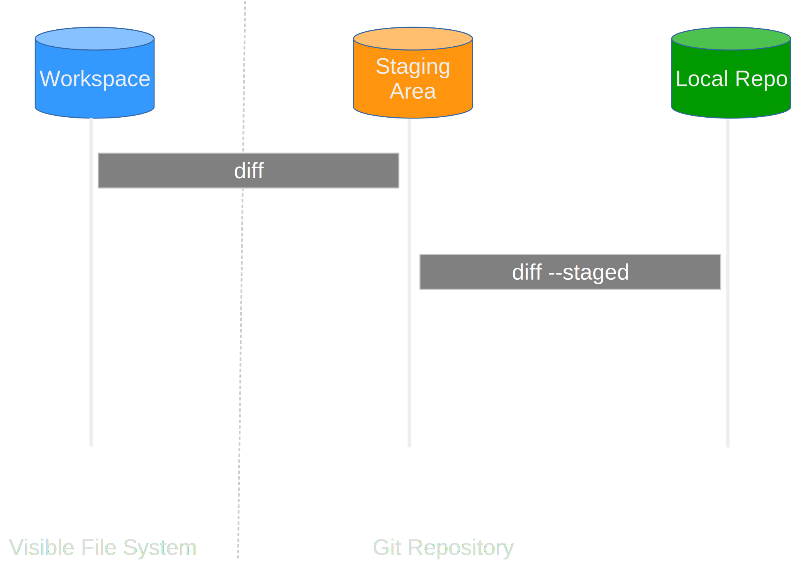

## Tracking Changes

We've got a repository now containing a few pre-existing files - so let's add one more. You might remember seeing GitHub suggest we added a README.md to let people know what our code is about, so let's do that on the command line. We'll use the text editor `nano`, as:

```bash
nano README.md
```

Then type an example description:

```text
# Climate Analysis Toolkit

This is a set of python scripts designed to analyse climate datafiles.
```

We can save our file using `Control-O` (`Control` and `O` at the same time), then `Enter`, and quit out of nano using `Control-X`.
Our description is a bit brief, but it's enough for now!
Let's try `git status` again:

```bash
git status
```

```text
# On branch main
# Untracked files:
#   (use "git add <file>..." to include in what will be committed)
#
# README.md
nothing added to commit but untracked files present (use "git add" to track)
```

Now, whilst our current snapshot of the repository is up-to-date, we've added a new file that we're not tracking yet. We can tell Git to track the file we've just created using `git add`:

```bash
git add README.md
```

and then check that the right thing happened:

```bash
git status
```

```text
# On branch main
# Changes to be committed:
#   (use "git reset HEAD <file>..." to unstage)
#
# new file:   README.md
#
```

Git now knows that it's supposed to **keep track** of `README.md`, just like `climate_analysis.py` and `temp_conversion.py` but it **hasn't recorded that as a commit** yet. We dont have a snapshot of the repository with all the existing files _and_ `README.md`.

### Initial Commit

To get it to do that,
we need to run one more command:

```bash
git commit -m "Added a basic readme file."
```

We use the `-m` flag (for "**message**")
to record a short, **descriptive comment** that will help us remember later on what we did and why.

If we just run `git commit` without the `-m` option,
Git will launch `nano` (or whatever other editor we configured at the start)
so that we can write a longer message.

**Good commit messages** start with a brief (<50 characters) summary of
changes made in the commit, **NOT "Bug Fixes"** or **"Changes"**!

If you want to go into more detail, add
a blank line between the summary line and your additional notes.

```text
[main fa90884] Added a basic readme file.
 1 file changed, 3 insertions(+)
 create mode 100644 README.md
```

When we run `git commit`,
Git takes everything we have told it to save by using `git add` and stores a copy permanently inside the special `.git` directory.
This permanent copy is called a **[revision](https://git-scm.com/docs/revisions)** and its short **identifier** (or short `SHA`) is `fa90884`.
Your revision will have different identifier.

If we run `git status` now:

```bash
git status
```

```text
# On branch main
# Your branch is ahead of 'origin/main' by 1 commit.
#   (use "git push" to publish your local commits)
#
nothing to commit, working directory clean
```

Git tells us our local repository is up-to-date, but indicates we have changes that the remote version does not (we'll get to that later!).



Git has a special [**staging** area](https://git-scm.com/about/staging-area) where it keeps track of things that have been **added** to the current change set
but **not yet committed**.
`git add` adds changes to staging, and `git commit` copies them to long-term storage (as a commit).

:::callout{variant="info"}

## The Staging Area

Why do we have this two-stage process, where we **add** files to the staging area, then create a **commit** from them?

Among other reasons, it allows you to easily bundle together a lot of changes in one go.
If you changed the name of a variable used in multiple files (e.g. from `t` to `temperature`), you'd need to change it in all your files in one go in order for it to make sense.
If you stored a copy of each file one-by-one you'd end up with a lot of versions of the code that didn't work - due to inconsistent variable names.
The **staging area** lets you bundle together all those small changes that don't work in isolation into one big change that's coherent.

Git does give you shortcuts to reduce **add -> commit** to a single step, but when you're starting out it's always better to make sure you know what's going in to each commit!
:::

### Review the Log

If we want to know what we've done recently, we can ask Git to show us the **repository's history** using `git log`:

```bash
git log
```

```text
commit fa90884ca03dcefb97e415a374ac1aacaaa94c91 (HEAD -> main)
Author: Sam Mangham <mangham@gmail.com>
Date:   Wed Mar 16 15:22:29 2022 +0000

    Added a basic readme file.

commit 499b6d18b36a25d3f5ab9be1b708ea48fef1dd65 (origin/main, origin/HEAD)
Author: Sam Mangham <mangham@gmail.com>
Date:   Wed Mar 16 14:19:13 2022 +0000

    Initial commit
```

`git log` lists all **revisions committed** to a repository in reverse chronological order (most recent at the top).

The listing for each revision includes

- the **revision's full identifier** (which starts with the same characters as the short identifier printed by the `git commit` command earlier),
- the **branch** it was created on (including whether or not it's up-to-date with any **remote versions of that branch** - in this case, our last README commit hasn't been pushed to the remote repo yet),
- the revision's **author**,
- **when** it was created,
- the **log message** Git was given when the revision was committed.

:::callout(variant="tip")

## Compatibility Notice

If you don't see information on the **remote branches**, try `git log --decorate`.
This ensures output will indicate, for each commit revision, whether it is up-to-date with its _remote_ repository, if one exists.
Older versions of git don't show this information by default.
:::

### Modify a file (1)

Now suppose we modify an existing file, for example by adding a **Docstring** to the **top** of one of the files:

```bash
nano climate_analysis.py
```

```text
""" Climate Analysis Tools """
```

When we run `git status` now,
it tells us that a file it already knows about has been modified:

```bash
git status
```

```text
# On branch main
# Your branch is ahead of 'origin/main' by 1 commit.
#   (use "git push" to publish your local commits)
#
# Changes not staged for commit:
#   (use "git add <file>..." to update what will be committed)
#   (use "git checkout -- <file>..." to discard changes in working directory)
#
# modified:   climate_analysis.py
#
no changes added to commit (use "git add" and/or "git commit -a")
```

The last line is the key phrase:
"no changes added to **commit**".

So, while we have changed this file,
but we haven't told Git we will want to save those changes
(which we do with `git add`)
much less actually saved them (which we do with `git commit`).

::::callout{variant="warning"}
It's important to remember that git only stores changes when you make a commit!
::::

### Review Changes and Commit

It is good practice to always **review
our changes** before saving them. We do this using `git diff`.
This shows us the differences between the current state
of the file and the most recently commited version:

```bash
git diff
```

```text
diff --git a/climate_analysis.py b/climate_analysis.py
index 277d6c7..d5b442d 100644
--- a/climate_analysis.py
+++ b/climate_analysis.py
@@ -1,3 +1,4 @@
+""" Climate Analysis Tools """
 import sys
 import temp_conversion
 import signal
```

The output is **cryptic** because
it is actually a series of **commands** for tools like editors and `patch`
telling them how **to reconstruct one file given the other**.

The key things to note are:

1. Line 1: The **files** that are being **compared** (a/ and b/ are labels, not paths)
2. Line 2: The two **hex strings** on the second line which parts of the **hashes** of the files being compares
3. Line 5: The **lines** that have changed. (It's complex)
4. Below that, the changes - note the '**+**' marker which shows an addtion

After reviewing our change, it's time to commit it:

```bash
git commit -m "Add Docstring"
```

```text
# On branch main
# Your branch is ahead of 'origin/main' by 1 commit.
#   (use "git push" to publish your local commits)
#
# Changes not staged for commit:
#   (use "git add <file>..." to update what will be committed)
#   (use "git checkout -- <file>..." to discard changes in working directory)
#
# modified:   climate_analysis.py
#
no changes added to commit (use "git add" and/or "git commit -a")
```

**Whoops**:
Git won't commit because we didn't use `git add` first.
Let's fix that:

```bash
git add climate_analysis.py
git commit -m "Add Docstring"
```

```text
[main 55d3f56] Add Docstring
 1 file changed, 1 insertion(+)
```

Git insists that we **add** files to the set we want to commit
before actually committing anything
because we may not want to commit **everything at once**.

For example,
suppose we might have **fixed a bug** in some existing code, but we might have added new code that's **not ready to share**.

### One more addition

What if we've made some edits, added them, and then forgotten what they were?
Let's add another line to the end of the file:

```bash
nano climate_analysis.py
```

```text
# TODO(smangham): Add call to process rainfall
```

Check what's changed with **diff**:

```bash
git diff
```

```text
diff --git a/climate_analysis.py b/climate_analysis.py
index d5b442d..6f8ed8a 100644
--- a/climate_analysis.py
+++ b/climate_analysis.py
@@ -26,3 +26,5 @@ for line in climate_data:
             kelvin = temp_conversion.fahr_to_kelvin(fahr)

             print(str(celsius)+", "+str(kelvin))
+
+# TODO(smangham): Add call to process rainfall
```

So far, so good:
we've added one line to the end of the file
(shown with a `+` in the first column).

Now let's put that change in the staging area (or **add it to the change set**), then go away for the weekend. When we come back, we can't remember what we added, so we see what `git diff` reports:

```bash
git add climate_analysis.py
git diff
```

```text

```

**There is no output**! This is because **git diff** shows us the differences between the **working copy** and what's been added to the **change set** in staging area.

However, if we add the `--staged` flag to the command:

```bash
git diff --staged
```

```text
diff --git a/climate_analysis.py b/climate_analysis.py
index d5b442d..6f8ed8a 100644
--- a/climate_analysis.py
+++ b/climate_analysis.py
@@ -26,3 +26,5 @@ for line in climate_data:
             kelvin = temp_conversion.fahr_to_kelvin(fahr)

             print(str(celsius)+", "+str(kelvin))
+
+# TODO(smangham): Add call to process rainfall
```

it shows us the difference between the last **committed change** and what's in the **staging area**. You might not use this often, but it's very useful when you come back to a project you've left for a while!

Let's **commit** our changes:

```bash
git commit -m "Add rainfall processing placeholder"
```

```text
[main 6f60ad6] Add rainfall processing placeholder
 1 file changed, 2 insertions(+)
```

Let's now check our status:

```bash
git status
```

```text
# On branch main
# Your branch is ahead of 'origin/main' by 3 commits.
#   (use "git push" to publish your local commits)
#
nothing to commit, working directory clean
```

And now look at the history of what we've done so far:

```bash
git log
```

```text
commit 6f60ad638f344fbb5fdf81f05a804f7417984eec (HEAD -> main)
Author: Sam Mangham <mangham@gmail.com>
Date:   Wed Mar 16 15:40:30 2022 +0000

    Add rainfall processing placeholder

commit 55d3f56c9f2d42919ffaff4fbaabd69fe99053eb
Author: Sam Mangham <mangham@gmail.com>
Date:   Wed Mar 16 15:35:42 2022 +0000

    Add Docstring

commit fa90884ca03dcefb97e415a374ac1aacaaa94c91
Author: Sam Mangham <mangham@gmail.com>
Date:   Wed Mar 16 15:22:29 2022 +0000

    Added a basic readme file.

commit 499b6d18b36a25d3f5ab9be1b708ea48fef1dd65 (origin/main, origin/HEAD)
Author: Sam Mangham <mangham@gmail.com>
Date:   Wed Mar 16 14:19:13 2022 +0000

    Initial commit
```



To recap, when we want to add changes to our repository,
we first need to add the changed files to the staging area
(`git add`) and then commit the staged changes to the
repository (`git commit`).
