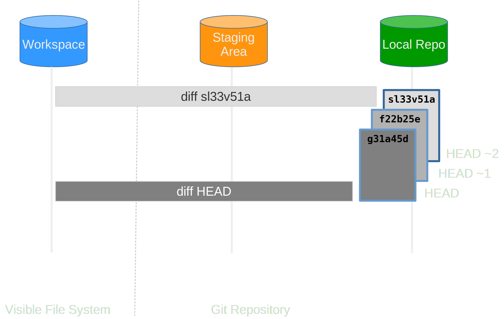
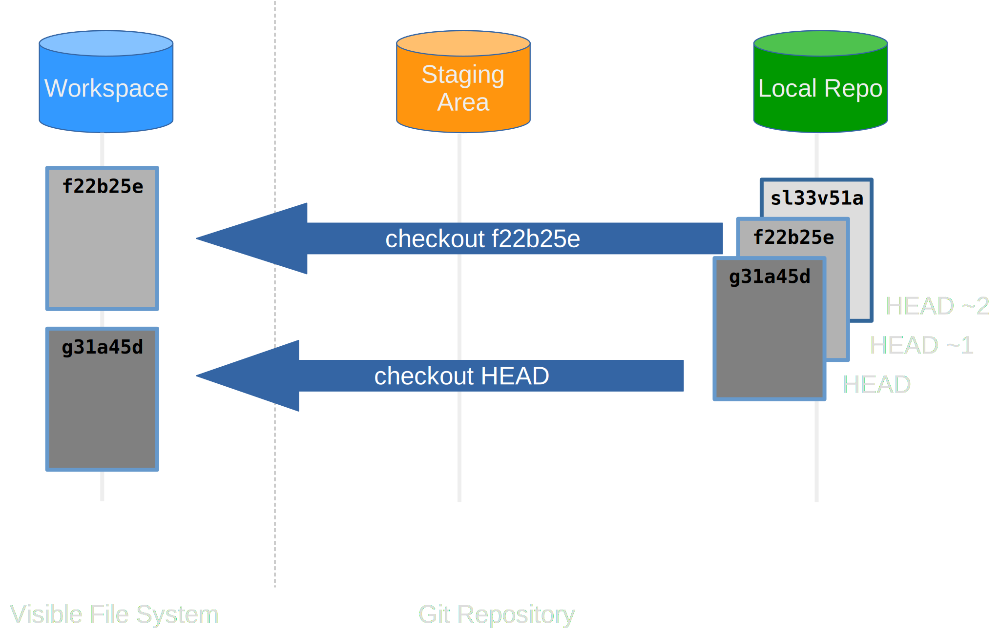

## Exploring History

We've seen that `git log` gives us some information on what commits were made when, but let's look a bit deeper at the specifics:

~~~bash
git log
~~~

~~~text
commit f15ad111042cee7492f40ad6ff0ec18588fce753 (HEAD -> main)
Author: Sam Mangham <mangham@gmail.com>
Date:   Wed Mar 30 17:15:47 2022 +0100

    Add rainfall processing placeholder

commit 6aeaf44173344939e9994d7ccb5512fc5b26c211
Author: Sam Mangham <mangham@gmail.com>
Date:   Wed Mar 30 17:14:14 2022 +0100

    Add Docstring

commit 503f02b5f51d5622121e204494dfabc9b2ae7410
Author: Sam Mangham <mangham@gmail.com>
Date:   Wed Mar 30 17:12:02 2022 +0100

    Added a basic readme file

commit 499b6d18b36a25d3f5ab9be1b708ea48fef1dd65 (origin/main, origin/HEAD)
Author: Sam Mangham <mangham@gmail.com>
Date:   Wed Mar 16 14:19:13 2022 +0000

    Initial commit
~~~

We can see commits identified by long IDs, but also **HEAD** at the top of the log. **HEAD** is the name used to refer to the **most recent** end of the chain of commits to our **local repository**.

### Relative History

What if somehow we've introduced a bug, and we want to see what's changed between our latest version of the code and the copy that was working last commit, or a few commits ago? Which lines did we edit, and what did we add?

We can use `git diff` again to look for differences between files, but refer to the versions of the files **as saved in older commits** using the notation `HEAD~1`, `HEAD~2`, and so on to refer to the commits.
We can refer to previous commits using the `~` notation,
so `HEAD~1` (pronounced "head minus one")
means "the previous commit",
while `HEAD~123` goes back 123 commits from the latest one.

~~~bash
git diff HEAD~1 climate_analysis.py
~~~

~~~text
diff --git a/climate_analysis.py b/climate_analysis.py
index d5b442d..c463f71 100644
--- a/climate_analysis.py
+++ b/climate_analysis.py
@@ -26,3 +26,5 @@ for line in climate_data:
             kelvin = temp_conversion.fahr_to_kelvin(fahr)

             print(str(celsius)+", "+str(kelvin))
+
+# TODO(smangham): Add call to process rainfall
~~~

So we see the difference between the file as it is now, and as it was **the commit before before the latest one**.

~~~bash
git diff HEAD~2 climate_analysis.py
~~~

~~~text
diff --git a/climate_analysis.py b/climate_analysis.py
index 277d6c7..c463f71 100644
--- a/climate_analysis.py
+++ b/climate_analysis.py
@@ -1,3 +1,4 @@
+""" Climate Analysis Tools """
 import sys
 import temp_conversion
 import signal
@@ -25,3 +26,5 @@ for line in climate_data:
             kelvin = temp_conversion.fahr_to_kelvin(fahr)

             print(str(celsius)+", "+str(kelvin))
+
+# TODO(smangham): Add call to process rainfall
~~~

And here we see the state **before the last two commits**, HEAD minus 2.

### Absolute History

What about if we want to compare our version of the code to the version from last month, or from the version we used to make a paper last year?
Calculating the number of commits is wildly impractical.
Instead, we can refer to **specific revisions** using those long strings of digits and letters that `git log` displays.

These are unique IDs for the changes,
and "unique" really does mean unique:
every change to any set of files on any machine
has a unique 40-character identifier. (A SHA-1 hash of the new, post-commit state of the repository).

If we scroll down to the bottom of the `git log` output, we can see the ID for our first commit - in the example above, it's `499b6d18b36a25d3f5ab9be1b708ea48fef1dd65` (but **yours will be different!**). Try this, substituting your first commit's ID:

~~~bash
git diff 499b6d18b36a25d3f5ab9be1b708ea48fef1dd65 climate_analysis.py
~~~

~~~text
diff --git a/climate_analysis.py b/climate_analysis.py
index 277d6c7..6f8ed8a 100644
--- a/climate_analysis.py
+++ b/climate_analysis.py
@@ -1,3 +1,4 @@
+""" Climate Analysis Tools """
 import sys
 import temp_conversion
 import signal
@@ -25,3 +26,5 @@ for line in climate_data:
             kelvin = temp_conversion.fahr_to_kelvin(fahr)
 
             print(str(celsius)+", "+str(kelvin))
+
+# TODO(smangham): Add call to process rainfall
~~~

We can now see all the changes since a specific commit! However, typing random 40-character strings is annoying and incredibly easy to typo,
so Git lets us use just the first **seven**:

~~~bash
git diff 499b6d1 climate_analysis.py
~~~

~~~text
diff --git a/climate_analysis.py b/climate_analysis.py
index 277d6c7..6f8ed8a 100644
--- a/climate_analysis.py
+++ b/climate_analysis.py
@@ -1,3 +1,4 @@
+""" Climate Analysis Tools """
 import sys
 import temp_conversion
 import signal
@@ -25,3 +26,5 @@ for line in climate_data:
             kelvin = temp_conversion.fahr_to_kelvin(fahr)
 
             print(str(celsius)+", "+str(kelvin))
+
+# TODO(smangham): Add call to process rainfall
~~~

This is particularly handy as you can **exactly identify specific versions of the code**, for example the one you used to write your first paper, and the different, newer version you used to write your second paper.

:::callout

## Other Ways To Reference Commits

Newer versions of Git have some more advanced ways of referencing past commits. In place of `HEAD~1` you can use `HEAD~` or `HEAD@{1}`,
or you can even use text to ask more advanced questions, like `git diff HEAD@{"yesterday"}` or `git diff HEAD@{"3 months ago"}`!
:::

### Restoring Files

All right:
we can **save changes** to files and **see what we've changed** &mdash; suppose we need to **restore** older versions of things?

Let's suppose we **accidentally** overwrite or delete our file:

~~~bash
rm climate_analysis.py
ls
~~~

~~~text
README.md
temp_conversion.py
~~~

**Whoops!**

`git status` now tells us that the file has been changed,
but those changes haven't been staged:

~~~bash
git status
~~~

~~~text
# On branch main
# Your branch is ahead of 'origin/main' by 3 commits.
#   (use "git push" to publish your local commits)
#
# Changes not staged for commit:
#   (use "git add/rm <file>..." to update what will be committed)
#   (use "git restore <file>..." to discard changes in working directory)
#
# deleted:    climate_analysis.py
#
no changes added to commit (use "git add" and/or "git commit -a")
~~~

Following the helpful hint in that output, we can put things back the way they were
by using `git restore`:

~~~bash
git restore climate_analysis.py
cat climate_analysis.py
~~~

~~~text
[SNIPPED - but changes rolled back]
~~~

By default, `restore` replaces the file with the version of it in the *staging area*. If you haven't used `git add`, that should be the same as the version in the last commit. But what if we already used `git add` on our incorrect version of a file, or we broke the file more than one commit ago?

We can use `git checkout`, e.g.:

~~~bash
git checkout <HEAD or commit ID> climate_analysis.py
~~~

:::callout

## Compatibility Notice

Older versions of Git don't include the `git restore` command - fortunately, it's just a shortcut for `git checkout --`.
If `git restore` doesn't work, try `git checkout -- temp_conversion.py`.
`checkout` has a *lot* of functions, and newer versions of Git simplify things by giving them new names.
:::

:::callout

## Double Whoops

What if you accidentally did `git rm climate_analysis.py`? That command tells Git to *delete the file and remove it from the repository* - so it will record that the file has been deleted, then stop tracking further changes.
Even if you re-make the file, it won't be tracked until you use `git add` on it again.

The file still exists in the *history*, though so if you want to undo this you can do `git checkout HEAD climate_analysis.py`, to get the file back and start tracking it again.
Since you can retrieve any file that existed in *a* previous commit, even if you removed it from future ones, this makes it important to not commit files containing passwords or sensitive information!
:::

The fact that files can be reverted one by one
tends to change the way people organize their work.

Consider a situation where all your code is in one file,
and you fixed a bug in one section but accidentally introduced one elsewhere.

You can't just roll back to fix one bug without un-fixing the other.
However, if each section is in its own file, you can just roll back the section you broke!
