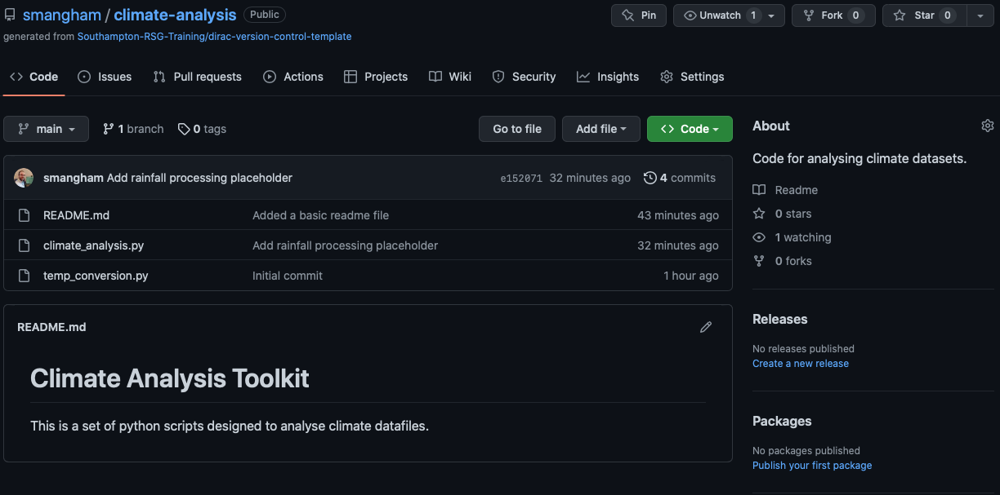
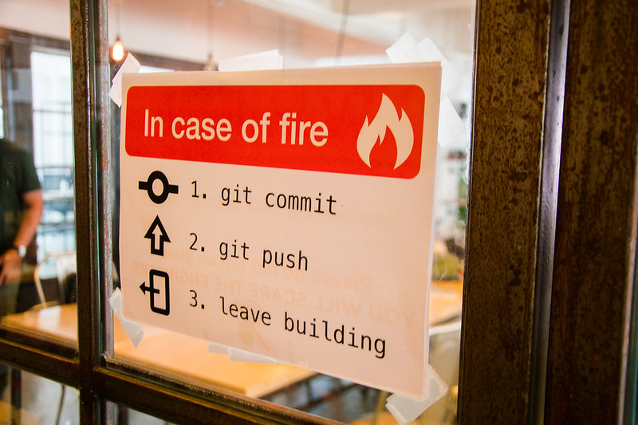
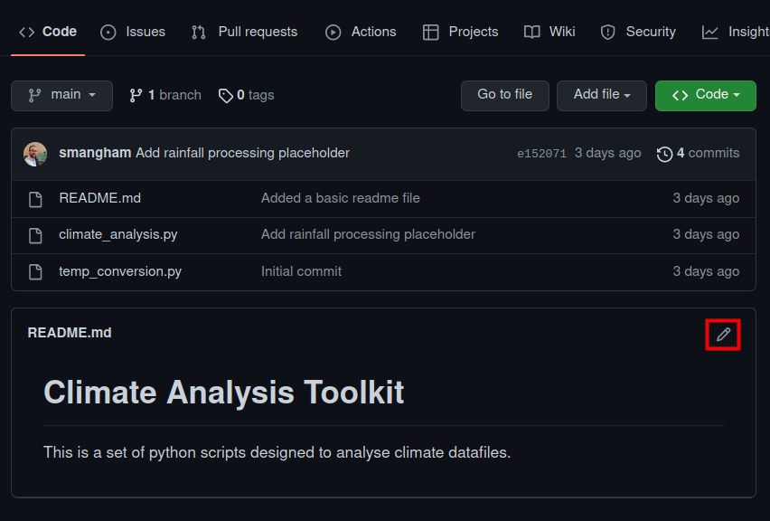
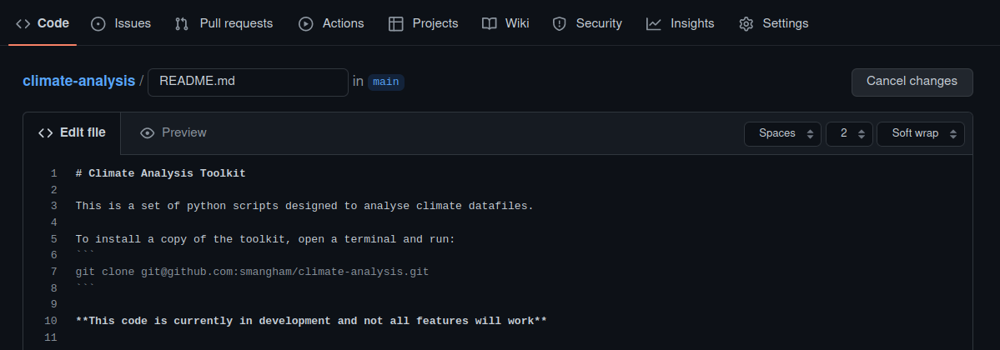
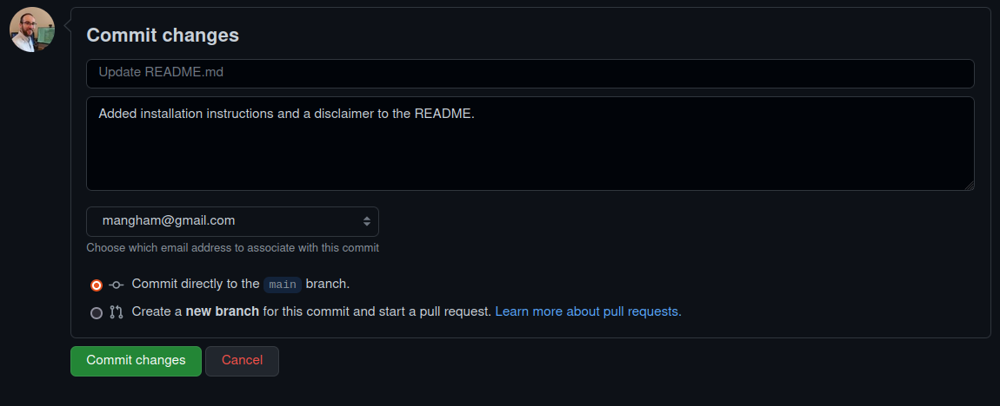
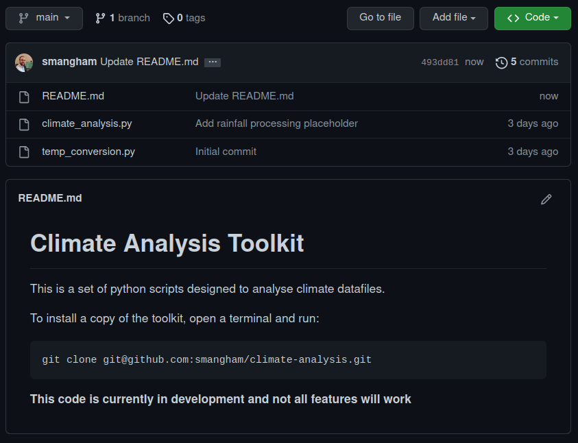
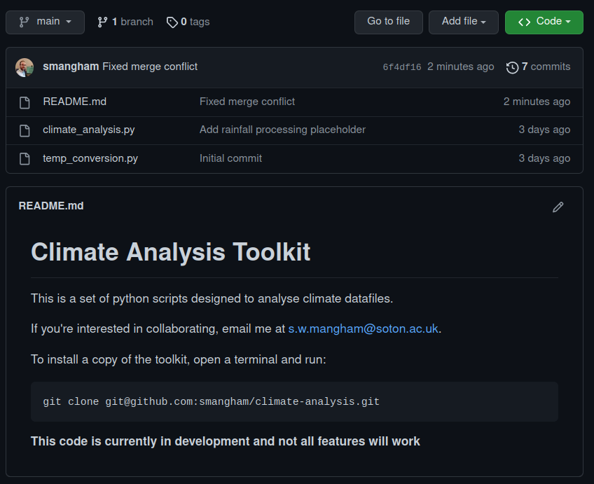

We've learned how to use a **local repository** to store our code and view changes:


Now, however, we'd like to share the changes we've made to our code with others, as well as making sure we have an off-site backup in case things go wrong. We need to upload our changes in our **local repository** to a **remote repository**.

:::callout

## Why Have an Off-site Backup?

You might wonder why having an off-site backup (i.e. a copy not stored at your University) is so important.
In 2005, [a fire destroyed a building at the University of Southampton](http://news.bbc.co.uk/1/hi/england/hampshire/4390048.stm). Some people's _entire PhD projects_ were wiped out in the blaze.
To ensure your PhD only involves a normal level of suffering, please make sure you have off-site backups of as much of your work as possible!


:::

To do that, we'll use the **remote repository** we set up on GitHub at the start of the workshop. It's another repository, just like the **local repository** on our computer, that Git makes it easy to send and receive data from. Multiple **local repositories** can connect to the same **remote repository**, allowing you to collaborate with colleagues easily.


So we're finally going to address all those _"Your branch is ahead of 'origin/main' by 3 commits"_ messages we got from `git status`! However, GitHub doesn't let just anyone push to your repository - you need to prove you're the owner (or have been given access). Fortunately, we already set up an SSH key earlier.

Now we can synchronise our code to the remote repository, with `git push`:

```bash
git push
```

```text
Counting objects: 11, done.
Delta compression using up to 32 threads.
Compressing objects: 100% (9/9), done.
Writing objects: 100% (9/9), 1.11 KiB | 0 bytes/s, done.
Total 9 (delta 2), reused 0 (delta 0)
remote: Resolving deltas: 100% (2/2), completed with 1 local object.
To git@github.com:smangham/climate-analysis
   70bf8f3..501e88f  main -> main
```

And we're done! This bit was easy as when we used `git clone` earlier, it set up our **local repository** to **track** the **remote repository**. The `main -> main` line shows we're sending our local branch called `main` to the remote repository as a branch called `main`.

:::callout

## What _is_ a Branch, Though?

Branches allow you to have alternate versions of the code 'branching off' from another branch (e.g. `main`).
You can try out new features in these branches without disrupting your `main` version of the code, then **merge them in** once you've finished. We have a **Stretch Episode** that gives you a brief introduction to them!
:::

If we go back to the repository on GitHub, we can refresh the page and see our updates to the code:



Conveniently, the contents of `README.md` are shown on the main page, with formatting. [You can also add links, tables and more](https://docs.github.com/en/get-started/writing-on-github/getting-started-with-writing-and-formatting-on-github/basic-writing-and-formatting-syntax). Your code should always have a descriptive `README.md` file, so anyone visiting the repo can easily get started with it.

:::callout

## How often should I push?

Every day. You can never predict when your hard disk will fail or your building will be destroyed!

[Credit: Mitch Altman, CC BY-SA 2.0](https://www.flickr.com/photos/maltman23/38138235276)
:::

## Collaborating on a Remote Repository

Now we know how to **push** our work from our local repository to a remote one, we need to know the reverse - how to **pull** updates to the code that someone else has made.

We want to invite other people to collaborate on our code, so we'll update the `README.md` with a request for potential collaborators to email us at our University email address.

```bash
nano README.md
cat README.md
```

```text
# Climate Analysis Toolkit

This is a set of python scripts designed to analyse climate datafiles.

If you're interested in collaborating, email me at s.w.mangham@soton.ac.uk.
```

```bash
git commit -am "Added collaboration info"
```

```text
[main 39a2c8f] Added collaboration info
 1 file changed, 2 insertions(+)
```

In this case, we use `git commit -am` where the `-a` means **commit all modified files we've previously used `git add` on**, and the `-m` bit means 'and here's the commit message' as usual. It's a handy shortcut.

But **don't push to GitHub** just yet! We're going to set up a small conflict, of the kind you might see when working with a remote repository. What happens if you change a file at the same time as one of your collaborators does, and you _both_ commit those changes? How does GitHub know which version of the file is 'correct'?

Pretending to be an existing collaborator, we'll go and add those installation instructions by editing our `README.md` file directly on GitHub. This isn't _common_, but if you want to quickly make some small changes to a single file it can be useful. We edit it as:



And expand it a little, making more use of GitHub's markdown formatting by adding the following lines after the first:

````text
To install a copy of the toolkit, open a terminal and run:
```
    git clone git@github.com:smangham/climate-analysis.git
```

**This code is currently in development and not all features will work**
````



Then commit the changes directly to our `main` branch with a descriptive commit message:





### Push Conflicts

Great. Now let's go back to the terminal and try pushing our local changes to the remote repository. This is going to cause problems, just as we expected:

```bash
git push
```

```text
To git@github.com:smangham/climate-analysis
 ! [rejected]        main -> main (fetch first)
error: failed to push some refs to 'git@github.com:smangham/climate-analysis'
hint: Updates were rejected because the remote contains work that you do
hint: not have locally. This is usually caused by another repository pushing
hint: to the same ref. You may want to first merge the remote changes (e.g.,
hint: 'git pull') before pushing again.
hint: See the 'Note about fast-forwards' in 'git push --help' for details.
```

Git helpfully tells us that actually, there are commits present in the **remote repository** that we don't have in our **local repository**.

### Merge Conflicts

We'll need to **pull** those commits into our local repository before we can push our own updates back!

```bash
git pull
```

```text
remote: Enumerating objects: 5, done.
remote: Counting objects: 100% (5/5), done.
remote: Compressing objects: 100% (3/3), done.
remote: Total 3 (delta 0), reused 0 (delta 0), pack-reused 0
Unpacking objects: 100% (3/3), done.
From github.com:smangham/climate-analysis
   501e88f..023f8f6  main       -> origin/main
Auto-merging README.md
CONFLICT (content): Merge conflict in README.md
Automatic merge failed; fix conflicts and then commit the result.
```

:::callout

## Compatibility Notice

Newer versions of git will default to attempting to merge conflicting 'histories'. Older versions might not - and they'll give you a message like:

```text
hint: You have divergent branches and need to specify how to reconcile them.
hint: You can do so by running one of the following commands sometime before
hint: your next pull:
hint:
hint:   git config pull.rebase false  # merge
hint:   git config pull.rebase true   # rebase
hint:   git config pull.ff only       # fast-forward only
hint:
hint: You can replace "git config" with "git config --global" to set a default
hint: preference for all repositories. You can also pass --rebase, --no-rebase,
hint: or --ff-only on the command line to override the configured default per
hint: invocation.
fatal: Need to specity how to reconcile divergent branches
```

We want to default to **merging**. **Fast forward** and **rebase** are advanced options you'd typically only see used in large teams in industry. So as git suggests, we can fix it our problem with:

```bash
git config --global pull.rebase false
git pull
```

Now we'll get the same behaviour as newer versions of git.
:::

We have created a conflict! Both us, and our remote collaborator, both edited `README.md`. Let's take a look at the file:

```bash
cat README.md
```

```text
# Climate Analysis Toolkit

This is a set of python scripts designed to analyse climate datafiles.

If you're interested in collaborating, email me at s.w.mangham@soton.ac.uk.
To install a copy of the toolkit, open a terminal and run:

    git clone git@github.com:smangham/climate-analysis.git


**This code is currently in development and not all features will work**
```

Git has tried to auto-merge the files, but unfortunately failed. It can handle most conflicts by itself, but if two commits edit the _exact same_ part of a file it will need you to help it.

We can see the two different edits we made to the end of the `README.md` file, in a block defined by `<<<`, `===` and `>>>`. The top block is labelled `HEAD` (the changes in our latest local commit), whilst the bottom block is labelled with the commit ID of the commit we made on GitHub.

We can easily fix this using `nano`, by deleting all the markers and keeping the text we want:

```bash
nano README.md
cat README.md
```

```text
# Climate Analysis Toolkit

This is a set of python scripts designed to analyse climate datafiles.

If you're interested in collaborating, email me at s.w.mangham@soton.ac.uk.

To install a copy of the toolkit, open a terminal and run:

   git clone git@github.com:smangham/climate-analysis.git


**This code is currently in development and not all features will work**
```

Now we've got a fixed and finished `README.md` file, we can commit our changes, and push them up to our remote repository:

```bash
git commit -am "Fixed merge conflict"
```

```text
[main 6f4df16] Fixed merge conflict
```

```bash
git push
```

```text
Counting objects: 10, done.
Delta compression using up to 32 threads.
Compressing objects: 100% (6/6), done.
Writing objects: 100% (6/6), 774 bytes | 0 bytes/s, done.
Total 6 (delta 2), reused 0 (delta 0)
remote: Resolving deltas: 100% (2/2), completed with 1 local object.
To git@github.com:smangham/climate-analysis
   023f8f6..09f5151  main -> main
```

Now back on GitHub we can see that our `README.md` shows the text from both commits, and our conflict is resolved:



Now we can successfully collaboratively develop our research code with others.

:::callout

## Conflict Mitigation

If you've got multiple different people working on a code at once,
then the **branches** we mentioned earlier can really help reduce conflicts.
Each collaborator can work on their own branch, and only merge them back in once everything is finished - dramatically reducing the number of conflicts!
:::


