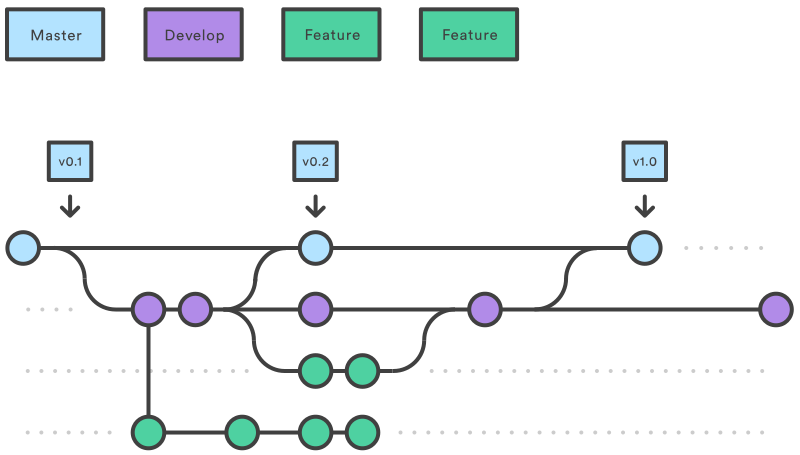
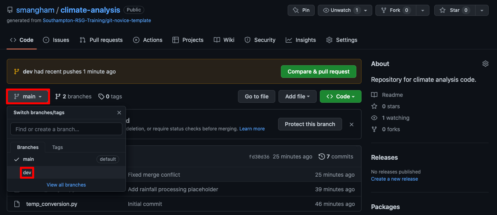
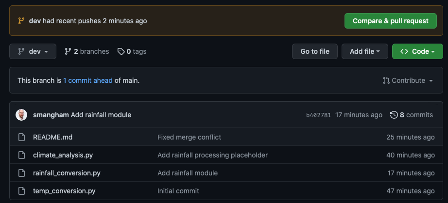
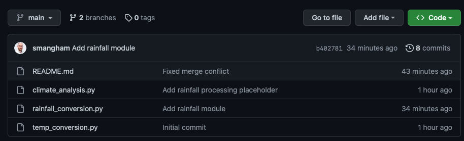
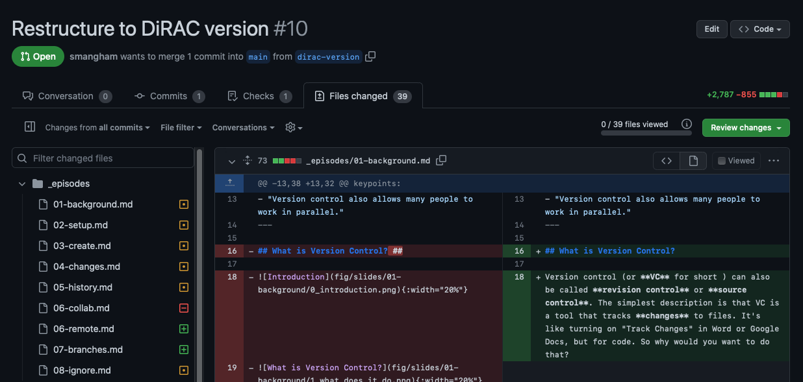

We've seen branches mentioned a *lot* so far - mostly `main`. So what are they?

A branch is a **parallel version of a repository**. It can **branch off** from a commit, contain its own set of extra commits and edits to files, then easily **merge back** into the branch it came off (or even another!). We can visualise this flow of splitting and merging branches like this:

## Why Use Branches?

If you're a user of a code, and don't plan to do any development, you might never have to interact with branches. You'll download the `main` branch, containing the most recent, stable version of the code, and just use that. Likewise, if you create a new repository for a small code with only a single developer, then as long as you aren't sharing the code or its outputs you can just do all your work on the `main` branch like we've been doing.

However, if you plan on **making changes to an existing code**, **collaborating with others**, or **sharing your code or its outputs**, then you'll definitely want to use branches - as they make your life a lot easier.

### Sharing Your Code: `main` and `dev` branches

As mentioned, if you're using an existing code written by somebody else, you'll typically just download the `main` branch and use that. What if, though, the author(s) of the code want to continue working on it without the potential users downloading half-finished or untested code? They could keep all their changes local and only commit and push once a new feature has been completed and rigorously tested, but that's not particularly sustainable for large features. It could potentially take months to add a new feature (a long time to go without a backup!), and you might want to share the work-in-progress version with others to test. 

The traditional way to do this is to create a **development branch (`dev` or `develop`) coming off the main branch (`main` or `master`)**. The **main branch** contains tested, finished code that can be shared with others, whilst the **development branch** contains work-in-progress code. Typically you **merge** your development branch into your master branch when your work on it has been tested and is ready to share - for example, when you release a paper using it. Then you can continue working on your development branch and sharing your development code with other other members of your group.

### Making Changes to an Existing Code: Feature branches

Once you have a working code, particularly one that's being shared, you'll inevitably want to add new features. You could add them directly to your development branch - however, what happens if, mid-way through, you need to pause the feature and switch to something else as you wait for simulations to finish, new data to arrive, or similar? Instead of ending up with a mess of multiple half-finished modifications, which are impossible to evaluate independently of the other, you can instead create a new **feature branch coming off of your development branch** for each new feature. You work on each new feature or bugfix in their own  **feature branch**, and merge them back into your **development branch** once they're tested and complete. Then, as before, once you're ready to publish a paper using your new functionality you merge it all back into the **main branch**.

### Collaborating With Others: Feature branches

Feature branches also make collaborating with others far easier! Instead of stepping on each other's toes by making conflicting edits to the same files, you can simply each work on your own branch. **GitHub** offers features to help manage collaborations too, by limiting who can merge their work into a branch without approval, allowing you to set up workflows where newer team members run their changes past those with experience.

## Merging

We've mentioned **merges** repeatedly; as Git tracks the *changes* made to each file in each commit, it can easily determine whether or not the changes made in two branches **conflict** with each other. It can intelligently merge together two modified versions of a file where their changes don't overlap, and highlight sections where they do for you to resolve, showing both versions of the code.

These use the same conflict resolution we saw earlier - new files are added seamlessly, whilst modified files use smart conflict resolution and might need your intervention if there's a clash!

## The Basics

We can use the `git branch` command to list the branches in our local repository, and let us know which we're on:

~~~bash
$ git branch
~~~

~~~
* main
~~~

At the moment, we only have one - `main` - and the asterisk tells us it's the one we're currently on. We can check this by creating a new branch using `git branch new_branch_name`, and listing them again:

~~~bash
$ git branch dev
$ git branch
~~~

~~~
  dev
* main
~~~

Now we've got a `dev` branch set up!

### Working with a `dev` branch

We'll try a quick example of using the `main` and `dev` branches to have a work-in-progress version of the code that we only share when we've completed and tested it.

We can switch to our new branch with:

~~~bash
$ git switch dev
~~~

~~~
Switched to branch 'dev'
~~~

:::callout
## Compatibility Notice

Older versions of Git don't have `git switch` - instead, you have to use `git checkout dev`.  As we've already seen, `checkout` has a *lot* of functions, and newer versions of Git simplify things by giving them new names.
:::

Any commits we make on this branch will exist *only* on this branch - when you use `git switch main` to switch back to your **main branch**, they won't show up in your `git log` results! 

We'll give it a try. In one of our earlier edits to `climate_analysis.py`, we mentioned we wanted to process rainfall measurements in our climate data. Let's imagine these are historic values, in imperial measurements, that we'll need to convert. We'll make a new file, and write a simple function to handle it:

~~~bash
$ nano rainfall_conversion.py
$ cat rainfall_conversion.py
~~~

~~~
def inches_to_mm(inches):
    mm = inches * 25.4
    return mm

~~~

Now we've made the file, we want to **commit it** to our `dev` branch.
Make sure you're on the `dev` branch with `git switch dev` if you haven't already, and then add it like we added our changes before:

~~~bash
$ git add rainfall_conversion.py
$ git commit -m "Add rainfall module"
~~~

~~~
[dev b402781] Add rainfall module
 1 file changed, 4 insertions(+)
 create mode 100644 rainfall_conversion.py
~~~

So we've successfully made a new file, and committed it to our repository,
on the `dev` branch. Let's take a look at the directory now using `ls`:

~~~bash
$ ls
~~~

~~~
README.md              climate_analysis.py    rainfall_conversion.py temp_conversion.py
~~~

We can see that the `rainfall_conversion.py` file is all present and correct. But we told git that we made it on the `dev` branch - what happens if we switch back to `main` with `git switch` again?:

~~~bash
$ git switch main
~~~

~~~
Switched to branch 'main'
Your branch is up to date with 'origin/main'.
~~~

~~~bash
$ ls
~~~

~~~
README.md           climate_analysis.py temp_conversion.py
~~~

The `rainfall_conversion.py` file isn't present, as the **commit** that created it was made on the `dev` branch. It still exists, and if we use `git switch dev` it'll re-appear. However, whilst we're on `main`, it's tidied away into our hidden `.git` directory. 

This doesn't just work on new files. If you edit an existing file on `dev`, then when you switch back to `main` you'll see the old version.

### Remote Branches

Now we've made changes to our `dev` branch, we want to send them up to GitHub, to make sure that we don't lose any of our development work! Let's switch back to `dev` with `git switch`:

~~~bash
$ git switch dev
~~~

~~~
Switched to branch 'dev'
~~~

And use `git push` to synchonise our branch with GitHub, just like we did earlier. However, this time we'll get an error:

~~~bash
$ git push
~~~

~~~
fatal: The current branch dev has no upstream branch.
To push the current branch and set the remote as upstream, use

    git push --set-upstream origin dev

To have this happen automatically for branches without a tracking
upstream, see 'push.autoSetupRemote' in 'git help config'.
~~~

When we used `git clone` it linked up our `main` branch with the `main` branch on our GitHub repository automatically. Our `dev` branch is new, though, and git doesn't yet know where it should be pushing it to. Fortunately, git has told us what we need to do to tell it (git is good about this!).

The `origin` argument to `git push` tells it which remote repository we're pushing to (we can see a list of them, and their web addresses, with `git remote -v`). The `dev` argument tells it to push the **current branch** to the remote repository as a branch called `dev`. The `--set-upstream` flag tells it that we're setting this behaviour as the default **for this branch**.

We'll use a shortcut for `--set-upstream` - `-u`:

~~~bash
$ git push -u origin dev
~~~

~~~
Enumerating objects: 4, done.
Counting objects: 100% (4/4), done.
Delta compression using up to 4 threads
Compressing objects: 100% (3/3), done.
Writing objects: 100% (3/3), 415 bytes | 415.00 KiB/s, done.
Total 3 (delta 0), reused 0 (delta 0), pack-reused 0
remote: 
remote: Create a pull request for 'dev' on GitHub by visiting:
remote:      https://github.com/smangham/climate-analysis/pull/new/dev
remote: 
To github.com:smangham/climate-analysis.git
 * [new branch]      dev -> dev
branch 'dev' set up to track 'origin/dev'.
~~~

Now we've got it up on GitHub successfully! Let's go check on the site:

It defaults to showing the `main` branch, but lets us know there's been a recent push to a different branch. We can check out what the other branch looks like by clicking on the drop-down on the left and selecting `dev`:

We can see the `rainfall_conversion.py` file has been uploaded! This makes it easy for us to share work-in-progress versions of our code that others can easily look at. 

:::callout
## Linking Remotes

It's always worth double-checking before you run `git push origin dev` for the first time - if you're accidentally still on the `main` branch, you can end up pushing it to GitHub as a new branch called `dev`, and having two copies!

To avoid this, we can set the 'upstream' for a branch when we make it, using:

~~~bash
$ git branch --track branchname origin/branchname
~~~
 
But this functionality isn't available on older versions of git.
Alternatively, if your git is new enough to suggest it, you can make it automatically link branches to their remote equivalents with:

~~~bash
$ git config --global push.autoSetupRemote true
~~~
:::

:::callout
## Downloading Branches
 
It's easy to share a branch with a collaborator so they can test out a different version of the code. If they `clone` the repository, like we did back at the start, it defaults to `main` but they can download the other branches and try them out too, using:

~~~bash
$ git clone git@github.com:yourname/climate-analysis.git
$ git fetch
$ git switch dev
~~~

Where `git fetch` downloads *all* the branches on the remote repository, not just the `main` one.
:::

## Merging Branches

If we're happy with the way our work on the `dev` branch has gone, and we've tested it, we can merge the content back in!

Let's switch back to our `main` branch:

~~~bash
$ git switch main
~~~

~~~
Switched to branch 'main'
Your branch is up to date with 'origin/main'.
~~~

Now, to merge the changes from our `dev` branch into the current (`main`) branch, we just need to do:

~~~bash
$ git merge dev
~~~

~~~
Updating fd30d36..b402781
Fast-forward
 rainfall_conversion.py | 4 ++++
 1 file changed, 4 insertions(+)
 create mode 100644 rainfall_conversion.py
~~~

Now, let's push our updated `main` branch to GitHub:

~~~bash
$ git push
~~~

~~~
Total 0 (delta 0), reused 0 (delta 0), pack-reused 0
To github.com:smangham/climate-analysis.git
   fd30d36..b402781  main -> main
~~~

And we can see on GitHub that the two branches are up-to-date:

:::callout
## Pull Requests

When we looked at GitHub earlier, we saw a banner letting us know we could compare our branches, make a **Pull Request**:

A **Pull Request** is another way of merging branches, that works better when you're part of a team.
There's an interface for discussing the changes you've made with your colleagues, 
requesting others peer-review your code, and it shows all your changes in detail:

 
Then, once you've taken a proper look and you're happy with your changes, you can merge the branches
through the GitHub web interface. 
If you're working as part of a team, it's better to make a **Pull Request** than use than `git merge`.
:::